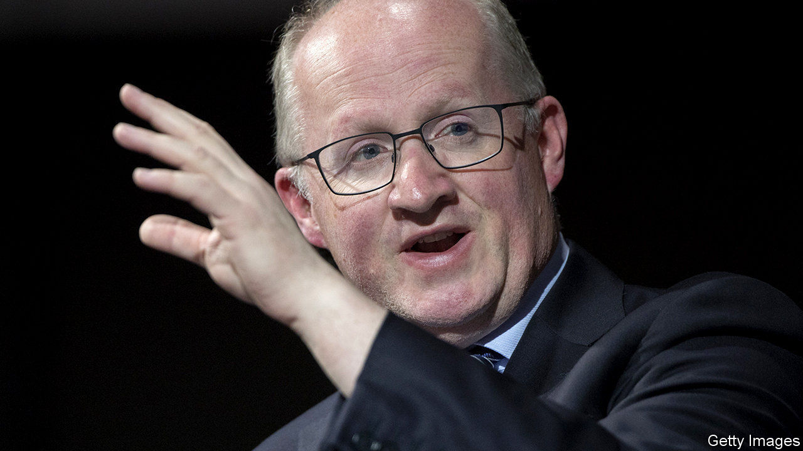

## Lane speaking

# How to fight an economic crisis in a monetary union

> Philip Lane, the ECB’s chief economist, lays out his framework

> May 16th 2020

Editor’s note: The Economist is making some of its most important coverage of the covid-19 pandemic freely available to readers of The Economist Today, our daily newsletter. To receive it, register [here](https://www.economist.com//newslettersignup). For our coronavirus tracker and more coverage, see our [hub](https://www.economist.com//coronavirus)

WHEN PHILIP LANE joined the European Central Bank (ECB) nearly a year ago, he hardly expected to be fighting off the economic effects of a pandemic. The bank’s preoccupations back then seem quaint now. The euro area’s economy was sputtering and the ECB was forecasting a growth rate of 1.4% for 2020. Now Mr Lane, the bank’s chief economist, speculates that GDP might fall by 5-12% this year.

Like other central banks, the ECB has cooked up an alphabet soup of schemes—including the Pandemic Emergency Purchase Programme (PEPP), which will buy bonds worth €750bn ($815bn). Unlike other rich-world banks, though, the ECB must fend off suspicions that it cannot act freely. On May 5th Germany’s constitutional court ruled that the Bundesbank would have to stop participating in the ECB’s five-year-old quantitative-easing scheme unless it is shown to be “proportionate”. Some fear the PEPP could face a legal challenge next.

Christine Lagarde, the bank’s president, has vowed that it is “undeterred” by the ruling. It could probably pass the court’s test, but may not wish to accede to a national court. The row makes its credibility with investors paramount. Ms Lagarde is neither an economist nor an experienced central banker, so it falls to Mr Lane to provide the technical underpinning for that credibility. He puts forward policies and develops the ECB’s intellectual framework.

The Irishman has all the credentials he needs. As an academic in America and Ireland, the Harvard-trained economist studied cross-border capital flows, which were at the root of the euro area’s sovereign-debt crisis in 2010-12. He was part of a circle of wonks proposing ways to fix flaws in the euro’s architecture. As governor of Ireland’s central bank from 2015 to 2019, he made policy too. His experience and his understated style, say colleagues, give his arguments greater force. (It might help that his accent has become familiar over time.)

The job of central banks in the crisis is to ensure that the conditions for a recovery are in place, and to stabilise panicking markets. Mr Lane identifies an extra role for the ECB, as the central bank of a monetary union: to avoid an “unwarranted” tightening in financial conditions resulting from investors dumping riskier (eg, Italian) government debt for safer (eg, German) bonds. The flight to safety, first analysed by Mr Lane and others during the debt crisis, is what the PEPP now tries to tackle. It makes purchases “flexibly”, rather than in rough proportion to each member country’s GDP, as the ECB’s other schemes do.

A flight to bunds would also be averted if debt were jointly backed by member states. In 2018 a group of advisers, led by Mr Lane, recommended the use of sovereign-bond-backed securities to the European Commission. Joint issuance is back on the table as members discuss how to fund the recovery. But with northern states still reluctant to share risks, it seems unlikely. So it falls to the ECB to avert panic.

When Ms Lagarde said in March that it was not the ECB’s job to close spreads, investors took fright. But Mr Lane defends the sentiment. Eliminating spreads is not the aim: “Market discipline operates in the euro area.” It is a point of satisfaction that the ECB’s bond-buying over the years has pushed down risk-free rates, but that differentiation between members remains.

Modest levels of spreads may be desirable, but not huge gaps. Debt-laden Italy and Spain have been hit hard by the virus, but have spent relatively little on stimulus. What if they lose access to markets? If countries face solvency trouble, says Mr Lane, other tools must kick in—eg, the euro area’s bail-out fund. That could help to unlock unlimited bond purchases by the ECB.

Higher public debt will be a feature of the post-pandemic landscape. Cautious households will probably save more, providing demand for that debt. The rich world will start to resemble Japan. Low inflation may not persist, though. In the near term, Mr Lane says, the pandemic is “surely disinflationary”. But he reserves judgment on the long term. Shorter supply chains could push up inflation. Lots of firms could go bust, handing survivors pricing power.

For now, the incentives of monetary and fiscal authorities align neatly. With policy rates at or below zero, central banks are devising new ways to lower borrowing costs. That suits governments, which are issuing vast quantities of debt to fund stimulus. Expect a clash, though, when central banks decide raise interest rates. You could imagine politicians in America or Britain appointing a pliable central-bank head. That is less likely in the euro area, argues Mr Lane, where “19 sovereigns watch each other”. But, as Germany’s judges have revealed, the institutional environment in which the ECB operates is all too messy. It is just as well that Ms Lagarde is a former politician and a lawyer. Economics will only get you so far. ■

Dig deeper:For our latest coverage of the covid-19 pandemic, register for The Economist Today, our daily [newsletter](https://www.economist.com//newslettersignup), or visit our [coronavirus tracker and story hub](https://www.economist.com//coronavirus)

## URL

https://www.economist.com/finance-and-economics/2020/05/16/how-to-fight-an-economic-crisis-in-a-monetary-union
