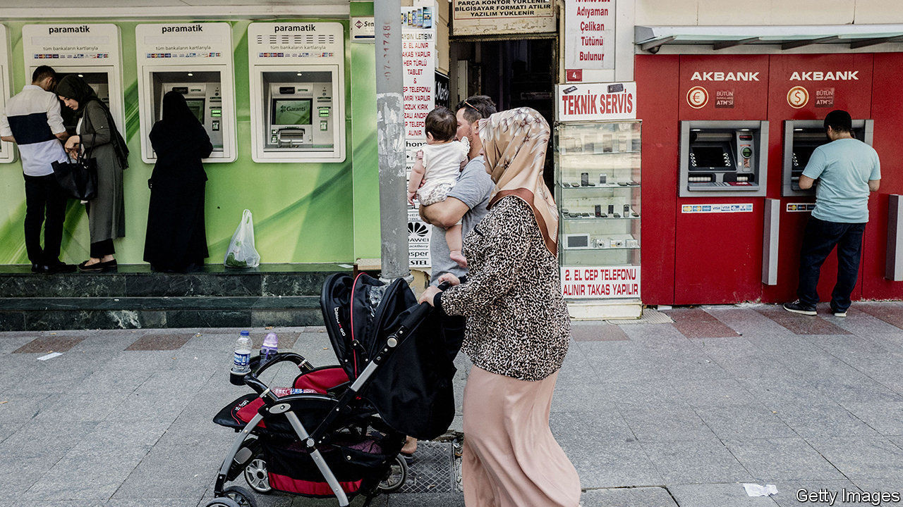
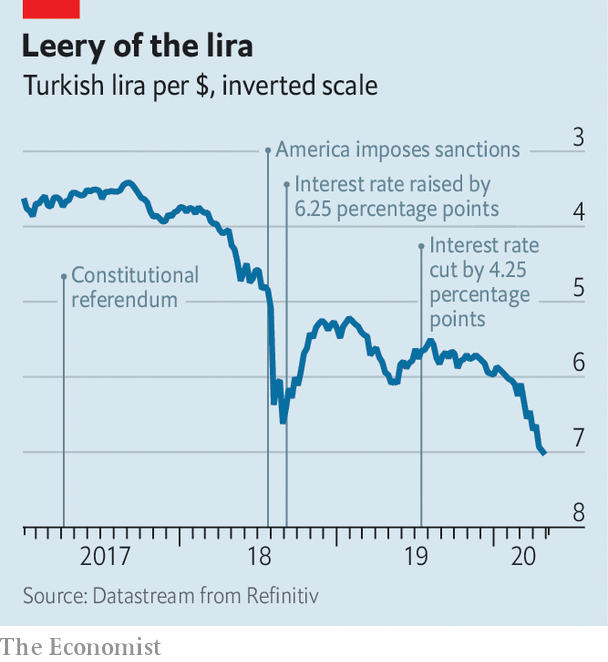

## A host of difficulties

# Turkey’s defence of the lira has been unwise and ineffective

> The country is trying to strengthen its currency—at the expense of weaker banks

> May 14th 2020ISTANBUL AND HONG KONG

POLICYMAKERS IN emerging markets frequently complain that foreign capital is fickle. But foreign capital could be forgiven for having a similar gripe about emerging markets. On a conference call on May 6th Turkey’s finance minister, Berat Albayrak, was solicitous and reassuring, telling nervous overseas investors that the country’s dollar reserves were adequate and its commitment to market principles was firm. But the next day the banking regulator turned cold, reprimanding three foreign banks, BNP Paribas, UBS and even Citigroup, which helped host the call, for failing to meet their lira obligations on time. As punishment, it barred them from the country’s currency market. Four days later, the mood changed and the ban was lifted.

These shifts in official demeanour, from hospitality to hostility to something in between, all reflect a consistent concern about the currency. The lira has lost about 15% of its value against the dollar so far this year, the most among big, commodity-importing emerging markets. In trading on May 7th it briefly weakened to 7.27 against the dollar, beyond the point it reached in August 2018, after America imposed sanctions on Turkish officials in retaliation for the detention of an American pastor.

To stop the lira’s slide, regulators have tightened limits on the amount of lira local banks can provide to foreign financial institutions, making it harder for foreigners to bet against the currency. And they have imposed new restrictions on the spread of “misleading or wrong information” in financial markets. “They want to discourage people from talking about these issues,” says Mustafa Sonmez, an economist. People are “not to criticise”. He ought to know. He and dozens of others, including two Bloomberg journalists, were indicted last year on charges of seeking to “destabilise the economy” during the 2018 crisis.

The authorities have intervened in more conventional ways as well. GlobalSource Partners, a consultancy, estimates that the central bank, often acting through the state banks, has burned through roughly $35bn in foreign reserves this year trying to prop up the lira. How much more it can spend is a matter of controversy. The country’s “gross” foreign assets (including gold) stood at over $87bn on May 12th. But on the other side of its balance-sheet, the central bank reports foreign liabilities worth $71.3bn. It has also entered into currency swaps with local lenders, obtaining dollars in exchange for lira on the condition that the transaction will be reversed in due course. Deduct those borrowed dollars from the total, and its net reserves have dipped below zero.

Officials say they are seeking additional swap lines from foreign central banks. The country already has an arrangement with China (worth $1bn) and another with Qatar (worth $5bn). But it has little hope of obtaining a similar agreement with America’s Federal Reserve. A Fed policymaker recently pointed out that its swap lines are limited to countries that enjoy “mutual trust” with America. The feelings that now prevail between Turkey and America are probably mutual, but hardly trustful.

Turkey bounced back from the 2018 currency crisis by belatedly raising interest rates (and releasing the pastor). But the central bank’s boss was fired last year by the country’s president, Recep Tayyip Erdogan, who has governed with little restraint since winning new powers in a referendum in 2017. To revive growth and restore the president’s popularity, the new central-bank governor has cut rates to 8.75%, more than two percentage points below the rate of inflation. “When you have a negative real interest rate, that is not a recipe for currency stability anywhere,” says Paul McNamara of GAM, an asset manager.

The country has thus tried to strengthen growth, at the expense of weakening the currency. And it has tried to fortify the currency—but at the expense of weakening the banks, which will eventually need some of their dollars back if they are to meet their own foreign-currency obligations, points out Brad Setser of the Council on Foreign Relations, a think-tank.

Turkey should “abandon this strategy”, says Piotr Matys, a currency strategist at Rabobank. “The most rational move would be to let the lira float freely and publish a package of reforms, ideally overseen by the IMF.” There is but one problem. Mr Erdogan wants nothing to do with the IMF. On that, he has been far from fickle. ■