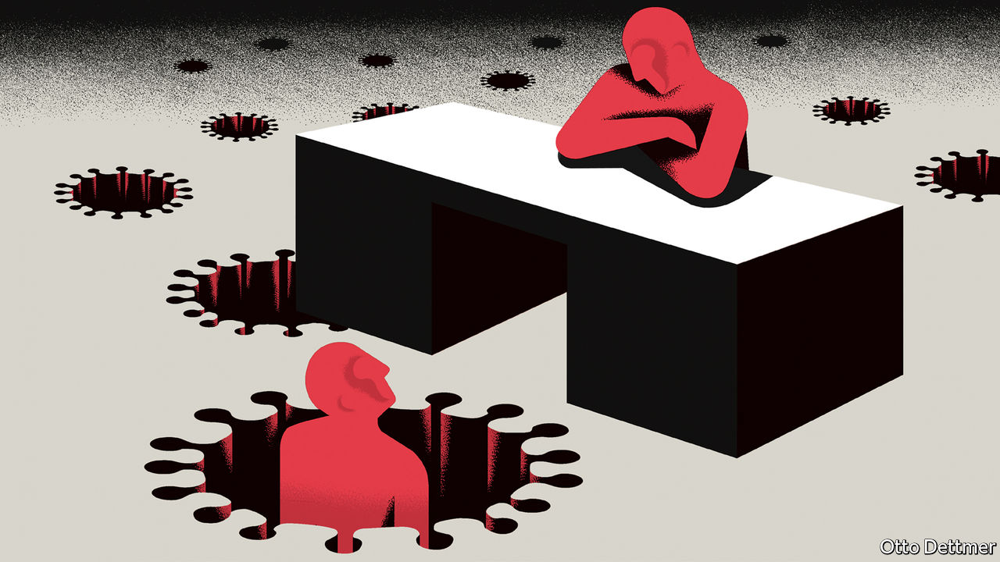

## Free exchange

# Why the pandemic could eventually lower inequality

> History suggests it could precipitate shifts towards a more equal income distribution

> May 16th 2020

Editor’s note: The Economist is making some of its most important coverage of the covid-19 pandemic freely available to readers of The Economist Today, our daily newsletter. To receive it, register [here](https://www.economist.com//newslettersignup). For our coronavirus tracker and more coverage, see our [hub](https://www.economist.com//coronavirus)

FOR AMERICA’S poor, the covid-19 pandemic has delivered a swift and brutal reversal of fortune. At the start of the year unemployment was plumbing new lows. Years of wage growth for low-income workers had healed some of the scars left by the global financial crisis. Already by 2016, the most recent year for which figures are available, the economic expansion had produced a smaller rise in American income inequality, after taxes and transfers, than any expansion since the early 1980s. Between 2016 and 2019 the weekly earnings of low- and middle-income workers grew at an annual average pace of 3.8%. Since covid-19 struck, however, a host of economic statistics—and legions of pundits—have pointed to a resurgence in inequality. Yet if history is a guide, the pandemic could eventually render the distribution of income more egalitarian.

There are many reasons why the well-heeled might suffer less in the pandemic. Much of the plunge in asset prices that occurred in March has since been retraced. In places like New York City and Los Angeles, covid-19 seems to have hit poorer neighbourhoods harder. Low-wage earners are often less able to work from home or maintain social distancing. Interruptions to schooling widen the gaps in achievement between children from richer backgrounds and those from poorer families.

Meanwhile, workers on the lower rungs of the income ladder have borne the brunt of job losses. America’s unemployment rate rose by roughly ten percentage points, to 14.7%, in April—the highest since the Depression. The jobless rate for workers with a college education went up by nearly six percentage points, to 8.4%; that for workers without a high-school diploma leapt by just over 14 percentage points, to 21.2%. A new paper published by the Becker Friedman Institute at the University of Chicago reinforces the point. Between February and April, find its authors, employment among workers in the top fifth of the income distribution dropped by 9%. In the bottom fifth, by contrast, it plunged by 35%.

Were the crisis of unemployment to end as swiftly as it began, the effects of these uneven job losses on inequality would be limited, and fleeting. Many jobless workers are earning more in unemployment benefits than they did on the job, thanks to a top-up of $600 per week enacted by Congress in March. Of the more than 20m Americans who were out of work in April, 78% were reported to be temporarily laid off. But the danger is that temporary job losses become permanent. The authors of the Becker Friedman paper calculate that active employment—or the number of workers counted on payrolls—declined by 14% between February and April. About 40% of that fall occurred at firms that had ceased operations, at least temporarily. Not all will reopen. A new working paper by Jose Maria Barrero of Instituto Tecnológico Autónomo de México, Nicholas Bloom of Stanford University and Steven Davis of the University of Chicago is similarly gloomy, concluding that 42% of pandemic-related job losses will be permanent. Meanwhile, the crush of claimants has overwhelmed some state governments and slowed the flow of unemployment aid. Top-up benefits are due to expire in July, when millions will still be jobless.

The most vulnerable workers are therefore likely to be squeezed hard by the recession. But if history is a guide, those at the top of the income distribution could yet face a reckoning. Disruptive global events have often precipitated shifts towards a more equal distribution of income and wealth. In his influential book, “Capital in the Twenty-First Century”, Thomas Piketty points out that high levels of inequality in the late 19th and early 20th centuries were reduced by the calamitous events of the period from 1914 to 1945. In that time the share of income earned by America’s top 1%, for instance, dropped from 19% to 14%. The combination of depression, war, inflation and taxes compressed incomes and laid waste to vast fortunes. Walter Scheidel, a historian, goes further still in his book on long-run inequality, “The Great Leveller”. Since antiquity, he argues, only four forces have ever managed to reduce inequality in a sustained way: war, revolution, state failure and pandemic. (The troubles often coincide: a pandemic contributed to the failure of the Roman empire; another coincided with the end of the first world war.)

Past crises are a far cry from today’s difficulties. The Black Death compressed income gaps by dramatically reducing the ratio of workers to arable land. Even in the worst possible case, covid-19 will kill far fewer than the 30-60% of Europeans felled by bubonic plague. Stockmarkets could plunge again, but it is very unlikely that they will match the collapse of nearly 90% that took place between 1929 and 1932. Yet some comparisons can still be made. The debts racked up by governments during this pandemic will in some cases reach heights last seen during the world wars. When governments eventually balance the books—and especially if they reduce debt burdens via taxation, financial repression or debt restructuring—the wealthy could find themselves footing the bill.

Furthermore, the crisis could have indirect effects that influence the trajectory of inequality. In a critique of Mr Piketty’s arguments published in 2017 Marshall Steinbaum, now of the University of Utah, argued that the wars and the Depression of the 20th century mainly led to greater egalitarianism by discrediting ruling elites and the regressive policies that had enabled the rises in inequality in the first place. That created space for social democracy to bloom. Inequality fell not only because of higher taxes but also because of extensions to the welfare state.

History need not repeat itself. Governments and economic systems of all kinds have struggled to manage the pandemic effectively and equitably. But it does not take much imagination to see that if politicians allow the costs of the pandemic to be borne unequally they could sow the seeds of a transformative populist backlash. They would do well to heed the lessons of the past. ■

Dig deeper:For our latest coverage of the covid-19 pandemic, register for The Economist Today, our daily [newsletter](https://www.economist.com//newslettersignup), or visit our [coronavirus tracker and story hub](https://www.economist.com//coronavirus)

## URL

https://www.economist.com/finance-and-economics/2020/05/16/why-the-pandemic-could-eventually-lower-inequality
