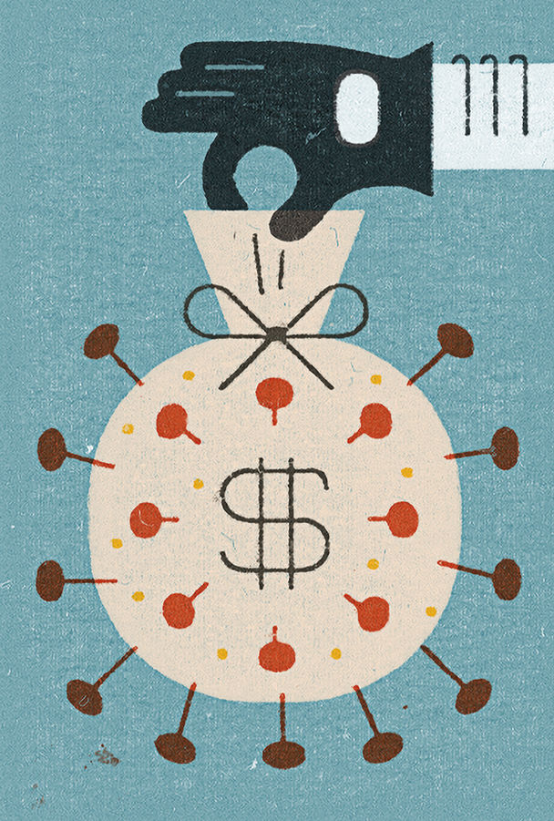

## Covid nostra

# The pandemic is creating fresh opportunities for organised crime

> And governments are not paying attention

> May 16th 2020JOHANNESBURG, ROME AND SÃO PAULO

Editor’s note: The Economist is making some of its most important coverage of the covid-19 pandemic freely available to readers of The Economist Today, our daily newsletter. To receive it, register [here](https://www.economist.com//newslettersignup). For our coronavirus tracker and more coverage, see our [hub](https://www.economist.com//coronavirus)

KARACHI IS AMONG Asia’s most crime-ridden cities. And yet in eight days in March, after covid-19 forced it into lockdown, not a single car was reported stolen. El Salvador, which has one of the world’s highest murder rates, enjoyed four homicide-free days in the same month. Many countries have reported tumbling crime rates, as crooks, along with everyone else, have shut themselves away. Italy was the first European country to lock down, on March 9th. Even before then, many people were working from home. The number of crimes reported in Italy between March 1st and March 22nd dropped by 64% compared with the same period in 2019.

“I would not be surprised if crime statistics, which are dominated by less serious crimes like theft and various kinds of street crime, were to go down, at least temporarily,” says Jürgen Stock, secretary-general of Interpol, the world policing body. But government figures reflect only reported crime—and not all crime is reported, especially when lawbreaking, along with much else, has gone indoors. The Italian figures showed a drop of 44% in domestic violence. Police reckon that is because many victims dare not call to report assaults while their assailants are within earshot.

Meanwhile Gun Violence Archive, an NGO based in Washington, DC, counted more than 2,000 deaths by shooting in America between March 1st and April 19th—a 6% increase over the average in the same period during the past three years. That echoes what happened in the 1918-19 flu pandemic. According to Barry Latzer, an emeritus professor at the John Jay College of Criminal Justice in New York, murders in 1918 increased in each of the five worst-affected states. Sheltering in place shortens tempers. It also makes it easier for gangsters to locate enemies and rivals.

Most worrying, says Mr Stock, is the potential for covid-19 to create the ideal conditions for the spread of serious, organised crime. The pandemic is encouraging organised criminals to put old skills to new use. The global economic depression that looks likely to follow will offer them a chance to extend their reach deep into the legitimate economy. “The potential for problems arising from this is without precedent,” frets another international law-enforcement official.

New scams are already proliferating, some ingeniously simple. On March 16th the South African Reserve Bank issued a statement denying that it had sent collectors house-to-house to recover banknotes in case they had been contaminated with covid-19. Sales of counterfeit, often substandard, drugs have surged. In March Operation Pangaea, co-ordinated by Interpol and involving police forces in 90 countries, led to more than 100 arrests worldwide and the seizure of potentially dangerous pharmaceuticals worth more than $14m. Brazilian drugs gangs short of cash are robbing more banks.

Meanwhile the urgent need for personal protective equipment (PPE) has opened up a new field for ineffective, overpriced or even non-existent goods. Two factors have helped the criminals: the waiving of normal procurement controls by governments desperate to protect their health workers; and the impossibility of arranging face-to-face meetings between customers and suppliers. In the most elaborate scam so far, a group of fraudsters succeeded in getting the authorities in Germany’s most populous region, North Rhine-Westphalia, to part with €2.4m ($2.6m). The money was a down-payment for 10m masks. More than 50 vehicles were lined up to import the fictitious masks from the Netherlands before the ruse was discovered. It involved a website registered in Spain, an intermediary in Ireland and a firm in the Netherlands with a website that turned out to have been cloned by the scammers. With the help of financial institutions in three countries, investigators managed to block the payments, including €500,000 on its way to Nigeria.

That attempted sting reflects an explosion in cybercrime since the lockdowns began. On the night of March 12th the Czech Republic’s second-largest hospital, the University Hospital in Brno, was hit by a ransomware attack (in which the target is prevented from accessing files until a payment is made). Urgent surgical operations had to be postponed and patients redirected to other hospitals. Several other medical facilities have experienced similar attacks since the start of the covid-19 emergency, according to Interpol.

But more traditional organised criminal activities have been hampered by the lockdowns. Protection rackets, prostitution rings, illegal gambling and the drugs trade all depend on people being able to move around freely. So do imprisoned bosses of organised crime groups if they are to continue to control their businesses. This is a particular challenge for the Brazilian drugs gangs, many of whose leaders are jailed. Lincoln Gakiya, a prosecutor for the state of São Paulo, says visiting family members often convey notes and information. Now incarcerated bosses have to rely on infrequent appearances by their lawyers to communicate with their subordinates.

Extortion provides many criminal groups with a regular flow of cash. It is especially important to the street gangs, or maras, of Central America. But collecting cash during a pandemic is tricky. Data quoted by the Global Initiative against Transnational Organised Crime comparing March 2020 with the same month last year showed 9% and 17% falls in extortion incidents registered by police in Guatemala and El Salvador (though most are not reported). In Honduras the decline was 80%. According to the FNAMP, an anti-gang unit in the country, Honduran gang leaders have warned transport firms that once the quarantine ends, protection money will have to be paid retrospectively.

The biggest money-spinner for most organised crooks is the drugs trade. Mr Stock says early reports suggest the global business, estimated at around $500bn, has been disrupted—but only temporarily and partially. “For many cartels and syndicates it’s not a big problem”, he explains, “because of the money that is available at that level. They have immense liquidity.”

The opium harvest in Afghanistan that supplies nearly all the world’s heroin has been largely unaffected. Coca farmers in Colombia, the world’s largest cultivator, have just had their best year on record, though in Peru a shortage of imported chemical precursors has made it harder to produce cocaine. The closure of pharmaceutical plants in China threatened the supply of precursors used in the production of methamphetamines, but the interruption was temporary.

The next stage in the supply chain—wholesale distribution—has been distorted. But gangs are already adapting. Syndicates that rely on drugs smuggled on flights, such as Nigerian gangs in South Africa, have been hit hard. Two members of Mexico’s Sinaloa cartel told Reuters that far fewer drugs are being transported in cars across the border into the United States since it was shut on March 21st. Syndicates seem to be using tunnels and drones instead. Officials in Brazil have reported that traffickers in cocaine, which enters from Colombia and Peru on its way to Europe and Africa, are switching consignments from land routes and onto boats travelling down the Amazon. With maritime and air traffic greatly diminished, it is even harder to get drugs out of Brazil. Yet seizures between February and April were up by 10%. Elvis Secco of the Brazilian Federal Police’s drugs and organised crime unit says traffickers are offloading their stockpiles and taking more risks, which partly explains why more narcotics are being impounded.

Cocaine prices in Europe and America have risen accordingly. But that also reflects the difficulties of retail distribution, the link in the supply chain that has probably had to be adjusted most. In Naples last month police dogs found 89 packages stuffed with narcotics waiting to be dispatched from a courier depot. The drugs had been ordered on the darknet. The courier firm had no idea of its role.

Shortly afterwards Interpol told its 194 members that drug-dealers were also using the cover of food deliveries to sell their wares. In Ireland police found 8kg of cocaine and two handguns hidden in pizza boxes. In the Cape Flats, a sprawl of townships on the outskirts of Cape Town, gangs are delivering drugs along with food parcels. Heroin prices there rose initially because of a mix of profiteering and new delivery fees (they have now returned to normal). In Lesotho getting heroin direct to your door costs 200-500 rand ($11-27), on top of the usual 1,200 rand per gram.

The Cape Town gangs are among several around the world that are making a big show of charity during the pandemic. Mobsters have been reported delivering food to the needy in Mexico and Italy. In El Salvador and Brazil they have enforced curfews. In Japan yakuza have offered to disinfect a quarantined cruise liner.

But even where such initiatives are not used as a cover for drug peddling, their effects are anything but benign. They enhance gangsters’ popularity and image as latter-day Robin Hoods. They guarantee future votes for the politicians whom mobsters sponsor. And they realise one of the fundamental aims of a true mafia: delegitimising the state by displacing official authority. A gang that enforces a lockdown is doing the job of the police; one that distributes food to the destitute, that of government welfare bodies.

A deep or prolonged depression will open up rich opportunities for crooks in at least three areas. High unemployment will make it easier for mobsters to recruit people. Government recovery schemes will give them a chance to muscle in on juicy public contracts. And lower corporate profits will make it easier for mafias to take over businesses that can then be used to launder illicit gains.

In Italy, after the financial crisis, some firms accepted loans at below-market rates in return for taking onto the books—or the board—a mafioso who then began to give the orders. According to the chief of the Italian police, Franco Gabrielli, his officers in the regions worst hit by covid-19 have already come across men carrying cash-stuffed briefcases that may be part of the Italian mafias’ version of “helicopter money”. The risk is that politicians already struggling to cope with the effects of the pandemic will shove its implications for the underworld to the back of their minds and the bottom of their agendas. ■

Dig deeper:For our latest coverage of the covid-19 pandemic, register for The Economist Today, our daily [newsletter](https://www.economist.com//newslettersignup), or visit our [coronavirus tracker and story hub](https://www.economist.com//coronavirus)

## URL

https://www.economist.com/international/2020/05/16/the-pandemic-is-creating-fresh-opportunities-for-organised-crime
