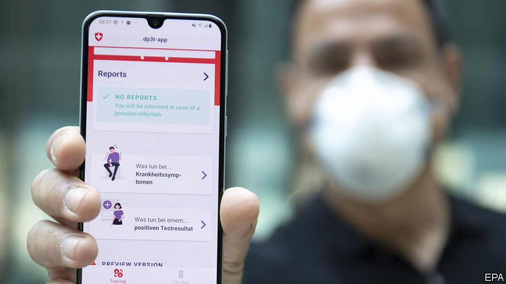
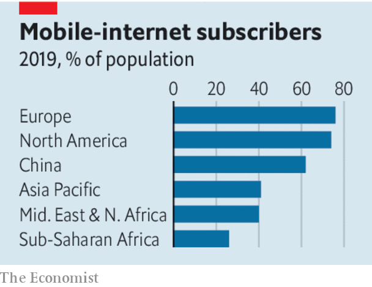

## Escaping the lockdown

# Don’t rely on contact-tracing apps

> Governments are pinning their hopes on a technology that could prove ineffective—and dangerous

> May 16th 2020

Editor’s note: The Economist is making some of its most important coverage of the covid-19 pandemic freely available to readers of The Economist Today, our daily newsletter. To receive it, register [here](https://www.economist.com//newslettersignup). For our coronavirus tracker and more coverage, see our [hub](https://www.economist.com//coronavirus)

EVERYTHING HAPPENS faster in a crisis. Faced with covid-19, vaccine-makers are cutting as many corners as they safely can. Anti-viral drugs are being rushed into clinical trials. Even so, it will be months until anything is available. With 297,000 people recorded dead, the wait is agonising. But caution is crucial. Medicine’s history is full of promising treatments that, when tested, turned out not to work or even to cause harm.

Many governments hope salvation can come sooner, with contact-tracing apps on smartphones—even as a row brews over Apple’s and Google’s grip on the technology. These apps can be used to automate the difficult process of tracking down people who have been in contact with those diagnosed with covid-19, which is vital for keeping tabs on the virus. Countries from Bahrain and Bulgaria to Indonesia and Iceland have developed such apps.

They are an attractive idea. Yet contact-tracing apps are also an untested medical invention that will be introduced without the sort of safeguards that new drugs are subjected to. Inaccurate information can mislead health officials and citizens in ways that can be as harmful as any failed drug. Governments should proceed with care.

Coverage is one complication. Epidemiologists reckon that apps might be useful if around 60% of people use them. Yet even in Europe, where adoption is highest, only 76% of people have mobile-internet subscriptions. That number is lower among the elderly, the most vulnerable to covid-19. A recent survey suggested less than half of Americans would use a contact-tracing app.

Accuracy is an issue, too. Such apps are designed to listen out for nearby mobile phones, registering a contact if another device comes close enough. Yet the strength of the radio signals used to do this is affected by all sorts of things besides distance. Human bodies impede transmission, for instance, meaning a phone in a pocket will behave differently from one in a hand.

That could make it hard to calibrate the system—and a mistake would have consequences. Too sensitive, and you risk a deluge of “false positives”: contacts deemed close and significant that were actually distant and irrelevant. Too forgiving, and genuine cases of viral transmission will go undetected.

Moreover, the apps themselves might change behaviour. An over-reassuring app could spur people to go out before it is safe. Privacy must be weighed against transparency, for medical reasons as well as for civil liberty. South Korea publishes detailed summaries of cases uncovered by its contact-tracers. A recent jump in cases was linked to a man who visited gay nightclubs. The resulting stream of homophobic invective could deter others from co-operating with the authorities, electronically or otherwise.

The efforts of some governments, including those of Britain, France and Germany, have been complicated by Apple and Google, which between them hold sway over almost every smartphone on the planet. The firms have made privacy a priority, deeming that users will be anonymous and information stored mostly on devices rather than uploaded to central repositories. That has infuriated many officials. Centralisation offers advantages, they say. And in any case, why should coders in Silicon Valley overrule decisions made by medical experts and elected officials?

As a rule, governments are right to worry about the unaccountable power of the tech giants. In this case, though, Google’s and Apple’s cautious approach is sensible. In a pandemic, experimenting with novel public-health responses such as mass surveillance should be done carefully, in case it subsequently turns out to have nasty side-effects. With high-tech software, caution is as valuable as it is with pills and potions. ■

Dig deeper:For our latest coverage of the covid-19 pandemic, register for The Economist Today, our daily [newsletter](https://www.economist.com//newslettersignup), or visit our [coronavirus tracker and story hub](https://www.economist.com//coronavirus)

## URL

https://www.economist.com/leaders/2020/05/16/dont-rely-on-contact-tracing-apps
