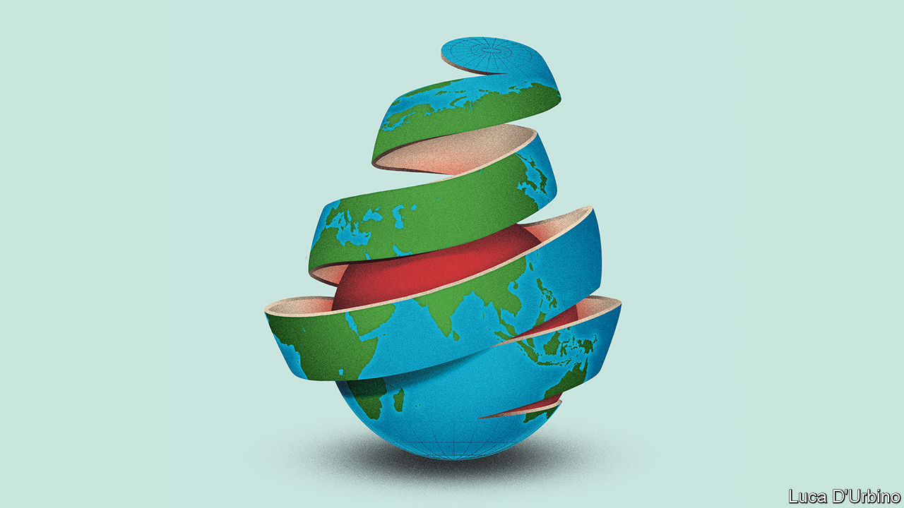

## Globalisation unwound

# Has covid-19 killed globalisation?

> The flow of people, trade and capital will be slowed

> May 14th 2020

Editor’s note: The Economist is making some of its most important coverage of the covid-19 pandemic freely available to readers of The Economist Today, our daily newsletter. To receive it, register [here](https://www.economist.com//newslettersignup). For our coronavirus tracker and more coverage, see our [hub](https://www.economist.com//coronavirus)

EVEN BEFORE the pandemic, globalisation was in trouble. The open system of trade that had dominated the world economy for decades had been damaged by the financial crash and the Sino-American trade war. Now it is reeling from its third body-blow in a dozen years as lockdowns have sealed borders and disrupted commerce (see [Briefing](https://www.economist.com//briefing/2020/05/14/covid-19s-blow-to-world-trade-is-a-heavy-one)). The number of passengers at Heathrow has dropped by 97% year-on-year; Mexican car exports fell by 90% in April; 21% of transpacific container-sailings in May have been cancelled. As economies reopen, activity will recover, but don’t expect a quick return to a carefree world of unfettered movement and free trade. The pandemic will politicise travel and migration and entrench a bias towards self-reliance. This inward-looking lurch will enfeeble the recovery, leave the economy vulnerable and spread geopolitical instability.

The world has had several epochs of integration, but the trading system that emerged in the 1990s went further than ever before. China became the world’s factory and borders opened to people, goods, capital and information (see [Chaguan](https://www.economist.com//china/2020/05/14/a-small-town-in-china-makes-half-of-japans-coffins)). After Lehman Brothers collapsed in 2008 most banks and some multinational firms pulled back. Trade and foreign investment stagnated relative to GDP, a process this newspaper later called slowbalisation. Then came President Donald Trump’s trade wars, which mixed worries about blue-collar jobs and China’s autocratic capitalism with a broader agenda of chauvinism and contempt for alliances. At the moment when the virus first started to spread in Wuhan last year, America’s tariff rate on imports was back to its highest level since 1993 and both America and China had begun to decouple their technology industries.

Since January a new wave of disruption has spread westward from Asia. Factory, shop and office closures have caused demand to tumble and prevented suppliers from reaching customers. The damage is not universal. Food is still getting through, Apple insists it can still make iPhones and China’s exports have held up so far, buoyed by sales of medical gear. But the overall effect is savage. World goods trade may shrink by 10-30% this year. In the first ten days of May exports from South Korea, a trade powerhouse, fell by 46% year-on-year, probably the worst decline since records began in 1967.

The underlying anarchy of global governance is being exposed. France and Britain have squabbled over quarantine rules, China is threatening Australia with punitive tariffs for demanding an investigation into the virus’s origins and the White House remains on the warpath about trade. Despite some instances of co-operation during the pandemic, such as the Federal Reserve’s loans to other central banks, America has been reluctant to act as the world’s leader. Chaos and division at home have damaged its prestige. China’s secrecy and bullying have confirmed that it is unwilling—and unfit—to pick up the mantle. Around the world, public opinion is shifting away from globalisation. People have been disturbed to find that their health depends on a brawl to import protective equipment and on the migrant workers who work in care homes and harvest crops.

This is just the start. Although the flow of information is largely free outside China, the movement of people, goods and capital is not. Consider people first. The Trump administration is proposing to curtail immigration further, arguing that jobs should go to Americans instead. Other countries are likely to follow. Travel is restricted, limiting the scope to find work, inspect plants and drum up orders. Some 90% of people live in countries with largely closed borders. Many governments will open up only to countries with similar health protocols: one such “travel bubble” is mooted to include Australia and New Zealand and, perhaps, Taiwan and Singapore (see [article](https://www.economist.com//finance-and-economics/2020/05/14/could-travel-bubbles-offer-a-route-to-economic-recovery)). The industry is signalling that the disruption to travel will be lasting. Airbus has cut production by a third and Emirates, a symbol of globalisation, expects no recovery until 2022.

Trade will suffer as countries abandon the idea that firms and goods are treated equally regardless of where they come from. Governments and central banks are asking taxpayers to underwrite national firms through their stimulus packages, creating a huge and ongoing incentive to favour them. And the push to bring supply chains back home in the name of resilience is accelerating. On May 12th Narendra Modi, India’s prime minister, told the nation that a new era of economic self-reliance has begun. Japan’s covid-19 stimulus includes subsidies for firms that repatriate factories; European Union officials talk of “strategic autonomy” and are creating a fund to buy stakes in firms. America is urging Intel to build plants at home. Digital trade is thriving but its scale is still modest. The sales abroad of Amazon, Apple, Facebook and Microsoft are equivalent to just 1.3% of world exports.

The flow of capital is also suffering, as long-term investment sinks. Chinese venture-capital investment in America dropped to $400m in the first quarter of this year, 60% below its level two years ago. Multinational firms may cut their cross-border investment by a third this year. America has just instructed its main federal pension fund to stop buying Chinese shares, and so far this year countries representing 59% of world GDP have tightened their rules on foreign investment. As governments try to pay down their new debts by taxing firms and investors, some countries may be tempted to further restrict the flow of capital across borders.

Don’t be fooled that a trading system with an unstable web of national controls will be more humane or safer. Poorer countries will find it harder to catch up and, in the rich world, life will be more expensive and less free. The way to make supply chains more resilient is not to domesticate them, which concentrates risk and forfeits economies of scale, but to diversify them. Moreover, a fractured world will make solving global problems harder, including finding a vaccine and securing an economic recovery.

Tragically, this logic is no longer fashionable. Those three body-blows have so wounded the open system of trade that the powerful arguments in its favour are being neglected. Wave goodbye to the greatest era of globalisation—and worry about what is going to take its place.■

Dig deeper:For our latest coverage of the covid-19 pandemic, register for The Economist Today, our daily [newsletter](https://www.economist.com//newslettersignup), or visit our [coronavirus tracker and story hub](https://www.economist.com//coronavirus)