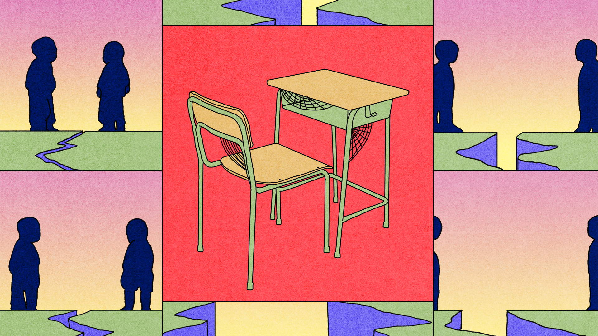
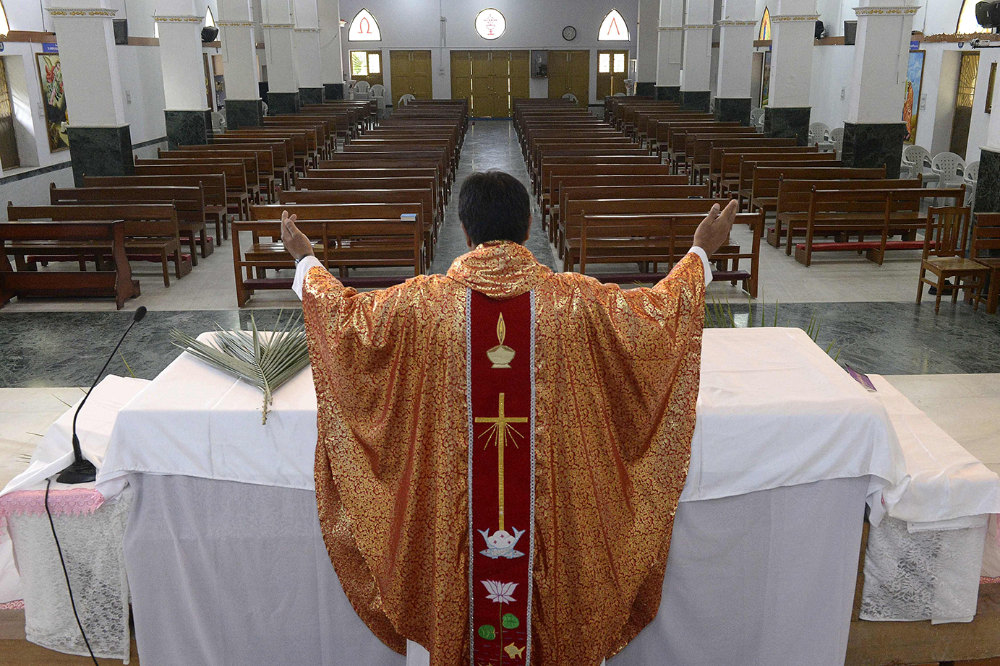
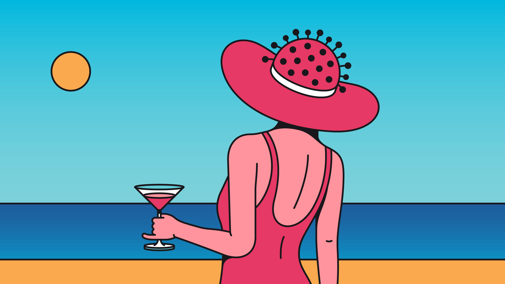

## On reopening schools, golf, religion, St Helena, underpants

# Letters to the editor

> A selection of correspondence

> May 14th 2020

I was dismayed by your leader calling for schools to reopen (“[Open schools first](https://www.economist.com//leaders/2020/04/30/when-easing-lockdowns-governments-should-open-schools-first)”, May 2nd). Terry Jones of the Department of Zoology at Cambridge University and his colleagues in Germany studied 3,700 patients with covid-19 and found no significant difference in the viral load in patients among age categories, including children. The study reckoned that children may be as infectious as adults. Paul Hunter of the Norwich Medical School found that closing schools was one of three of the most effective measures in reducing the transmission rate of the disease. (Both studies have not been peer-reviewed.)

You speculated, moreover, that people working from home with young children are less productive. I am a consultant psychiatrist in a high-risk category for covid-19 and the mother of primary-school-aged children. Because I now do not have to commute nor do the school-run my productivity has gone up. I do home visits by computer in areas it would otherwise take me a day to travel to. Vulnerable children often have health issues. Many have to care for adults. Their parents may be too scared to send them to school. Single parents worry about the logistics of sending one child to school while others stay home.

Children at home might not all be completing worksheets or giving thumbs-up emojis in Zoom classrooms, but to suggest they are not learning belies the resourcefulness of those children and their families. Young children, especially, learn through play and watching adults. The unusual situation of the lockdown is giving them opportunities to do that much more so than before. Children are learning all the time: to exercise indoors, to negotiate with siblings, to be patient, to be grateful. These virtues won’t be measured in exams.

You concluded that a rushed return to school may feel like “a rash experiment with young lives”. Children from all socioeconomic backgrounds learn least under stressful conditions. Instead of sending them back on the basis of erroneously extrapolated scientific conclusions, let us make wise, informed, safe choices on their behalf.

SABINA DOSANIConsultant child and adolescent psychiatristLondon

Although you addressed the inequities of returning to the classroom, the biggest consideration for American public schools remains funding. Without additional resources to pay for summer schools, longer hours and shorter holidays this is all a pipe dream.

HELEN LLOYDDirector of communicationsAlexandria City Public SchoolsAlexandria, Virginia

As a 16-year-old pupil, I can tell you that children thrive off social contact. Some will not comply with social distancing. Others will not be able to resist temptations. Even the most conscientious will breach the rules. It is not realistic to think we can transform crowded common rooms and corridors, with their hugs and handshakes and shared sweets and drinks, into safe spaces.

HARRIS WHITFORDSheffield

The teachers at my school have had to rethink how they approach learning. For my part as a 17-year-old, I have had to grasp how to use the old technology of email. The shutdown has made school administrators aware of the tech disparities among students, which should have been obvious before the pandemic. All said, however, I am very much looking forward to returning to the classroom.

SABINE ZEDNIK-HAMMONDBrussels

Your special report on [South Korea](https://www.economist.com//special-report/2020/04/08/south-korea-is-going-through-deep-social-economic-change) (April 11th) had much to say, mostly negative, about the plight of women in the country as well as its growing worldwide cultural influence. However, there is one area in which South Korean women completely dominate: golf. Four Korean women—Jin Young Ko, Sung Hyun Park, Sei Young Kim and Jeon Eun Lee—are in the top ten of the Rolex World Rankings. The highest placed male, Sungjae Im, is ranked 23rd. South Korean cultural influence on the world of golf is firmly in female hands.

JAMES LENNOXProfessor emeritus of history and philosophy of scienceUniversity of Pittsburgh

There is a basic reason why virtual worship online will not replace the traditional visit to a house of God (“[Our Father, who art in cyberspace](https://www.economist.com//international/2020/04/11/churches-turn-to-the-internet-to-reach-their-flocks)”, April 11th). Religious rituals have been designed to stimulate all five senses. Think of the spectacle of a Catholic mass, the colourful religious processions of the Hindus, the adhans of the mosque, the horns of Tibetan monasteries, the cake and wine of the Eucharist, the chashni of the Zoroastrians, the incense of Shinto shrines and the ghee poured into the Hindu havan, just a few of the world’s thousands of religious rituals that stimulate the senses of their followers.

As for the sense of touch, this obviously needs more than one worshipper to be present. It is for this same reason that virtual company meetings are insipid compared with the real thing.

NAWSHIR MIRZAMumbai

I read with great interest Banyan’s [column](https://www.economist.com//asia/2020/04/11/the-eternal-fanciful-allure-of-the-south-pacific) juxtaposing the allure and perceived immunity of remote islands in the face of disease with the harsh reality of history (April 11th). By fortunate happenstance, I recently had the pleasure of spending five weeks on St Helena as the covid-19 crisis quickly deepened. Although perhaps best known as the home to Napoleon in exile, St Helena was also one of two places unaffected by the Spanish flu of 1918 to 1920, the other being Antarctica.

I arrived there in mid-March after two weeks at sea to a world greatly changed. Myself and dozens of other cruising sailboats suddenly found ourselves in limbo as country after country along the traditional sailing routes back to North America or Europe closed their ports. There are individuals, couples and families around the world in their small floating homes with no ports at which to call for water, fuel, or provisions (apparently some countries now find maritime safety conventions to be optional).

The Saints, however, welcomed us all with open arms, despite a few, fortunately false, rumours that covid-19 had come to the island and some understandable concerns about the impact on their own scarce resources.

KENNON JONESAt sea, on passage from St Helena to the US Virgin Islands

In response to your invitation for readers to share their covid-19 experiences ([Letters](https://www.economist.com//letters/2020/04/08/letters-to-the-editor), April 11th) I am a PhD student and have evidently been practising for just such a scenario. Staying indoors, reading and writing in my underpants all day has been almost the sole agenda on my calendar for over a year now.

Laundry has given rise to mixed feelings. I have to do it because there are only so many pairs of underwear. However, there is very little else to add to the machine. A waste of $3 each time. Every penny counts on a student budget, but at least I can put off shopping for trousers a bit longer.

NAREG SEFERIANArlington, Virginia

## URL

https://www.economist.com/letters/2020/05/14/letters-to-the-editor
