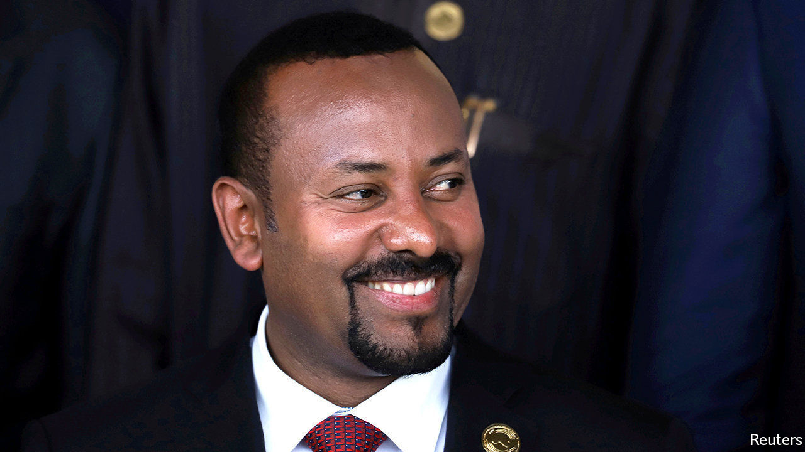
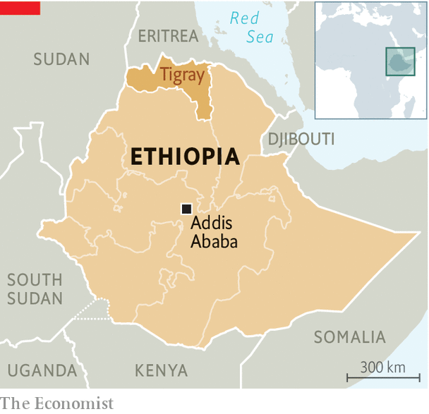

## Vote again another day

# Ethiopia is entering constitutional limbo

> Postponed elections may leave it without a legal government

> May 16th 2020ADDIS ABABA

EVEN IN NORMAL times Ethiopia’s plans to hold national elections in August would have been fraught with uncertainty. Would they be free and fair? Would they help restore peace to a country riven by ethnic violence? Now, with the polls postponed indefinitely by covid-19, Ethiopia is approaching a constitutional crisis.

By law Ethiopia’s parliament will reach the end of its constitutional five-year term on October 5th. That could leave the country without a legitimate parliament or government. Abiy Ahmed, a young reformer who took office in 2018 promising democracy after massive protests, says that because of the exceptional circumstances of the pandemic his government will stay in charge until elections can be held safely.

The delay has prompted a backlash from opposition leaders. Many of them had suspected long before the outbreak of covid-19 that Abiy’s Prosperity Party would try to rig or postpone the elections: its predecessor suppressed the opposition so thoroughly in 2015 that it won 95% of the vote.

The Tigrayan People’s Liberation Front (TPLF), which called the shots in the country for nearly three decades until it was ousted by Abiy, accused the prime minister of exploiting the pandemic to dismantle the constitution and lay the groundwork for one-man rule. It said it will press ahead with polls in Tigray, the region it still controls, in defiance of the federal government. This squabble will further pull at the seams of a federation that has been badly fraying in recent years.

To avert a showdown the government has asked the Council of Constitutional Inquiry for an opinion on the postponement. But this is not an independent constitutional court. The council is merely an advisory body to the upper house of parliament, which is controlled by the ruling party, notes Zemelak Ayele of Ethiopia’s Centre for Federal Studies.

Although the constitution does not spell out the circumstances under which an election may be postponed, it still provides a “framework” allowing it , says Adem K Abebe, an expert based in The Hague. But such legal subtleties may count for little without the support of opposition leaders. To get this Abiy may have to bargain with them on matters such as the timing of the election, as well as allay their concerns about its fairness and the independence of state media and the security forces.

Jawar Mohammed, a popular figure among the Oromo ethnic group, wants Abiy to start talks about a caretaker administration taking charge until elections are held, among other matters. Abiy has met his opponents once to discuss the constitutional impasse. But he has dismissed calls for an interim government and warned that “illegal elections” will “harm the country and the people”. There is a risk, however, that without a compromise his prophecies become self-fulfilling. ■

Correction (May 15th 2020): An earlier version of this piece incorrectly said that Ethiopia's parliament expires on September 30th, because of a mixup between the Ethiopian and Gregorian calendars. Sorry.

## URL

https://www.economist.com/middle-east-and-africa/2020/05/16/ethiopia-is-entering-constitutional-limbo
