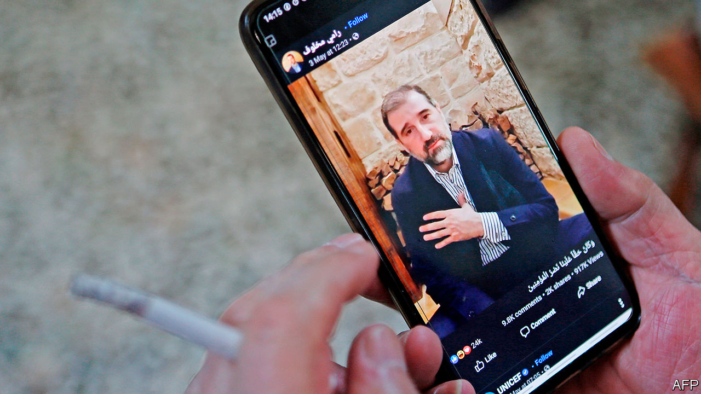

## A regime divided

# Trouble in Bashar al-Assad’s own ranks

> A family feud risks dividing the Syrian president’s supporters

> May 16th 2020

IN 1957 A young air-force officer from the highlands called Hafez al-Assad married a girl from the coast named Anisa Makhlouf. It seemed a good fit: Assad was ambitious; the Makhloufs were powerful. And indeed, after Assad took over in a coup in 1970 the two clans ran the country like a family business, propelling their esoteric Muslim sect, the Alawites, from Syria’s backwaters to the centre of power.

Half a century on, though, the partnership is unravelling. In a series of videos posted on Facebook Rami Makhlouf, Syria’s wealthiest tycoon, accused his cousin and Hafez’s son, President Bashar al-Assad, of confiscating his assets. Mr Makhlouf even complained, unironically, that the blood-soaked security forces, which he long sponsored, were treating his employees in “an inhumane way” and “attacking the people’s freedoms”.

Things had been moving against Mr Makhlouf for a while. The death of Anisa in 2016 deprived his clan of protection. Maher al-Assad, the president’s younger brother and commander of the Republican Guard, coveted his business empire. The president’s wife, Asma, wanted to empower her own clique and improve the prospects of their 19-year-old son, Hafez. In his most recent post Mr Makhlouf (pictured) seemed to blame her for his misfortune.

But the biggest reason for Mr Makhlouf’s fall is the president’s need for money after nine years of civil war that have devastated the economy. In December the government began seizing the businessman’s assets, citing “customs violations”. The shakedown came to a head last month when goons raided Syriatel, the country’s biggest mobile-network provider, owned by Mr Makhlouf. Senior managers were arrested and the state demanded at least $170m in licence fees. It was all part of an anti-corruption drive, said Mr Assad.

Normally the regime puts guns in the mouths of troublemakers and calls it suicide. But Mr Makhlouf poses an unusual challenge. His clan is larger than Mr Assad’s and is part of the powerful Haddadin tribe. Mr Makhlouf has courted their loyalty throughout the war. In 2012 he formed the Bustan Association, a charity with an armed wing, to protect and care for his kinsmen. It provided meals, health care and jobs—until Mr Assad curbed some of its activities last year.

Alawite hardliners bewail the downfall of Mr Makhlouf, whom they consider their protector. Some suggest the president is forsaking his own sect for the predominantly Sunni merchants who are close to his wife (also a Sunni). Most Alawites have lost loved ones fighting for Mr Assad, so they cringe at the thought of him handing the war’s spoils to Sunnis, many of whom rebelled against him. “Alawites feel threatened and will rally around Rami,” says a business associate of Mr Makhlouf. “If [the security forces] go after him, they risk destabilising the regime.”

Iran, which backs the regime, is looking on anxiously. Mr Makhlouf has “always been close to the Iranians”, says the associate. “He put all his eggs in the Iranian basket.” But Iran itself has bigger problems. The assassination in January of Qassem Suleimani, the commander of its foreign operations, and mounting financial trouble have made it harder for Iran to maintain its position in Syria. Israel has been increasing its air strikes on Iranian bases in the country and says Iran is retreating.

Russia, which also backs Mr Assad, may not mind seeing Iran go. It wants its own companies to benefit from reconstruction contracts in Syria. The S-300 air-defence system that it gave the regime never seems to work against Israeli missiles. Analysts say Russia is acquiescing in, if not facilitating, the strikes on Iranian positions. It has also moved its forces into areas prized by Iran and cut it out of negotiations over northern Syria, where rebels backed by Turkey continue to hold territory and the Kurds have carved out a proto-state.

With the regime in disarray some think Mr Assad might be more willing to negotiate a political solution with the rebels. Russia wants a settlement in order to convince Western powers to help fund reconstruction. Under one (optimistic) scenario, Mr Assad would accept a new constitution that devolves powers to a more conciliatory prime minister ahead of presidential elections next year.

Good luck with that. Mr Assad appears as stubborn as ever. Russian diplomats paint him as a disobedient client. Criticism of him is increasing in Russian media. Some reports even suggest that President Vladimir Putin would prefer to deal with someone else. But no alternative has emerged. No matter how much Mr Assad alienates his allies—and his own people—they appear stuck with him. ■

## URL

https://www.economist.com/middle-east-and-africa/2020/05/16/trouble-in-bashar-al-assads-own-ranks
