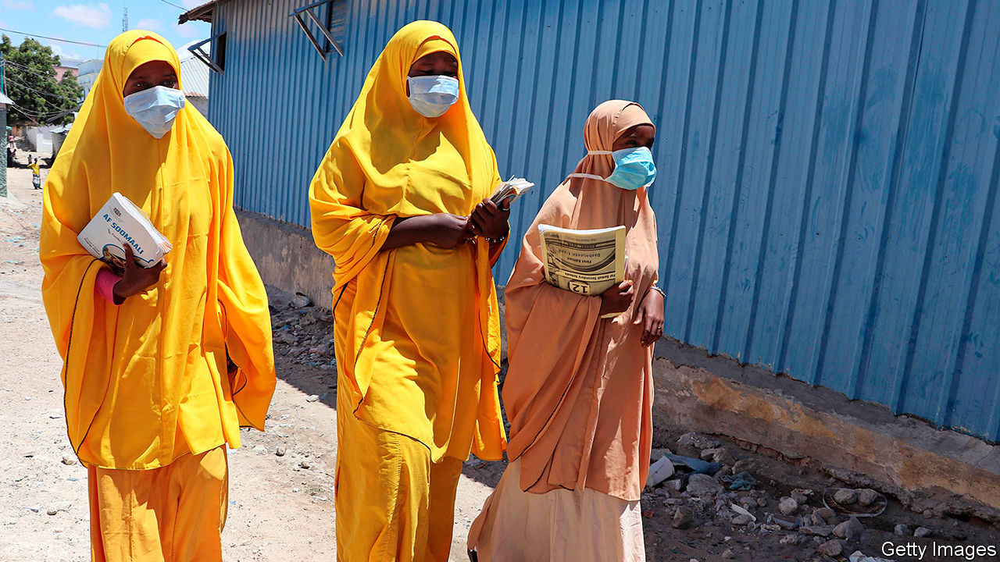
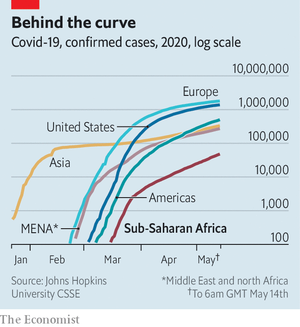

## The smouldering pandemic

# Why covid-19 seems to spread more slowly in Africa

> Transport links are worse

> May 16th 2020JOHANNESBURG

IT WAS NOT what fishermen usually mean by a good catch. Last month a worker at a fish factory in Tema, a port city in Ghana, infected 533 people with the virus behind covid-19. President Nana Akufo-Addo linked the “super-spreader” to about 10% of the country’s 5,408 cases.

That Ghana could identify the person is a tribute to its response. It has tested more than 155,000 people, the fourth-highest per-person rate in Africa, according to data from CDC Africa, a public-health body. Elsewhere a lack of testing makes it harder to assess the true course of the disease. But what data there are, and new analysis by the World Health Organisation (WHO), suggest the virus is spreading more slowly in Africa than elsewhere—and that its path will vary across the continent.

Africa, which contains about 17% of the world’s population, has less than 2% of its confirmed cases of covid-19. By May 13th CDC Africa had counted 69,947 cases and 2,410 deaths. Over the past month reported cases have doubled roughly every two weeks. Until recently American cases were doubling about every three days.

This may partly reflect insufficient testing. Africa has checked just over 1m people—a day’s work for officials in Wuhan. South Africa and Ghana account for nearly half. The Partnership for Evidence-Based Response to Covid-19, a public-health consortium, notes that “the true number of infections is likely to be much greater than currently known.” Its rough estimate suggests a tally eight times higher.

Another sign of undercounting is the share of covid-19 tests coming back positive. The “test-positivity-rate” is an imperfect guide. But assuming those being tested have covid-like symptoms, a rate above 5-10% suggests there are many uncounted cases, says Jason Andrews of Stanford University. At least 22 African countries have rates above 10%, including Algeria (91%), Sudan (87%) and Tanzania (78%).

John Magufuli, Tanzania’s president, does not believe his country’s results. “We only see them releasing positive, positive, positive results,” he said. He claims that the national laboratory was sent papaya, goat and sheep samples that tested positive. (The lab denies this.) No new official data have been released since April 29th.

Opposition activists and NGOs say that there have been dozens of burials of covid-19 victims in Dar es Salaam, Tanzania’s largest city. On May 12th the American embassy said that hospitals there were “overwhelmed”. “It is a cover-up,” says Zitto Kabwe, an opposition leader.

There are similar reports of undocumented surges in other countries. In Kano, in northern Nigeria, hundreds of unexplained deaths have been alleged by gravediggers. In Mogadishu, the capital of Somalia, medics claim that the deaths they are seeing do not chime with official totals.

Nevertheless there are few signs that these “ghost hotspots” are ubiquitous. Some countries, including Mauritius, Namibia and the Seychelles, have not reported a new case for two weeks. Ethiopia, Rwanda and Uganda have fewer than 700 cases between them and positive-test rates below 1%. Nor are there reports of surges. “In a society like ours there’s simply no way this could be kept secret,” says Berhanu Nega, an Ethiopian opposition leader.

Crucial in slowing the early spread of covid-19 was the swift introduction of containment measures. Most African countries implemented lockdowns far earlier than rich countries did. By the end of April at least 42 African countries had done so; 38 of these were in place for at least 21 days.

So despite undercounting, official data are still a rough reflection of reality in many countries, say those leading the response. “While covid-19 likely won’t spread as exponentially in Africa as it has elsewhere in the world, it likely will smoulder in transmission hotspots,” says Matshidiso Moeti, the director for the WHO in Africa.

Her view of a slower, longer pandemic is explained in a paper by WHO colleagues, published by  bmj Global Health on May 14th. Unlike other models, which tend to apply patterns seen elsewhere in the world to Africa, theirs claims to make assumptions based on the continent’s “unique socio-ecological context”. For example, it takes into account the fact that Africans travel less, thanks to sparse road networks.

The authors reckon that without containment measures 16-26% of those in the WHO Africa region would be infected in the first year, with higher shares in well-connected countries like South Africa. About 29m-44m people would be symptomatic. This is a lower estimate than other models yield. The WHO also calculates that there would be 83,000–190,000 deaths without mitigating steps—implying a lower rate of infected people dying than in rich countries, mostly because Africans are younger. However, Africa does not have rich countries’ hospitals. Surges in cases would overwhelm health systems.

Because the model assumes no mitigating measures such as lockdowns, the actual tallies should be lower. Yet many African governments are in the midst of loosening restrictions, as they try to balance the harm of covid-19 with that to their economies and public health more broadly. Researchers at Imperial College London reckon that in some countries the knock-on effects on treatment for HIV, TB and malaria could be of the same order of magnitude, in terms of years of life lost, as that of covid-19.

Many rich countries are easing lockdowns after reaching, in theory, peaks in new cases. African countries may be doing so while case-rates accelerate. Africa seems to be suffering a slower pandemic, but the risks are still immense. ■