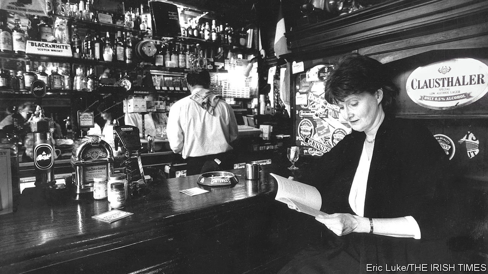

## Visions in the ordinary

# Eavan Boland died on April 27th

> The Irish poet who recovered and championed women’s voices was 75

> May 16th 2020

WHEN SUMMER nights were warm, Eavan Boland liked to stand in the front doorway of her small suburban house in Dundrum, outside Dublin. She would look at the buddleia, and at the lamplight glossing the leaves of the hedge. Yet these things were not simply visible to her. She saw them with her body. It was as if she was part of some great continuum, or stood in a place of myth, like the women singers she imagined in the hard west of Ireland whose mouths were filled with “Atlantic storms and clouded-over stars/and exhausted birds”.

This sense of communality, which led her to be one of Ireland’s finest poets, was essentially a woman’s feeling. And it was missing almost entirely from Irish poetry. There the voice was male, bardic, authoritative, grown sweet and self-confident on the flattery of princes. It was “I”, not “we”. The poet was a hero, a seer, a towering figure (Yeats above all), whose themes were history, epic and elegy. This was not a world for women. When they featured in the work they were mostly objectified, passive and silent. No page recorded “the low music/of our outrage”. Their own poems were not encouraged, as if they were women’s-magazine things that would defile the pure, visionary flow. If she were to write in the men’s style, with their assurance, she would fit right in, as she fitted into the clever literary conversations in the pubs round St Stephen’s Green when she was at Trinity College. But once she was married and the mother of two small daughters, happy if she could jot down just one line or one image, that was not her life.

Her days now revolved round cooking, washing up, nappies, feeds; lifting the kettle to the gas stove, setting her skirt over a chair to have it without creases for the morning. They were full of small untidinesses and oversights which assumed huge importance, like the loaf forgotten by the cash register, or washing left wet. They were full, too, of hidden satisfactions: a row of cups winking on their saucers, a copper pan well polished, fresh green celery feathers. Much of this was so ordinary that it might have seemed unremarkable. Certainly it was not named in Irish poetry. But ordinariness, “dailiness”, was precisely what she wanted to capture. The surfaces of things could barely hold what was under them; just as the small, routine gestures of many couples contained the unspoken steadfastness of love.

Other “women’s subjects” needed tackling more forcefully. She had no qualms about that. The whole poetic tradition had to be scrubbed and abraded with the wash stones of resistance. So an anorexic torched her witch-body, its “curves and paps” until, “thin as a rib”, she could slip back into Adam again, “as if I had never been away”. A menstruating woman confronted the moon, “dulled by it/thick with it…a water cauled by her light…barren with her blood.” Shockingly, a wife who believed “I was not myself, myself” in her everyday dutifulness felt herself remade when her husband, coming home tight, split her lip and knuckled her neck “to its proper angle”; and was grateful for his remodelling.

Yet the all-too-ordinary often slipped into something else. She was too deeply read in the myths and epics of Ireland for it to be otherwise. The life that was lived in a brick house could still have a visionary quality. In “Night Feed”, she noticed not only the rosy zipped sleeper, the hard suckling, the silt of milk left in the bottle, but the movements of earth and stars, and the “long fall from grace” as the feed ended. The stopping of the tumble-dryer, like death, began “to bury/The room in white spaces.” An old florin, brushed on a shelf, turned into a silver salmon.

That everyday life was also not remote from history. But she preferred to call it The Past: a place of shadows, fragments, defeats, rather than heroics. The Troubles appeared, through an ancient television set, as “grey and greyer tears” and “moonlight-coloured funerals”. Emigration to America was a woman in a gansy-coat on the deck of the Mary Belle, holding her half-dead baby to her. In “Quarantine” the worst year of the famine, 1847, was encapsulated in a couple found frozen, he still carrying her, holding her feet against his breastbone to try to warm them. Just two people’s deaths, how they had lived, what they had suffered,

Such themes were inevitable, for her discovery of her woman’s voice in poetry was meshed to her discovery of Ireland. She had left that home at the age of six, when her diplomat father was posted to London and then New York. When at 14 she returned, she did not know the secret language of the country, especially of Dublin, which she grew to love. As a woman she saluted “Anna Liffey” as the river rose in the hills above her house, flowing through black peat and bracken, then claiming and “retelling” the city for her, putting the pieces together, as she went on trying to.

Ireland, though, could still disappoint her. In 1991, when the monumental Field Day Anthology of Irish Writing came out, she was one of only three contemporary women poets included. Furious, she fired up her campaign for women to be noticed and, through poetry workshops, for poetry to be extended to all who had no voices. After 1996 a professorship at Stanford, alternating with trips home, allowed her to check on progress from abroad. By the 21st century, to her delight, women poets were flourishing in Ireland, and two new Field Day volumes were devoted to women’s writing. Though she never liked to take credit, she had been a voice and a constant encouragement; she had changed the conversation.