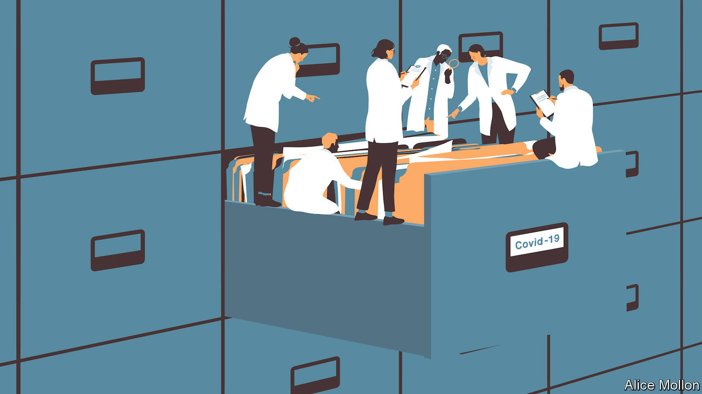

## Health data

# The pandemic has spawned a new way to study medical records

> It preserves confidentiality while liberating useful information

> May 14th 2020

Editor’s note: The Economist is making some of its most important coverage of the covid-19 pandemic freely available to readers of The Economist Today, our daily newsletter. To receive it, register [here](https://www.economist.com//newslettersignup). For our coronavirus tracker and more coverage, see our [hub](https://www.economist.com//coronavirus)

ON MAY 7TH an article appeared on medRxiv, an online repository for medical research. It showed, for England at least, the degrees to which SARS-CoV-2, the virus that causes covid-19, discriminates in its deadliness between various groups of people. Men are more likely to die than women. The old and the socially deprived more likely than the young, well-off and well-connected. Those with uncontrolled diabetes or severe asthma, more likely than those without. And members of the country’s ethnic minorities more likely than those of its white majority.

None of these, even the first (for men are more vulnerable than women to quite a wide range of infections), is exactly a surprise. Even the finding that current smokers actually have a lower risk of death from the illness than do non-smokers, though superficially arresting, is in line with the results of other studies that used different methods—though a possible protective effect on asthma patients of steroid inhalers looks worth following up. But the actual results of this study are not really the remarkable thing about it. That, according to its lead author Ben Goldacre, a clinician and data scientist at the University of Oxford, is the method of analysis by which they were obtained. Instead of extracting sensitive patient records from the databases of the company which manages them on behalf of general practitioners (GPs, Britain’s network of family doctors), the team behind the paper developed a suite of software that lets them run their massive analysis on the data in situ.

The research was carried out by studying the medical records of some 17m people on the books of GPs in England and the 5,683 covid-attributable deaths therein. GPs are the first port of call in England’s National Health Service (NHS) for any non-emergency matter, and thus hold the most complete records of patients’ health. Studying these at this scale and degree of detail, with individual records linked up to causes of death, has never been done before. Merely making plans to meddle with such primary-care data has been a cause of great national concern in Britain in the past. Dr Goldacre’s research was possible only because of the incentives created by the pandemic, and the ingenuity of the group of epidemiologists and data scientists he assembled, who call themselves the OpenSAFELY Collective.

In normal circumstances, merely obtaining permission to look at such a trove of sensitive health data would take months, perhaps years, of jumping through hoops held by ethics committees, computer-security checkers and so on. Running the analysis and getting it published might take months more. These are not, though, normal circumstances, and in fact it took OpenSAFELY a mere 42 days to go from idea to publication.

Three factors made this pace possible. The first is the existence of notices, signed by the country’s health minister, Matt Hancock, which give a wide range of people within the NHS broad licence to have access to and process health data in connection with fighting covid-19. These Control of Patient Information (COPI) notices make it much easier to get data wrangling done. Numerous people close to the government’s digital efforts to fight the disease tell tales of COPI notices being waved in the faces of anyone who offers resistance to a particular data transfer. The OpenSAFELY team was acting on behalf of the NHS, and so had the power of the COPI notice behind its actions, speeding its way.

More important though, was the political heft arrayed under the OpenSAFELY banner. Academic expertise on electronic health records was provided by a team at the London School of Hygiene and Tropical Medicine, renowned for such work. The nitty gritty was covered by the Phoenix Partnership (TPP), a British company which stores, on behalf of GPs, the electronic health records of some 50m people. And Dr Goldacre himself is one of Britain’s foremost medical glitterati. He was once a columnist on a national newspaper and has nigh-on half a million followers on Twitter. His personal brand completed the picture, along with the data scientists and coders at his Evidence-Based Medicine DataLab in Oxford.

The most important component of OpenSAFELY’s success, though, was its approach to the records themselves. It did not try to copy them, or move them out of TPP’s data centre for processing. Instead, its coders wrote software which let them perform their analysis within that data centre. Even then, Dr Goldacre’s crew were not given free rein to poke around inside TPP’s systems. Instead they wrote a series of programs which let them interrogate the patient records through a secure connection. A log was also kept of all queries that the group ran on the records—thus the watchers were themselves watched.

This combination, not requiring their own copies of a patient’s data and leaving a log of every action they took, made it easier to trust OpenSAFELY. Dr Goldacre’s system has even brought Britain’s fiercest privacy advocates on board. MedConfidential, a group that focuses on the confidentiality of medical records, has stated its support for this approach. “It was designed and built to promote both research and patient confidentiality at the same time, rather than suggesting they’re opposites,” says Sam Smith, one of the group’s co-founders. John Chisholm, who chairs the ethics committee of the British Medical Association, a doctors’ trade union, said that the study contained “hugely valuable information about risk factors” for death from covid-19.

This kind of research, mining medical records for patterns which might help serve the provision of health care, is still in its infancy. But it is most advanced in Britain, for two reasons. The first is that the single medical market of the NHS has created huge patient-record companies like TPP. The second is that the NHS’s norm of GPs being the first point of call for health care means that they have become a catch-all for medical data, and hold the richest, most unified data sets. In China, for instance, people tend to go directly to hospital when they are ill, rather than to visit a GP. Scandinavian countries do have joined-up records, and are often the subjects of medical-research projects for that very reason. But their small, homogenous populations make them less than ideal from a research perspective. The American system, meanwhile, is fragmented across a zillion private providers, though the health-care system of the Veterans Affairs department does have a large number of people in a unified arrangement.

For now, therefore, Britain remains ahead. Dr Goldacre says it is “the only country on the planet with the scale of data needed to deliver these analyses”. And new challenges are coming. The team will look at the impacts of covid-19 on children, and the potential protective effect of inhaled steroids. OpenSAFELY is also beginning to work with other health-record firms besides TPP, to extend the range of data available for analysis.

If OpenSAFELY’s approach continues to work as it is extended in this way, others will surely follow suit. Dr Goldacre and his collaborators have made this easy by leaving a trail of tools, in the form of open-source software that can be downloaded free, by anyone, from GitHub, a popular code repository. That code may be tweaked to run any query on any kind of database.

The broad adoption of this methodology would have big implications. Electronic-health-records systems would cease to be mere stores of data, and would start to become active pieces of the infrastructure underpinning medical research, shifting with the needs of science. This would be particularly important for the development of medical artificial intelligence, which requires large quantities of well-curated data in order to learn about ailments with sufficient accuracy.

Covid-19 will not last for ever. The cover of national emergency will eventually pass. Those who wish to study health records in future will need more specific justifications than the sweeping permissions offered by COPI notices. But the OpenSAFELY team has shown that it is possible to get interesting results without copying data and without asking anyone to trust them with a large, sensitive data set. In doing so, they may have made those justifications a little easier to find. ■

Dig deeper:For our latest coverage of the covid-19 pandemic, register for The Economist Today, our daily [newsletter](https://www.economist.com//newslettersignup), or visit our [coronavirus tracker and story hub](https://www.economist.com//coronavirus)