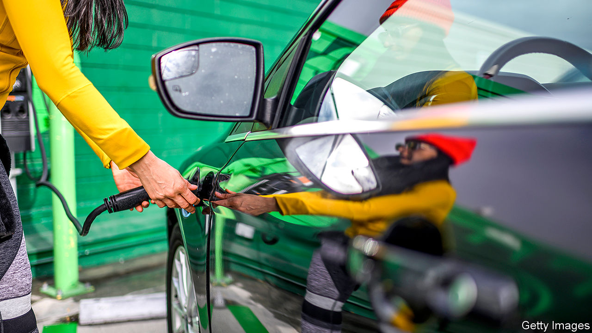

## Cutting the cord

# Wireless charging of electric cars looks increasingly promising

> No need for lots of cables

> May 14th 2020

THEY MAY BE facing extinction in the electric-transport revolution, but one benefit of cars with internal combustion engines is that they are easy and quick to refuel, so travelling a long way in one is rarely a problem. Not so for their successors. In the absence of universal standards, electric cars come with a variety of charging systems and different sorts of cables and sockets. Extended journeys therefore need careful planning to make sure that the battery is fully charged at the start and that compatible fast-charging stations are available en route.

It would be much more convenient if electric cars could be recharged wirelessly. Some electric toothbrushes and other small devices, such as mobile phones, can already be topped up in this way using a process called electromagnetic induction. This employs an alternating mains current flowing through a coil to create a varying magnetic field, which then generates another current in a second coil placed alongside it according to principles elucidated in the 19th century by Michael Faraday. The device containing the second coil then converts the transmitted power into direct current, which is used to recharge a battery.

As users of electric toothbrushes and phones will know, device and charger must be both close to each other and precisely aligned for this process to work. That is tricky to achieve with an electric car, which sits above the ground and requires higher levels of energy transfer.

These problems are being overcome with advances like that made by WiTricity, a firm based near Boston, Massachusetts. This company was founded in 2007 to commercialise the work of Marin Soljaèiæ and his colleagues at the Massachusetts Institute of Technology. Dr Soljaèiæ knew, in theory, that by having the transmitting and receiving coils resonate at the same frequency it should be possible to transfer greater amounts of energy over longer distances, and he sought to turn that knowledge to practical account. In one experiment, he and his colleagues sent enough power over a two-metre gap to illuminate a 60 watt bulb. They also did safety tests and found that transmission of this power could be done without harming people in the vicinity.

WiTricity is working with a number of carmakers and sold its first commercial system in 2018 to BMW, which fits it to some of its 530e hybrid cars. Alex Gruzen, WiTricity’s boss, expects further developments soon. He says the arrangement can transmit power from the grid to the car’s battery with an efficiency of up to 93%, which is similar to that achieved by a plug-in system. Nor does a car’s receiving coil have to be positioned directly above the charging pad on the ground—a useful feature of resonating coils being that they do not have to be so closely aligned to transmit power.

As to how much power can be transferred, and how quickly, this is a question of cost and design. For most uses at home, a wireless charger of 11 kilowatts might suffice. That would provide around 50km of range per hour of charging and cost around $2,000, says Mr Gruzen. At this price, he says, a wireless system would be competitive with plug-in home-charging units.

Another advantage of wireless recharging is what Mr Gruzen calls “power snacking”. This is topping up the battery when a car is stationary for a short time. The company provides systems to recharge taxis in this way while they wait in line, and to do the same for electric buses at bus stops. It is also possible to charge vehicles while they are on the move. That might make sense in places where vehicles often queue up, such as at airports, but Mr Gruzen does not think digging up motorways to install a charging lane is a realistic proposition.

Other companies are producing wireless-recharging systems which use various forms of magnetic-resonance induction. So far these are mostly for commercial vehicles, though such systems are bound to encourage the spread of the technology to cars as well. Momentum Dynamics, a Pennsylvanian firm, for instance, announced in March a deal to supply wireless rechargers to GreenPower Motor Company, a producer of electric shuttle buses.

Wireless recharging of electric trucks is also coming. In February, a team led by Omer Onar at the Oak Ridge National Laboratory, in Tennessee, demonstrated a 20 kilowatt set-up that thus takes three hours to recharge the 60-kilowatt-hour battery pack in a hybrid UPS delivery truck. The team have also developed a 120 kilowatt fast-charger, which Dr Onar says would be capable of wirelessly charging electric cars at a similar rate to a Tesla Supercharger, one of the fastest plug-in systems available.

Crucially, as did not happen for plug-in vehicles, standards are being developed that should, at least in theory, permit any suitably equipped electric vehicle to use any wireless charger. China recently ratified a set of national criteria similar to those being developed and promoted by industry groups in the West, including WiTricity. As China has been one of the countries most forcefully pushing the electrification of vehicles, its clout in the marketplace might ensure that most companies, foreign ones included, keep to the standards it has set. ■