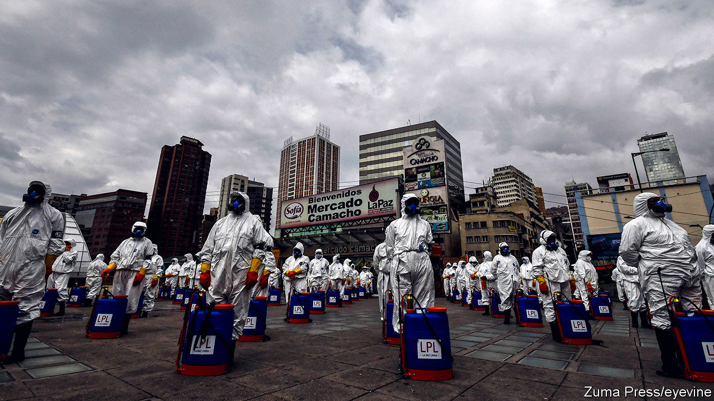

## In limbo

# Bolivia needs an election, but covid-19 makes that hard

> The opposition fears the interim president is using the pandemic to cement her power

> May 16th 2020

Editor’s note: The Economist is making some of its most important coverage of the covid-19 pandemic freely available to readers of The Economist Today, our daily newsletter. To receive it, register [here](https://www.economist.com//newslettersignup). For our coronavirus tracker and more coverage, see our [hub](https://www.economist.com//coronavirus)

ON APRIL 21ST, a month into Bolivia’s lockdown, police in riot gear swarmed the home of Patricia Arce, the mayor of Vinto, a city in the department of Cochabamba, and a senate candidate for the left-wing Movement to Socialism (MAS). Her family, their driver and a friend were celebrating her son’s 27th birthday with cake and chicha, a fermented-corn drink. All nine were jailed for two nights and charged with violating quarantine orders. 

Two weeks later, photos surfaced on Facebook of a birthday party in La Paz, Bolivia’s administrative capital, for the daughter of the country’s interim president, Jeanine Áñez, a conservative Catholic. Two guests had hitched a ride from Tarija, a department in the south, on an air-force jet. Ms Áñez’s critics accused her of hypocrisy. She had denounced such abuses of power by Evo Morales, her MAS predecessor, who resigned late last year after an attempt to rig his re-election led to protests in which at least 36 people died.

Ms Arce, as it happens, was a casualty of those protests. On November 6th, a mob of Mr Morales’s opponents dragged her from the town hall, cut her hair, doused her in red paint and paraded her through town. Ms Áñez’s rule-breaking birthday bash shows that, now that she is in power, the former opposition is “doing exactly what they criticised”, says Ms Arce. 

This tale of two festivities is a sign that last year’s wounds are still raw. To heal them, Bolivia was supposed to hold a re-run of presidential and congressional elections on May 3rd, free from the fraud that marred last October’s vote. The pandemic has postponed them. Ms Áñez has imposed one of Latin America’s strictest lockdowns, with harsh punishments for violators, and resisted setting a date for elections. She initially promised to leave office when a newly elected president took over. But in January she said that she would be among the candidates. Foes accuse her of misusing the pandemic to secure her hold on power. 

A fair election would either wrest from Ms Áñez the power she has amassed or legitimise her hold on it. The country needs such a vote to avoid a return of violence. But most people support her handling of the pandemic and are in no rush to vote. No one knows when the lockdown limbo will end. While it lasts, Bolivians will have to be on guard to ensure that Ms Áñez does not abuse the trust they have placed in her.

In Bolivia, a strict lockdown is the government’s “only weapon” against covid-19, says a diplomat. With a population of 11m, the country has only 430 intensive-care beds and 190 doctors qualified to treat patients who occupy them. Mr Morales, who benefited from a boom in natural-gas revenues during his 14-year presidency, spent money to reduce maternal and infant mortality. But he did little to strengthen the health system. Last year, as a pre-election ploy, he launched free universal health care. But he failed to budget for clinics, supplies and the 20,000 professionals needed to provide it, says Fernando Romero of Sirmes, the public-health workers’ union in La Paz. Doctors reacted by staging months of strikes. By May 13th this year, Bolivia had conducted just 13,605 tests for the virus, among the lowest rates in the region.

Under Ms Áñez’s lockdown rules just one person from each household is allowed out once a week, between 7am and noon. Some measures seem more political than protective. The decree establishing the lockdown, published on March 25th, criminalises “individuals who incite non-compliance” and “misinform or cause uncertainty to the population”. This has been used to prosecute dozens of “digital warriors”. Mauricio Jara, for example, downplayed the threat of the virus and called the government “dictatorial” on WhatsApp groups such as “Evo the Best”. He was charged with sedition and endangering public health, and jailed. On May 10th the government toughened the decree. Now information of “any form, whether written, printed or artistic”, that undermines the quarantine can lead to charges.

Such behaviour raises fears that Ms Áñez is replacing Mr Morales’s authoritarian rule with her own conservative version. “We need evidence that once the most critical stage of the pandemic is over, the government’s intention is to finish its mandate as soon as possible,” says Carlos Mesa, a centrist candidate for president. On April 30th the legislature, which is controlled by MAS, passed a law setting a deadline of August 2nd for elections. (The electoral tribunal had proposed a date between June 7th and September 6th.) Lawmakers from Ms Áñez’s party challenged the law in the constitutional court when the legislature overturned her veto. 

This, plus allegations of corruption in the defence ministry and the state oil and gas firm, has alienated critics of Mr Morales who had initially supported her. “During the honeymoon, we all looked the other way,” admits Raúl Peñaranda, a journalist. Forty-eight journalists issued a statement calling Mr Jara’s arrest illegal. Even Ms Áñez’s running-mate, Samuel Doria Medina, does not defend the part of the decree on which it was based. “Frankly, it was a mistake, absurd,” he says. “In a democracy you don’t do that kind of thing.” He blames the justice ministry, not Ms Áñez.

In parts of Bolivia, suspicion of her along with the deprivation caused by the lockdown are causing new outbreaks of violence. On April 30th protesters in El Alto, a poor neighbour of La Paz, threw stones at buses carrying medical workers. They were demanding new elections and an end to the lockdown. On May 11th security forces tear-gassed protesters in Cochabamba who were blocking roads and burning tyres. “If there’s no bread for the poor, there’s no peace for the rich,” one sign read.

MAS hopes to profit from such sentiments. It splintered after Mr Morales fled the country. Under his leadership from exile in Argentina it has lately become more united and strident. Luis Arce (no relation to Patricia), the party’s presidential candidate, is his pick. Some MAS politicians have suggested that the pandemic is an invention of the right. Mr Doria Medina accuses the party of exploiting privation.

Still, the malcontents are a minority. In a poll by Ipsos conducted on May 2nd-7th, 69% of respondents approved of Ms Áñez’s handling of the pandemic. The government has given grants to families and informal workers worth up to 500 bolivianos ($73) per person, which may help explain that support. Bolivians adhere to the lockdown more rigorously than citizens of any other Latin American country, according to data from Google Analytics. Two-thirds do not want elections to take place within the next 90 days. A survey by Ciesmori in April found that Ms Áñez led the eight presidential candidates, with 26% of voters planning to back her. Mr Arce was just behind at 24%. They may face each other in a run-off. 

Salvador Romero, the respected president of the electoral tribunal, plans to hold the election by the legislature’s August 2nd deadline, assuming the constitutional court does not overturn it. Bolivia cannot follow the example of richer countries that have spread out voting over several days or shifted to mail-in ballots, says Mr Romero. That would be a logistical nightmare. The commission plans to train poll workers in small groups. The vote itself will take place as usual, probably with hand sanitisers and face masks. Voting is mandatory, but many Bolivians may stay home unless they think the pandemic is under control. That may prompt the losers to challenge the legitimacy of the results. Bolivia is still a long way from a political cure. ■

Editor’s note: The Economist is making some of its most important coverage of the covid-19 pandemic freely available to readers of The Economist Today, our daily newsletter. To receive it, register [here](https://www.economist.com//newslettersignup). For our coronavirus tracker and more coverage, see our [hub](https://www.economist.com//coronavirus)