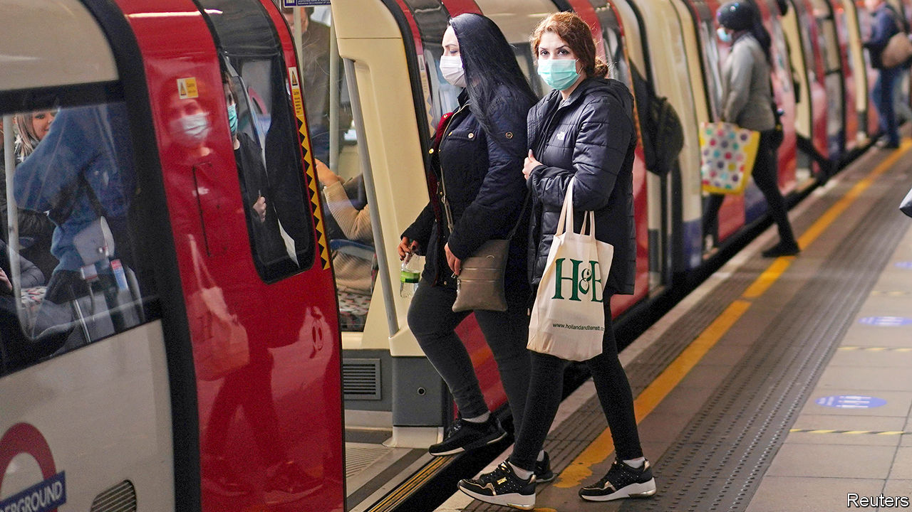
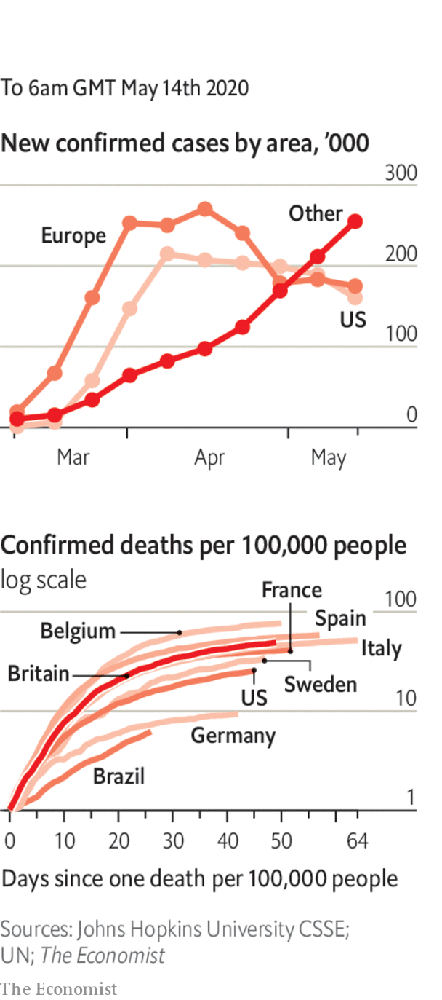

# Politics this week

> May 16th 2020

Boris Johnson, Britain’s prime minister, set out a path for easing lockdown in England. His message has changed from “stay at home” to “stay alert”. Restrictions will be eased in phases, depending on how quickly infections fall. Those who can’t work from home are urged to return cautiously to their jobs. Northern Ireland, Scotland and Wales published their own advice. See [article](https://www.economist.com//britain/2020/05/16/how-coronavirus-britain-looks-from-abroad).

France lifted many lockdown restrictions. Primary schools and nurseries have reopened. Most people are allowed to go back to work, with social distancing. Even hairdressers are operating again, but with compulsory masks and no coffee to chat over. See [article](https://www.economist.com//europe/2020/05/14/france-is-leaving-lockdown-now-the-trouble-begins).

New York state also took tentative steps towards reopening; three of its regions have met seven criteria, such as a 14-day decline in hospital admissions from covid. In Wisconsin the state Supreme Court ruled against the Democratic governor and overturned an extension to his stay-at-home order.

Anthony Fauci, an expert on infectious diseases who is advising the White House, told the Senate (via a video link) that rushing to end lockdowns before the pandemic has ended would result in more “suffering and death” and do more economic harm in the long run.

The governor of California, Gavin Newsom, said that ballot papers for November’s elections would be posted to all homes. Far fewer polling stations will open than normal.

William Barr, America’s attorney-general, astounded Washington by dropping the criminal case against Michael Flynn, DonaldTrump’s first national security adviser, who had pleaded guilty to misleading the Mueller inquiry. See [article](https://www.economist.com//united-states/2020/05/14/the-misrule-of-law).

Two advisers to Juan Guaidó, who is recognised by scores of democracies as Venezuela’s interim president, resigned after a failed attempt to topple the regime of Nicolás Maduro. One of them, Juan Rendón, a Miami-based member of the Venezuelan opposition, admitted negotiating a preliminary agreement with the American security firm behind the botched raid, but says he backed away from the plan. See [article](https://www.economist.com//the-americas/2020/05/14/nicolas-maduro-celebrates-a-farcical-attempt-to-remove-him-from-power).

Moisés Escamilla May, a leader of Los Zetas, a Mexican drug gang, died in prison of covid-19. He was serving a 37-year sentence for crimes, including beheading 12 people in Yucatán. Mr Escamilla supplied cocaine to Cancún.

Avianca, Colombia’s main airline, filed for bankruptcy protection in New York. Founded in 1919, it claims to be the world’s second-oldest continuously operating airline. Its boss blamed covid-19.

India’s government said it would spend $266bn (10% of GDP) on stimulus measures to diminish the economic damage done by its covid-19 lockdown. Around 120m Indians have lost their jobs over the past two months.

Terrorists attacked a maternity ward in Afghanistan, killing 24 people including mothers, babies, medics and a policeman. A suicide-bomber killed 32 mourners at a funeral. The Taliban denied responsibility for both attacks, but the government ordered the army to go back on the offensive, after a period in which it had sought to reduce violence.

Indian and Chinese soldiers brawled at two different spots along the two countries’ long and ill-defined border. See [article](https://www.economist.com//asia/2020/05/16/the-chinese-and-indian-armies-settle-a-clash-by-fisticuffs).

China announced a ban on imports of meat from four abattoirs in Australia, citing “food safety”. In unrelated news, Chinese officials are furious that Australia is calling for an international probe into the origins of covid-19. China also threatened to impose a tariff of over 80% on Australian barley in response to alleged dumping.

Donald Trump’s administration said work visas given to Chinese journalists would have to be renewed every 90 days. Previously they were open-ended. Liberals fretted that America cannot outdo a dictatorship in curbing reporting, and should not want to.

China warned France not to sell weapons to Taiwan, which is seeking an upgrade of French-made warships it bought in 1991. France said it respected its contractual obligations to Taiwan.

A missile fired by an Iranian naval vessel mistakenly struck an Iranian support ship, killing 19 sailors.

The IMF agreed to lend Egypt $2.8bn to help it cope with the economic fallout from covid-19. “The global shock has resulted in a tourism standstill, significant capital flight, and a slowdown in remittances,” said the fund. Meanwhile, President Abdel-Fattah al-Sisi approved changes to Egypt’s state of emergency that grant him and the security services more power. Human-rights groups say he has used the pandemic to tighten his grip.

Ethiopian troops accidentally shot down a Kenyan plane carrying humanitarian supplies to Somalia, according to a leaked report of the incident.

Three UN peacekeepers were killed when a UN convoy in northern Mali hit a roadside bomb. The peacekeeping mission is the UN’S most dangerous ongoing operation.

The Chinese city of Wuhan, which recently ended a stringent lockdown, recorded its first new infections since early April. South Korea, which had also largely brought the epidemic under control, reported a cluster of new cases linked to nightclubs in Seoul. See [article](https://www.economist.com//asia/2020/05/16/infections-at-nightclubs-mar-south-koreas-relaxation-of-restrictions).

Lebanon reimposed its lockdown after a spike in covid-19. The government has faced widespread protests recently. It blamed people who ignore social-distancing rules.

Brazil recorded its highest daily death toll. It is the sixth-worst affected country by cases and fatalities.

Disneyland Shanghai reopened for business after shutting for three months. The limited number of visitors must have a digital health code.

The White House ordered everyone in the building to wear a face mask, except Donald Trump and Mike Pence.

## URL

https://www.economist.com/the-world-this-week/2020/05/16/politics-this-week
