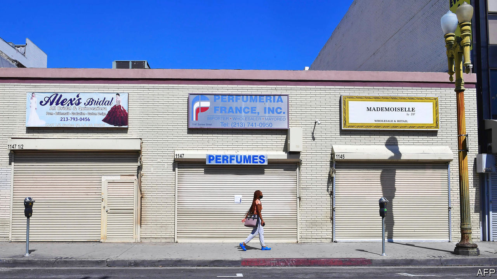
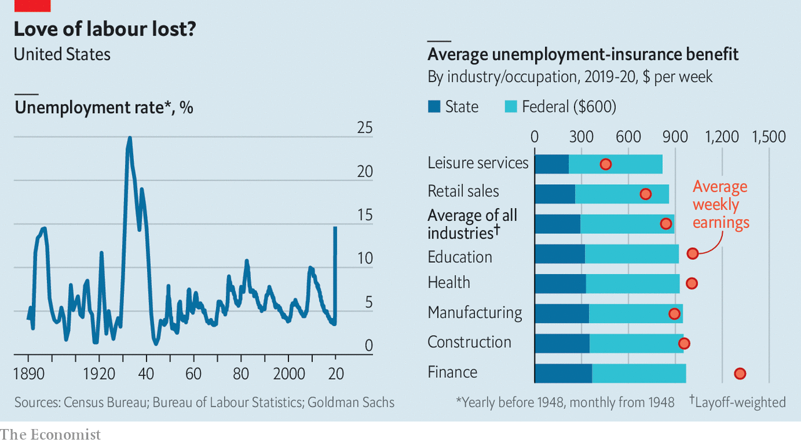

## Unemployment insurance

# Inefficiencies bedevil America’s response to soaring joblessness

> America’s welfare system is creaking

> May 16th 2020

Editor’s note: The Economist is making some of its most important coverage of the covid-19 pandemic freely available to readers of The Economist Today, our daily newsletter. To receive it, register [here](https://www.economist.com//newslettersignup). For our coronavirus tracker and more coverage, see our [hub](https://www.economist.com//coronavirus)

EILEEN SHEPPARD has been cutting hair professionally for 20 years. Now 39, she lives in a small town in upstate New York, and lost her livelihood when Andrew Cuomo, the state’s governor, shut down hair salons and other personal-care businesses on March 20th. Millions have found themselves in a similar position, pushing America’s unemployment rate to an 80-year high (see left-side chart). As elsewhere, New York’s computer systems could not handle the rush of applications for unemployment insurance (UI). Ms Sheppard spent hours each day refreshing the site, which kept crashing and losing the information she had entered, while trying to care for her son, who was out of school (her husband was at his job hours away). She eventually managed to apply, but nearly two months after she lost her job she has received no money—just a letter with further application instructions.

So rapid a rise in unemployment would stress any country’s UI system. Some, such as Britain’s, have coped surprisingly well. America’s has not. The federal government funds the administration of these benefits through grants tied in part to how much each state paid in UI claims in the previous year. America’s long economic expansion left its system woefully underfunded. So although the weekly $600 top-up that Congress approved in late March is nominally generous, millions of people have not had their money. Preliminary data analysed by The Economist suggest that up to 15m Americans who applied for UI in March and April had not received money by the start of May.

Compounding these administrative problems are looming political battles. The $600 booster expires at the end of July. Worries that America’s UI system is too generous and discourages work are growing on the right.

Like much else in America, UI is less one system than dozens, held together with some federal glue. It is intended to replace a share of lost wages while a recipient looks for work. Democrat-run states in the north-east tend to be more generous than Republican-run southern states, but overall, pre-pandemic America had perhaps the rich world’s stingiest system. The average payout in 2019 was equivalent to about 40% of previous earnings. Tough rules ensured that only those diligently seeking work would be granted welfare, and payouts were strictly time-limited.

Now America may have the world’s most generous system. Work-search requirements have been waived—rightly so, since people should be at home rather than pounding the pavement—and states have extended time limits on payouts. Workers deemed ineligible for ordinary UI, because they are self-employed, business owners or have an irregular work history, can now apply for benefits. And the extra $600 a week means that some can expect a hefty pay rise (see right-side chart). Goldman Sachs, a bank, estimates that three-quarters of laid-off workers are in line to receive benefits that exceed their former wage. Payments may be slow to arrive, but workers will in theory receive back-pay when their claims are finally processed.

The creation of some odd economic incentives was, to an extent, unavoidable. The states’ UI systems are archaic, relying on programming languages devised as long ago as 1959, making it impossible to tailor payouts more sharply. Hence the flat $600-a-week boost, which is, roughly, the difference between the national average weekly wage in 2019 ($970) and the average unemployment payout that year ($370). Giving some workers more money than they had earned in a job may not be the best use of public resources, but the people who benefit most are likely to be among America’s poorest. And the money thus “wasted” (about $80bn, on the highly unrealistic assumption that 30m workers are on the programme for an entire year) would amount to just 3% of America’s total fiscal stimulus.

Anyone hoping to game the benefits system is likely to be disappointed. Regulations are designed to foil people who quit a job in order to pick up an unemployment cheque. Having to quarantine because of household illness or care for a dependant with covid-19 will not cause anyone to lose their UI; refusing to work out of a general fear of illness will. Some reopening states, including Iowa, Ohio and Texas, encourage employers to report workers who refuse a job offer, disqualifying them from benefits.

Some economists want the government to do more to encourage employers to reduce working hours rather than laying people off—especially useful when businesses are allowed to reopen but face weak demand. With such programmes, explains Annelies Goger of the Brookings Institution, a think-tank, workers “don’t get the message that they’ve lost their jobs. They get the message that things are on pause.” Just over half of American states have short-term-work programmes, with UI covering the lost hours, but take-up had been low. Since the pandemic began take-up has increased, and Michigan has expanded its programme; workers in the schemes remain eligible for supplemental benefits. Katharine Abraham at the University of Maryland points to research suggesting that merely raising employers’ awareness of such programmes could make a big difference.

Another option would be to prolong the more generous unemployment system past July. Michael Bennet, a Democratic senator from Colorado, has proposed extending the current level of federal UI until the public-health emergency ends, and then gradually reducing benefits. But at some point such payouts will hinder the economic recovery, in particular the reallocation of workers from declining sectors to up-and-coming ones. Some research has indicated that a reduction in unemployment benefits in 2014-15 helped kick-start America’s pre-pandemic jobs boom.

Most probably, the unemployment system will return to its pre-pandemic ways sooner rather than later. Lindsey Graham, a Republican senator, has said the $600-a-week programme would be extended “over our dead bodies”. The economy is reopening and bosses are looking for workers. Congressional Republicans have pressed for broader protections for employers, similar to those given by President Donald Trump to the meat industry, which would shield them from liability for covid-related deaths provided they follow minimum federal safety standards. Democrats may reluctantly fall in line in exchange for more state and local aid in the next round of relief. Before long, many American workers will face unpalatable choices. ■

Dig deeper:For our latest coverage of the covid-19 pandemic, register for The Economist Today, our daily [newsletter](https://www.economist.com//newslettersignup), or visit our [coronavirus tracker and story hub](https://www.economist.com//coronavirus)

## URL

https://www.economist.com/united-states/2020/05/16/inefficiencies-bedevil-americas-response-to-soaring-joblessness
