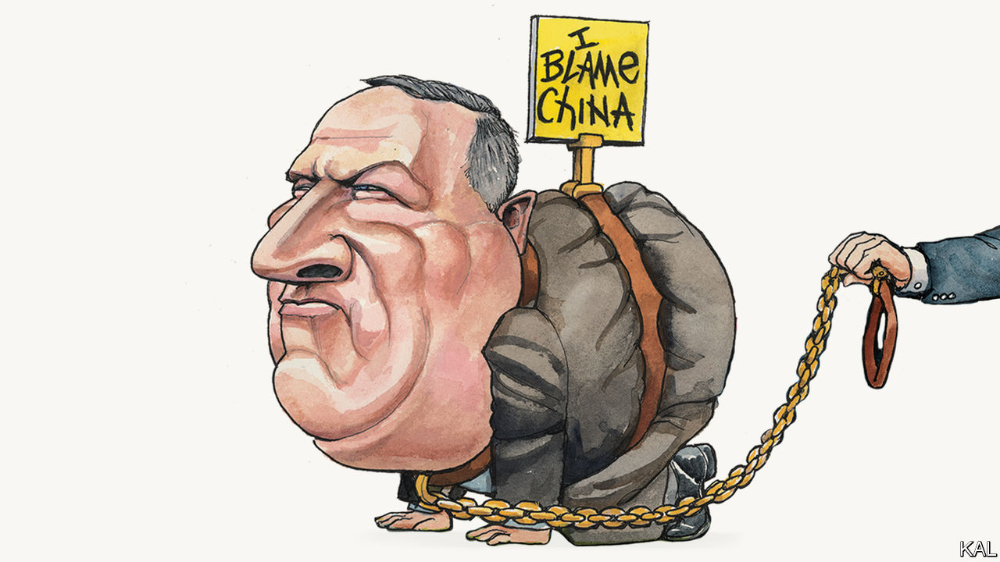

## Lexington

# Mike Pompeo’s politicisation of foreign policy is unworthy of him

> The secretary of state is confusing global leadership with bashing his opponents

> May 16th 2020

Editor’s note: The Economist is making some of its most important coverage of the covid-19 pandemic freely available to readers of The Economist Today, our daily newsletter. To receive it, register [here](https://www.economist.com//newslettersignup). For our coronavirus tracker and more coverage, see our [hub](https://www.economist.com//coronavirus)

FOR A MAN acknowledged to be highly intelligent, Mike Pompeo has a long history of talking nonsense. As a greenhorn House member, brought to Congress by the Tea Party wave of 2010, he made his name by pushing conspiracy theories about Hillary Clinton. He claimed, without evidence, that she was complicit in the murder of four Americans at an outpost in Benghazi, Libya, to a degree that was “worse, in some ways, than Watergate”. As Donald Trump’s secretary of state, he has encouraged a comparison, popular with Trump-loving evangelicals, between the irreligious president and the Jewish heroine Esther. His recent insistence that covid-19 probably emerged from a Chinese laboratory—a conclusion American spies appear not to share—was of this pattern.

The world has taken that into account. While Mr Pompeo has enraged the Chinese, hardly anyone else outside the Republican base seems to have taken his allegation all that seriously. The other half of America discounted it on the basis that Mr Pompeo said it. Officials in Australia, Germany and elsewhere similarly cast doubt on it. It is hard to think the words of any previous American chief diplomat, a role traditionally considered supra-partisan to a degree, have carried less weight.

Yet, in an administration of mediocrities, Mr Pompeo remains a substantial figure. He is one of its last significant talents. Even his critics note his smarts—famously displayed in a stellar record at West Point and Harvard Law School—and policy seriousness. His articulation of an America First foreign policy that engages with the world consistently but sceptically is a fair stab at making Trumpism coherent. Mr Pompeo, contrary to the impression he sometimes gives, is a serious grown-up, who has at least grudging respect from many in the foreign-policy establishment. His basic vision, of a confident America working with allies, is pretty standard foreign policy, suggests Leon Panetta, a former Democratic CIA director and defence secretary.

At the same time, almost uniquely among those who are neither related to the president nor rich, he has managed to retain Mr Trump’s confidence. Since the sacking of John Bolton eight months ago, he has been the administration’s foreign-policy tsar. Mark Esper and Robert O’Brien, the defence secretary and national security adviser, are nonentities by comparison.

Hence his recent prominence, haranguing China and Afghanistan’s feuding leaders and this week flying to Israel to discuss annexation and Iran. Along the way he has secured a few small but worthwhile successes. America’s capitulation to the Taliban would have been even more hasty had Mr Pompeo not opened a diplomatic effort with Pakistan to slow it. This is a more nuanced record than Mr Pompeo’s conspiracy-theorising might suggest.

At the root of this is that he holds, and on occasion pushes, fairly conventional conservative views, yet is more willing to defer to Mr Trump than were Mr Bolton or any of the president’s other discarded advisers. Like Jim Mattis and John Kelly, the secretary of state has a bullish military manner that the president loves. But unlike the generals, Mr Pompeo, who served in the army for only a few years, is always ready to take orders. His China-baiting, an obvious effort to distract from Mr Trump’s struggles with the pandemic, was a case in point. So, too, the many times he has found the words to defend presidential impulses he clearly abhorred: such as Mr Trump’s threatened troop withdrawal from Syria.

Two particular reasons seem to explain Mr Pompeo’s flexibility. One is personal. After a promising early career, he spent 12 years in Kansas on a series of undistinguished business ventures. He then came to Washington, DC, hungry to make up for lost time. His attacks on Mrs Clinton were a statement of intent. Yet his subsequent climb is mainly due to Mr Trump’s need for fresh faces for an administration that many Republicans were unwilling to join or, because of past criticism of the president, unwelcome in. Mr Pompeo could not otherwise have soared from a little-known congressman to a front-ranker with realistic presidential ambitions. No one in the administration owes Mr Trump more than he does.

The other explanation is that Mr Pompeo represents a broader politicisation of foreign policy, which predates Mr Trump. In 2013 he and Tom Cotton, then a fellow House member but since elected to the Senate, wrote a column urging Republicans to grant Barack Obama’s request for congressional support for an attack on Syria. It is hard to imagine them—two ultra-partisan Republicans—supporting any Democratic initiative now. This seepage of partisanship into one of the few remaining holdouts was perhaps inevitable. Yet it has accelerated under Mr Trump, in part because blaming the other side is the easiest way for establishment Republicans to justify his protectionism and other offences against conservative orthodoxy. It is no coincidence that Mr Pompeo’s signature concern, his extreme hostility to the Iranian regime and the nuclear deal Mr Obama made with it, is one of the most polarising there is. This makes it an issue the secretary of state might privately cite, if he ever felt the need back in Kansas one day, to justify any number of compromises for Mr Trump.

The hyper-partisanship of foreign policy Mr Pompeo has come to represent is a dreadful lookout, unworthy of his talents. It carries a risk of endless instability, with successive administrations seeking to undo their predecessors’ legacy, just as Mr Trump has sought to dismantle Mr Obama’s. It also introduces a new rationale for American diplomacy as far removed from its expansive, globally minded strengths as it is possible to imagine. This wretched moment exemplifies that. On current form, Mr Pompeo will not be remembered for squeezing Iran. He will be remembered for undercutting the world’s reasonable case against China’s handling of the virus by throwing mud for his boss in the midst of a pandemic. That is not American leadership.■

Editor’s note: The Economist is making some of its most important coverage of the covid-19 pandemic freely available to readers of The Economist Today, our daily newsletter. To receive it, register [here](https://www.economist.com//newslettersignup). For our coronavirus tracker and more coverage, see our [hub](https://www.economist.com//coronavirus)

## URL

https://www.economist.com/united-states/2020/05/16/mike-pompeos-politicisation-of-foreign-policy-is-unworthy-of-him
