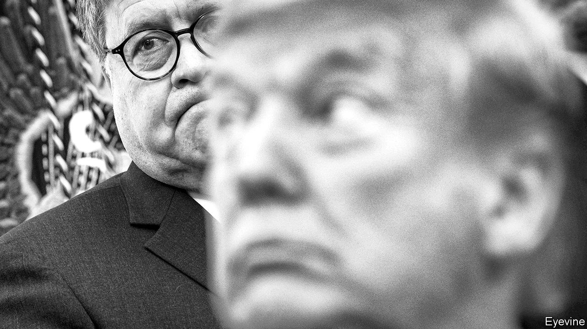

## William Barr’s Justice Department

# The misrule of law

> Donald Trump has found his Roy Cohn, alas

> May 14th 2020WASHINGTON, DC

“WHERE’S MY Roy Cohn?” President Donald Trump asked in early 2017, after Jeff Sessions, his first attorney-general, recused himself from the probe into Russian election-meddling. Mr Sessions explained that, since he was involved with the campaign, he should not be involved in any campaign investigation.

Mr Trump had no patience for such qualms. He wanted a man who would serve his interests as the legendarily fierce Cohn, a private lawyer in New York, had done—and as he believed Robert Kennedy had done for his brother John, and Eric Holder had done for Barack Obama. In William Barr (pictured behind the president), Mr Sessions’s replacement, Mr Trump seems to have found what he sought.

The attorney-general is America’s top law-enforcement officer, presiding over the Department of Justice (DoJ). Partly by statute, but mostly by norm and practice, both the DoJ and its boss, particularly since Watergate, maintain a degree of independence from the president, unlike other cabinet departments. This independence is not absolute, nor could it be when the president appoints, and can fire, the attorney-general, his two top deputies, those leading the department’s divisions and the prosecutors heading each of the 93 US attorneys’ offices around America and its territories.

To some extent, every president’s DoJ reflects his policy preferences and priorities. Mr Obama’s vigorously pushed to expand voting rights and civil-rights protections, for instance, and George W. Bush’s filed more briefs favouring religious liberty than Mr Obama’s.

But the department also defends settled federal law, and its career lawyers pride themselves on defending statutes they may disagree with politically. Mr Obama’s DoJ, for instance, backed the Defence of Marriage Act, which defined marriage as a union between a man and a woman, even though Mr Obama had called for its repeal. Mr Sessions upended this norm: his DoJ refused to back the Affordable Care Act’s constitutionality. A former department lawyer says this reversal was “unheard of”.

Since Watergate, most attorneys-general and the department’s civil servants have jealously guarded their remove from politics. As a veteran of its civil-rights division explains, “Most of the people who work there, and it’s true of me too, believe in the mission of representing the United States. We believe that justice should be carried out even-handedly. That’s what it means to have a democracy.” During her confirmation hearings Loretta Lynch, Mr Obama’s second attorney-general, repeatedly promised independence. Griffin Bell, Jimmy Carter’s first—and the first truly post-Watergate one—screened all communication from the White House “to insure that any improper attempts to influence a decision” did not reach senior officials.

Mr Trump brushes aside such niceties. “I have an Article 2,” he has said, referring to the constitution’s article which vests executive power in the president, “where I have the right to do whatever I want as president.” Norms and judicial precedent disagree. But Mr Barr has long held a similarly maximalist view of executive power.

Months before his appointment he wrote a memo to Rod Rosenstein, then the deputy attorney-general, explaining that the probe into Russian meddling “cannot provide a legitimate basis for interrogating the president,” because, in Mr Barr’s view, “the President alone constitutes the Executive branch,” has “all-encompassing” authority over federal law enforcement and cannot commit obstruction of justice through the lawful exercise of his power—such as firing an official involved in an investigation into presidential misconduct.

Since taking over, Mr Barr has stated that the Russia probe was “one of the greatest travesties in American history,” launched “without any basis…to sabotage the presidency.” The DoJ’s independent inspector-general found the investigation justified, and executed without bias. That did not mollify Mr Barr, who has assigned John Durham, a federal prosecutor, to look into its (well-established) origins.

He has intervened to press for a lighter sentence for Roger Stone, a Trump campaign adviser convicted of witness-tampering and lying to Congress. On May 7th he dropped a case against Michael Flynn, Mr Trump’s former national security adviser. The DoJ argued that it could not “prove its case beyond a reasonable doubt”—despite the fact that Mr Flynn had pleaded guilty and accepted responsibility in open court for lying to federal investigators. But his unusual move has encountered unusual resistance: the sentencing judge has appointed a former prosecutor to oppose the DoJ’s motion, and may even be mulling a perjury charge against Mr Flynn.

Both of those decisions by Mr Barr prompted DoJ lawyers to withdraw from the cases they helped prosecute. Mr Trump is now pushing an “Obamagate” theory that Mr Obama and his vice-president, Joe Biden, orchestrated the Russia investigation to hobble him.

Many worry that the next step will be using the DoJ to pursue Mr Trump’s enemies. More than 2,000 former employees have signed a letter calling on Mr Barr to resign, and for Congress to censure him for his “repeated assaults on the rule of law”. The civil-rights-department veteran says that morale has plummeted. “People I talk to [at the DoJ] feel like the institution is being damaged…The notion that government lawyers act in a non-partisan way to enforce the law is being assaulted.” Such damage is much easier done than undone. ■

## URL

https://www.economist.com/united-states/2020/05/14/the-misrule-of-law
