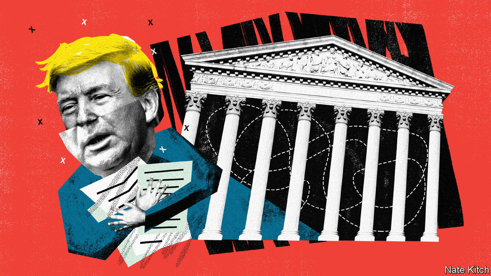

## Donald Trump’s finances

# The Supreme Court will not agree on the president's taxes

> Donald Trump could yet keep his finances out of the newspapers

> May 14th 2020NEW YORK

THE SEPARATION of powers, the founders’ bulwark against tyranny, is not what it might seem. As James Madison explained in the Federalist Papers No. 47, the idea is not to keep the legislative, executive and judicial departments “absolutely separate and distinct”. Rather, Madison wrote, each must exercise a measure of “control” or “agency” over its fellow branches. Negotiating the overlapping portions of the Venn diagram has often fallen to the judiciary, as it did on May 12th, when the Supreme Court took up two challenges to President Donald Trump’s quest to keep his taxes and other financial records secret.

Mr Trump is the first president since Richard Nixon to refuse to share at least some tax information with the American people. But in April 2019, with the Democrats back in control of the House of Representatives, three congressional committees subpoenaed years of papers from Mr Trump’s banks and his accounting firm. A few months later Cyrus Vance, Manhattan’s district attorney, sought similar records for a grand-jury investigation into Mr Trump’s alleged hush-money payoffs to an adult film star and a Playboy model before the election in 2016. Lower courts rejected Mr Trump’s pleas to block the subpoenas, leaving the nine justices with the final say.

The first pair of cases, argued by telephone (the court is not meeting in person during the pandemic), concerned House subpoenas to Capital One and Deutsche Bank, two of Mr Trump’s lenders, and Mazars USA, his accountant. The Oversight Committee had demanded documents to help it consider revising government ethics laws. The Intelligence and Financial Services Committees said they wanted to investigate money-laundering and foreign interference in the 2016 election.

Patrick Strawbridge, Mr Trump’s lawyer, described the House efforts as a “dragnet”. He seemed to raise the eyebrows of Chief Justice John Roberts, though, when he cast doubt on all congressional oversight of presidents. “Quite frankly,” Mr Strawbridge said, “the House has limited powers to regulate the presidency itself.” Jeff Wall, supporting Mr Trump from the Department of Justice, added that the subpoenas were designed to “undermine the president” and the House had not “even come close” to explaining why it needs the documents.

The House’s lawyer, Douglas Letter, seemed to have precedent on his side. In 1927 the court observed that the “power to secure needed information…has long been treated as an attribute of the power to legislate.” And in 1974 it unanimously ordered Nixon to comply with a subpoena for his White House tapes. But when pressed to identify a limit on Congress’s subpoena power, Mr Letter faltered. Justice Samuel Alito, one of the court’s most skilful questioners, backed him into a Socratic corner. There is “really no protection”, he asked, “preventing the harassment of a president”, because subpoenas require only a “conceivable legislative purpose, and you can’t think of a single example of a subpoena that wouldn’t meet that test?”

Justice Elena Kagan sought to elicit more persuasive responses from Mr Letter and vividly depicted Mr Trump’s request as placing a “ten-ton weight on the scales between the president and Congress”. Yet even Justice Stephen Breyer, a member of the liberal wing, worried that the House subpoenas might be unduly burdensome. He was bothered, he said, by the prospect of a red-baiting “future Senator McCarthy” haranguing “a future Franklin Roosevelt”.

When rulings arrive this summer, Mr Trump may win a majority in Trump v Mazars—keeping his finances out of the newspapers, for now. But he seems likely to lose Trump v Vance, the clash over the New York subpoena (if so, only the grand jury would be privy to Mr Trump’s records while he remains in office). In Vance, Jay Sekulow, Mr Trump’s lawyer, offered a royalist vision of the presidency shielded by “absolute immunity” from criminal investigation. But he struggled to explain how, in 1997, the court could unanimously order Bill Clinton to appear for depositions in a sexual-harassment suit, whereas a grand jury probing Mr Trump’s alleged payoffs to paramours was constitutionally barred from peeking at the president’s papers.

Noel Francisco, the solicitor-general, defended Mr Trump on somewhat less outlandish grounds. Carey Dunne, ably representing Mr Vance, argued that the investigation was “well within the scope of legal process permitted by this court” since 1807. If the justices side with Mr Trump, Mr Dunne warned, presidents may wind up unchecked and “above the law”. ■