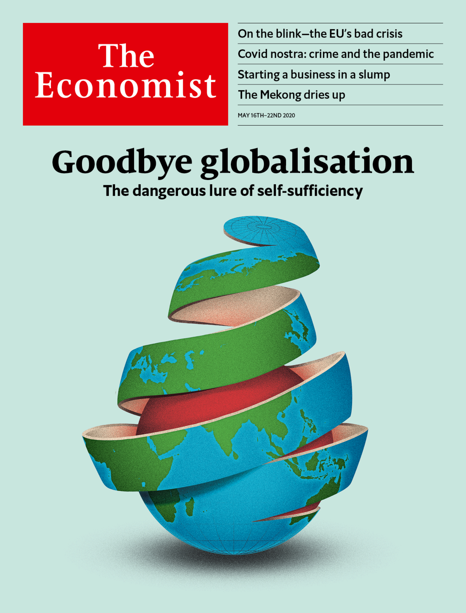

## Has covid-19 killed globalisation?

### The world this week
#### [Politics this week](./The%20world%20this%20week/politics-this-week.md)
#### [Business this week](./The%20world%20this%20week/business-this-week.md)
#### [Kals cartoon](./The%20world%20this%20week/kals-cartoon.md)
### Leaders
#### [Has covid 19 killed globalisation](./Leaders/has-covid-19-killed-globalisation.md)
#### [The european union is having a bad crisis](./Leaders/the-european-union-is-having-a-bad-crisis.md)
#### [Dont rely on contact tracing apps](./Leaders/dont-rely-on-contact-tracing-apps.md)
#### [When lockdowns end governments will have to free labour markets](./Leaders/when-lockdowns-end-governments-will-have-to-free-labour-markets.md)
#### [If china wont build fewer dams it could at least share information](./Leaders/if-china-wont-build-fewer-dams-it-could-at-least-share-information.md)
### Letters
#### [Letters to the editor](./Letters/letters-to-the-editor.md)
### Briefing
#### [The covid 19 pandemic puts pressure on the eu](./Briefing/the-covid-19-pandemic-puts-pressure-on-the-eu.md)
#### [Covid 19s blow to world trade is a heavy one](./Briefing/covid-19s-blow-to-world-trade-is-a-heavy-one.md)
#### [Businesses are proving quite resilient to the pandemic](./Briefing/businesses-are-proving-quite-resilient-to-the-pandemic.md)
### Asia
#### [South east asias biggest river is drying up](./Asia/south-east-asias-biggest-river-is-drying-up.md)
#### [The chinese and indian armies settle a clash by fisticuffs](./Asia/the-chinese-and-indian-armies-settle-a-clash-by-fisticuffs.md)
#### [Infections at nightclubs mar south koreas relaxation of restrictions](./Asia/infections-at-nightclubs-mar-south-koreas-relaxation-of-restrictions.md)
#### [Taiwans courts may decriminalise adultery](./Asia/taiwans-courts-may-decriminalise-adultery.md)
#### [Sri lankas new president is putting soldiers in charge of everything](./Asia/sri-lankas-new-president-is-putting-soldiers-in-charge-of-everything.md)
### China
#### [In china covid 19 has focused attention on mental health](./China/in-china-covid-19-has-focused-attention-on-mental-health.md)
#### [Why there are two panchen lamas and one is missing](./China/why-there-are-two-panchen-lamas-and-one-is-missing.md)
#### [A small town in china makes half of japans coffins](./China/a-small-town-in-china-makes-half-of-japans-coffins.md)
### United States
#### [Inefficiencies bedevil americas response to soaring joblessness](./United%20States/inefficiencies-bedevil-americas-response-to-soaring-joblessness.md)
#### [Two leading economists disagree about the flagging american dream](./United%20States/two-leading-economists-disagree-about-the-flagging-american-dream.md)
#### [The supreme court will not agree on the presidents taxes](./United%20States/the-supreme-court-will-not-agree-on-the-presidents-taxes.md)
#### [Last call for irish pubs](./United%20States/last-call-for-irish-pubs.md)
#### [The misrule of law](./United%20States/the-misrule-of-law.md)
#### [Mike pompeos politicisation of foreign policy is unworthy of him](./United%20States/mike-pompeos-politicisation-of-foreign-policy-is-unworthy-of-him.md)
### The Americas
#### [Bolivia needs an election but covid 19 makes that hard](./The%20Americas/bolivia-needs-an-election-but-covid-19-makes-that-hard.md)
#### [Nicolas maduro celebrates a farcical attempt to remove him from power](./The%20Americas/nicolas-maduro-celebrates-a-farcical-attempt-to-remove-him-from-power.md)
#### [Looking back on perus shining path](./The%20Americas/looking-back-on-perus-shining-path.md)
### Middle East & Africa
#### [Why covid 19 seems to spread more slowly in africa](./Middle%20East%20&%20Africa/why-covid-19-seems-to-spread-more-slowly-in-africa.md)
#### [Covid 19 helps ballot dodgers in africa](./Middle%20East%20&%20Africa/covid-19-helps-ballot-dodgers-in-africa.md)
#### [Ethiopia is entering constitutional limbo](./Middle%20East%20&%20Africa/ethiopia-is-entering-constitutional-limbo.md)
#### [Trouble in bashar al assads own ranks](./Middle%20East%20&%20Africa/trouble-in-bashar-al-assads-own-ranks.md)
#### [Friendly jews female bosses saudi tv promotes a new vision](./Middle%20East%20&%20Africa/friendly-jews-female-bosses-saudi-tv-promotes-a-new-vision.md)
### Europe
#### [France is leaving lockdown now the trouble begins](./Europe/france-is-leaving-lockdown-now-the-trouble-begins.md)
#### [Is swedens approach to covid 19 wise or reckless](./Europe/is-swedens-approach-to-covid-19-wise-or-reckless.md)
#### [No one knows how many people live in north macedonia](./Europe/no-one-knows-how-many-people-live-in-north-macedonia.md)
#### [Nato is facing up to russia in the arctic circle](./Europe/nato-is-facing-up-to-russia-in-the-arctic-circle.md)
#### [The enduring influence of kraftwerk](./Europe/the-enduring-influence-of-kraftwerk.md)
### Britain
#### [How coronavirus britain looks from abroad](./Britain/how-coronavirus-britain-looks-from-abroad.md)
#### [The alarming popularity of prehistoric dentistry](./Britain/the-alarming-popularity-of-prehistoric-dentistry.md)
#### [How post brexit immigration rules will exclude key workers](./Britain/how-post-brexit-immigration-rules-will-exclude-key-workers.md)
#### [The cost of the pandemic to britains economy is becoming clear](./Britain/the-cost-of-the-pandemic-to-britains-economy-is-becoming-clear.md)
#### [The pandemic has exposed flaws in public health england](./Britain/the-pandemic-has-exposed-flaws-in-public-health-england.md)
#### [Why teachers are doing so little teaching](./Britain/why-teachers-are-doing-so-little-teaching.md)
#### [Trade unions are back](./Britain/trade-unions-are-back.md)
### International
#### [The pandemic is creating fresh opportunities for organised crime](./International/the-pandemic-is-creating-fresh-opportunities-for-organised-crime.md)
### Business
#### [America inc faces a wave of bankruptcies](./Business/america-inc-faces-a-wave-of-bankruptcies.md)
#### [An earnings season to forget](./Business/an-earnings-season-to-forget.md)
#### [A wave of bankruptcies is coming in europe](./Business/a-wave-of-bankruptcies-is-coming-in-europe.md)
#### [Anta an ambitious chinese sportswear firm does some fancy footwork](./Business/anta-an-ambitious-chinese-sportswear-firm-does-some-fancy-footwork.md)
#### [The pandemic increases the challenges facing business schools](./Business/the-pandemic-increases-the-challenges-facing-business-schools.md)
#### [Silicon valley in the pandemic](./Business/silicon-valley-in-the-pandemic.md)
#### [Creative destruction in times of covid](./Business/creative-destruction-in-times-of-covid.md)
### Finance & economics
#### [Could travel bubbles offer a route to economic recovery](./Finance%20&%20economics/could-travel-bubbles-offer-a-route-to-economic-recovery.md)
#### [Turkeys defence of the lira has been unwise and ineffective](./Finance%20&%20economics/turkeys-defence-of-the-lira-has-been-unwise-and-ineffective.md)
#### [America files a new financial salvo at beijing](./Finance%20&%20economics/america-files-a-new-financial-salvo-at-beijing.md)
#### [How to fight an economic crisis in a monetary union](./Finance%20&%20economics/how-to-fight-an-economic-crisis-in-a-monetary-union.md)
#### [Why the pandemic could eventually lower inequality](./Finance%20&%20economics/why-the-pandemic-could-eventually-lower-inequality.md)
#### [Award](./Finance%20&%20economics/award.md)
### Schools brief
#### [Damage from climate change will be widespread and sometimes surprising](./Schools%20brief/damage-from-climate-change-will-be-widespread-and-sometimes-surprising.md)
### Science & technology
#### [The pandemic has spawned a new way to study medical records](./Science%20&%20technology/the-pandemic-has-spawned-a-new-way-to-study-medical-records.md)
#### [Protecting great apes from covid 19](./Science%20&%20technology/protecting-great-apes-from-covid-19.md)
#### [Wireless charging of electric cars looks increasingly promising](./Science%20&%20technology/wireless-charging-of-electric-cars-looks-increasingly-promising.md)
#### [Which way a wind turbine turns might not seem to matter](./Science%20&%20technology/which-way-a-wind-turbine-turns-might-not-seem-to-matter.md)
### Books & arts
#### [The weapons of political warfare](./Books%20&%20arts/the-weapons-of-political-warfare.md)
#### [A spirited and entertaining novel of brixton in the mid 20th century](./Books%20&%20arts/a-spirited-and-entertaining-novel-of-brixton-in-the-mid-20th-century.md)
#### [Why zoom meetings are so dissatisfying](./Books%20&%20arts/why-zoom-meetings-are-so-dissatisfying.md)
#### [Catch up on the finest french television dramas during lockdown](./Books%20&%20arts/catch-up-on-the-finest-french-television-dramas-during-lockdown.md)
#### [For hours of escape invent a board game](./Books%20&%20arts/for-hours-of-escape-invent-a-board-game.md)
#### [Even before lockdowns confinement was part of human life](./Books%20&%20arts/even-before-lockdowns-confinement-was-part-of-human-life.md)
### Economic & financial indicators
#### [Economic data commodities and markets](./Economic%20&%20financial%20indicators/economic-data-commodities-and-markets.md)
### Graphic detail
#### [Phone data identify travel hubs at risk of a second wave of infections](./Graphic%20detail/phone-data-identify-travel-hubs-at-risk-of-a-second-wave-of-infections.md)
### Obituary
#### [Eavan boland died on april 27th](./Obituary/eavan-boland-died-on-april-27th.md)
