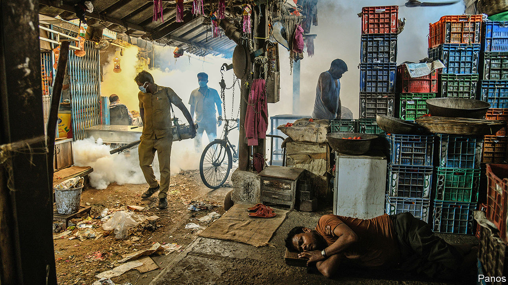
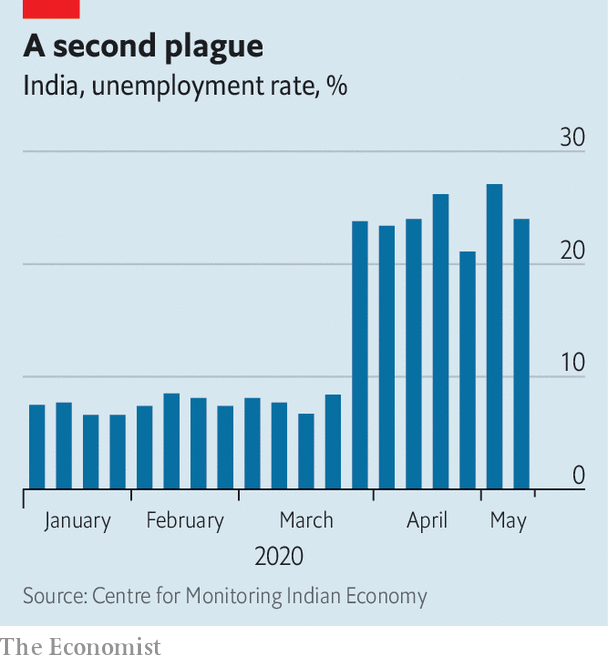

## Lockdown and out

# India’s economy has suffered even more than most

> And covid-19 is still proliferating

> May 23rd 2020DELHI

Editor’s note: Some of our covid-19 coverage is free for readers of The Economist Today, our daily [newsletter](https://www.economist.com/https://my.economist.com/user#newsletter). For more stories and our pandemic tracker, see our [hub](https://www.economist.com//news/2020/03/11/the-economists-coverage-of-the-coronavirus)

EMERGING FROM two months under one of the world’s most stringent covid-19 lockdowns, India faces a double dilemma. The stay-at-home rules did indeed bend the virus’s growth curve. This means that, so far, fewer Indians are known to have died of the disease than Swedes, even though India has 134 times more people. Yet India’s lockdown failed to bend it far enough. “We put more effort into containing the people than containing the virus,” as one epidemiologist puts it. As a result, official covid-19 deaths have risen steadily to 150 a day and are still rising. The streets and workplaces that 1.3bn Indians are returning to will be more virus-infested than when the lockdown started.

Already, however, India has paid a heavier economic price for the lockdown than have many countries initially hit harder by covid-19. In March alone no fewer than 140m workers are thought to have lost their jobs, catapulting the unemployment rate from 8% to an unprecedented 26% nationwide (see chart). Some 10m-80m migrants—the vagueness of the estimates speaks of the invisibility of the working underclass of street hawkers, labourers and factory hands—have despaired and tried to return to impoverished villages. Millions more Indians who work abroad have either sharply reduced their remittances or plan to return home. The 10% of the workforce in formal employment has fared better, but this is partly because employers have held off firing them for as long as possible. Only now are those cuts multiplying.

Goldman Sachs, a bank, expects the economy to contract by 45% this quarter at an annualised rate, and by 5% over the full year, assuming a big bounce in the second half. The National Council of Applied Economic Research, a think-tank in Delhi, predicts a contraction of 12.5% this fiscal year unless there is a huge stimulus.

Recognising the pain, Narendra Modi, the prime minister, on May 12th pledged an almost mythical-sounding 20 lakh crore rupees of fresh government spending, equivalent to $265bn or 10% of GDP, to reignite growth. Over the next five days a bank of finance-ministry officials faced cameras, unveiling slice after slice of measures, carefully designed to add up to Mr Modi’s magic number.

Yet although analysts expect the extra spending to push the budget deficits of the central government and the states to about 12% of GDP, and raise the country’s overall debt-to-GDP ratio to a wobbly 80%, many doubt that the measures will work. “What we needed was large tranches of money to go into circulation without ado,” said an editorial in Mint, a financial daily. But instead of a demand-side boost, and in particular urgent cash support for the poorest, what Mr Modi delivered was a hotchpotch of supply-side inducements and prods such as credit guarantees, along with reforms whose impact will only be felt in the medium term, at the earliest. Most of the stimulus was made up either of previously announced measures, or central bank moves to spur lending. Estimates of the actual new fiscal commitment by Mr Modi’s government range from a puny 0.7% of GDP to 1.3%, a far cry from the touted 10%.

Predictably, Mr Modi’s defenders explain that it is prudent to keep the government’s powder dry, considering that its budget amounts to just a sixth of GDP—far less than in richer countries—and it is not yet clear when the crisis will end. Instead of simply throwing money at the poor, the government has instead made it far easier for the small firms that employ most Indians, and form the backbone of the economy, to borrow and invest. The government has, to its credit, enormously increased spending on a rural jobs programme that Mr Modi dismissed as a boondoggle while in opposition. And such reforms as eliminating restrictions on the internal trade in agricultural goods and switching to a national, rather than state-based, system for distributing subsidised food are not just helpful to the poor, but also save the government money.

Even so, it is not just soft-hearted lefties who accuse Mr Modi of stinginess. Two of India’s Nobel laureates, the economists Amartya Sen and Abhijit Banerjee, had suggested that monthly emergency payments of up to $100 could help tide over many families. Instead, the sums offered so far amount to $6.60 each a month for perhaps 200m poor women, and promises of a one-off $26 apiece to some 70m farmers. Even for the 60% of Indians who survive on less than $3.20 a day, the World Bank’s poverty line for lower middle-income countries, such measly sums will not last long, much less stimulate the demand needed to generate jobs. A mountain of bad debt was already weighing on spending and investment before the coronavirus came along. Yet the government and the central bank seem to be hoping to revive the economy by encouraging lending. Critics see attempts to spur a borrowing binge before the wreckage of the previous one has been cleared away as not just optimistic, but foolhardy. “Expecting bank loans to grow more rapidly now is at best a pipe dream,” says Vivek Kaul, a columnist. ■

## URL

https://www.economist.com/asia/2020/05/23/indias-economy-has-suffered-even-more-than-most
