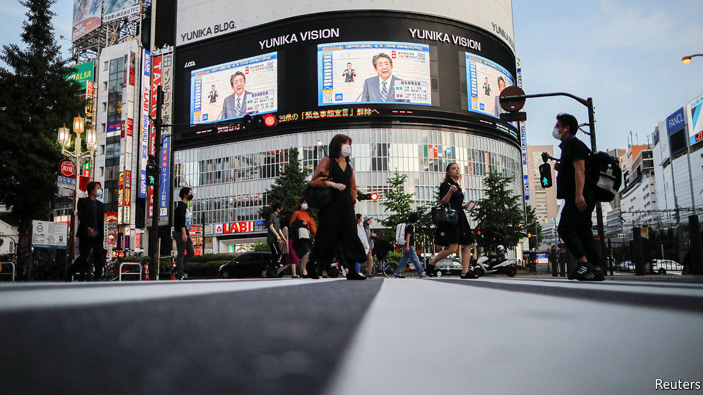
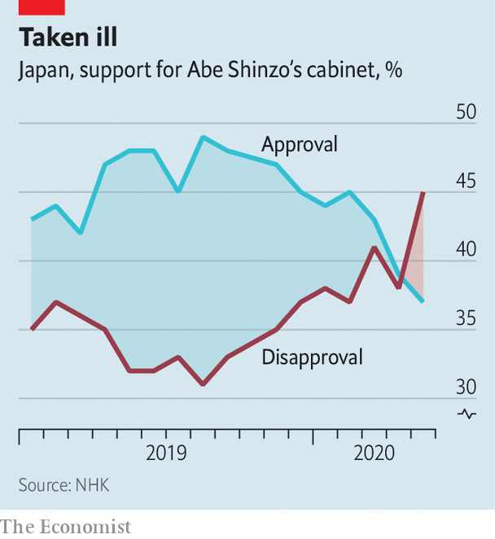

## Unscathed but scathing

# Japan is not rallying around its prime minister

> Even though the country has come through the pandemic in relatively good shape

> May 23rd 2020TOKYO

SINCE JAPAN recorded its first case of covid-19 on January 16th, 784 people have died across the country of 126m, fewer deaths than in one day in New York City during the peak of the outbreak there. On May 14th the government lifted the state of emergency in 39 of Japan’s 47 prefectures, with more likely to be released this week. In terms of deaths relative to population, Japan ranks alongside South Korea, whose government has been widely praised for its management of the pandemic.

Yet when it comes to public opinion, Abe Shinzo, Japan’s prime minister, has been one of a small handful of world leaders to see his approval ratings drop, alongside covid-deniers like Brazil’s Jair Bolsonaro. Polls show that more than half of the Japanese public disapproves of the government’s handling of the virus. Limited testing, shortages of protective gear for medical workers, the botched handling of a super-spreading cruise ship and hesitation to impose a state of emergency have fuelled frustration and distrust. “Citizens and the private sector were far ahead of the government,” says Nakabayashi Mieko, a former opposition MP. On May 19th Japan’s national broadcaster, NHK, found that more people disapproved than approved of Mr Abe’s government (see chart).

Mr Abe has cultivated the image of himself as a strong leader. But faced with covid-19 “he has not acted like the leader he claimed he was,” says Tobias Harris, author of “The Iconoclast”, a biography of Mr Abe to be published later this year. Instead, he has appeared hapless and out of touch, much as he did during his brief first stint as PM in 2006-07, when Japanese media pilloried him as kuuki yomenai, or “one who cannot read the air”, says Jeff Kingston of Temple University in Tokyo.

A scheme to send each Japanese household two cloth masks, at a cost of ¥47bn ($436m) to taxpayers, generated scorn. Detractors dubbed the programme “Abenomasks”, a play on “Abenomics”. When the masks started to arrive, many were dirty and defective and, for most people, too small; entire regions have yet to receive any. “Is that really public policy?” asks Sone Yasunori of Keio University.

The government’s economic stimulus measures have been similarly ham-fisted. Mr Abe backtracked on an initial plan to give struggling households ¥300,000 each, shifting instead to a universal ¥100,000 handout favoured by his Liberal Democratic Party’s coalition partner, Komeito. The result looked “muddled instead of decisive”, says Phillip Lipscy of the University of Toronto. The government has yet to dole out the cash; individuals will have to brave a bureaucratic gauntlet to obtain it. Loans and other support measures for businesses have come wrapped in red tape. More than 285,000 businesses inquired about subsidies to put employees on leave, but only 1.9% of them have actually received any payments. Meanwhile, the economy is officially in recession, having shrunk by 3.4% at an annual rate in the first quarter of the year and by 7.3% at the end of last year.

Throughout the pandemic Mr Abe has devoted lots of attention to a controversial plan to raise the retirement age for prosecutors—widely seen as a way to keep allies around. Normally apolitical celebrities waded in to denounce the move on social media. “In the midst of the coronavirus calamity, we should focus on people’s lives,” wrote Miyamoto Amon, a director of musicals and plays. Even Mr Abe’s friends in the conservative media voiced concerns. On May 18th Mr Abe finally backed down. “Day by day, Mr Abe is losing his centripetal force, not only in the government but in the ruling party,” says Toshikawa Takao, editor of Tokyo Insideline, a political newsletter.

Nonetheless, the prime minister remains the unchallenged centre of Japan’s political universe. The inept opposition is “not really taking advantage of this situation”, says Ms Nakabayashi. Although voters during the pandemic have preferred the more decisive leadership of governors such as Tokyo’s Koike Yuriko and Osaka’s Yoshimura Hirofumi, moving from local to national politics is tricky. Ms Koike’s party flopped at national elections in 2017. Mr Abe’s ruling Liberal Democratic Party remains dominant in the polls, and his challengers inside the party have stayed quiet. “People distrust his leadership,” says Mr Toshikawa. “But at the same time they recognise there is no alternative national leader at this moment.” ■

Editor’s note: Some of our covid-19 coverage is free for readers of The Economist Today, our daily [newsletter](https://www.economist.com/https://my.economist.com/user#newsletter). For more stories and our pandemic tracker, see our [hub](https://www.economist.com//news/2020/03/11/the-economists-coverage-of-the-coronavirus)