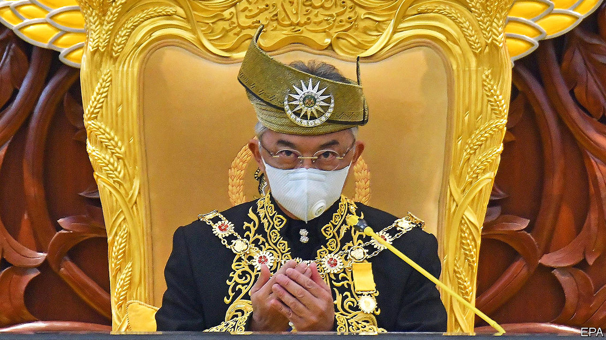

## Muhyiddin’s mess

# Malaysia’s shaky government dodges a no-confidence motion

> The prime minister will have been in office for five months before he proves his majority

> May 23rd 2020SINGAPORE

IT WAS THE shortest session on record. Malaysia’s MPs convened on May 18th to hear a speech from the king (pictured). No sooner had he finished than they adjourned until July. The official reason for the brevity was to avoid spreading covid-19. But the brisk timetable also thwarted plans to hold a vote of no confidence in the prime minister, Muhyiddin Yassin.

Mr Muhyiddin only took the job on March 1st and has yet to prove his government’s majority in parliament. His uncertain standing stems from the peculiar manner of his ascent. The previous government, led by Mahathir Mohamad, had fallen when two of its constituent parties split. Factions from both Keadilan, the biggest party in the outgoing government, and Bersatu, the party of both Dr Mahathir and Mr Muhyiddin, decided to form a new majority by aligning with the opposition. Mr Muhyiddin sided with the renegades.

Since he took the top job Mr Muhyiddin has had a tough time of it. Malaysia is battling more than 7,000 cases of covid-19 and has imposed a lengthy “movement control order” to slow its spread. There is not enough money to repair the damage. Although the government’s relief package has a notional value of more than 16% of GDP, it is only boosting spending by around 2% of GDP immediately.

To stay in office Mr Muhyiddin needs the backing of at least 112 of the 222 members of the lower house of parliament. The seating arrangements on May 18th suggest he may have 113 of them in his corner. Lawmakers from the Malaysian part of Borneo helped tip the balance. But bonds of loyalty to Mr Muhyiddin are likely to be loose. Maintaining this wafer-thin majority will consume much of the prime minister’s attention until parliament’s next scheduled meeting, in July.

Bersatu gives an idea of the difficulties. Powerful figures in the party, including Dr Mahathir, remain aligned with the opposition. The nonagenarian is Malaysia’s most experienced statesman and a dangerous foe. It was Dr Mahathir who put forward the motion for the parliamentary vote of no confidence. And his son intends to challenge Mr Muhyiddin for the party’s presidency. Indignation at being ousted from power, meanwhile, has helped to quell infighting within the opposition.

Should Mr Muhyiddin lose control of Bersatu, his new allies are likely to lose patience with him. “He is at the mercy of his colleagues in the same coalition,” explains one Malaysian political consultant. The two other big parties in his government are the United Malays National Organisation (UMNO), which for years was Malaysia’s ruling party, and PAS, an Islamist outfit. While they needed Mr Muhyiddin and other turncoats to join them in order to gain power, the bigwigs of UMNO resent the disproportionate share of jobs in the cabinet that went to members of Bersatu. In a show of petulance, UMNO has refused to declare Bersatu an official ally. And no wonder: Bersatu was only founded in response to corruption within UMNO. The two have an identical agenda—to improve the circumstances of the ethnic Malay majority—and so will compete for the same votes.

By teaming up with UMNO, Mr Muhyiddin has taken away Bersatu’s reason for being. And without a formal alliance, Bersatu will not benefit from UMNO and PAS’s well established campaign networks at the next election. The party will be “the most marginalised” when Malaysia votes again, says Maszlee Malik, a member of Bersatu’s Supreme Council.

Small wonder that Mr Muhyiddin has been coaxing lawmakers to stick with him with promises of cushy jobs and influence. One lawmaker from PAS has expressed confidence that all MPs who back the governing coalition will receive posts in government-linked companies, if they are not already busy with other official positions.

Such behaviour is reminiscent of the government of Najib Razak, the most recent prime minister from UMNO, who lost power two years ago after American officials, among others, accused him of allowing some $4.5bn in public money to go astray. That left UMNO out of government for the first time since independence. Mr Najib remains an MP—and Mr Muhyiddin’s fragile majority depends on his support. ■

Editor’s note: Some of our covid-19 coverage is free for readers of The Economist Today, our daily [newsletter](https://www.economist.com/https://my.economist.com/user#newsletter). For more stories and our pandemic tracker, see our [hub](https://www.economist.com//news/2020/03/11/the-economists-coverage-of-the-coronavirus)

## URL

https://www.economist.com/asia/2020/05/23/malaysias-shaky-government-dodges-a-no-confidence-motion
