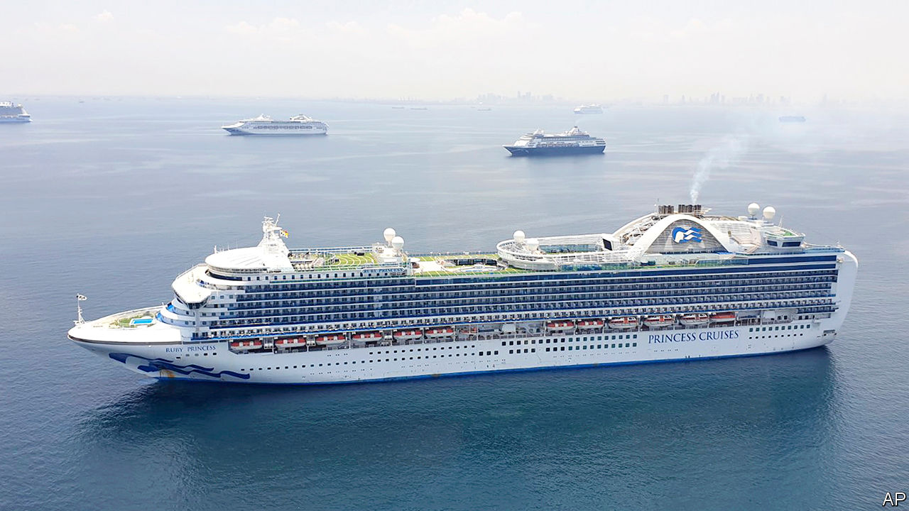

## Floating confinement

# Why the Philippines is a magnet for idled cruise ships

> And why thousands of crew members are still waiting impatiently to disembark

> May 23rd 2020MANILA

IN HEALTHIER TIMES the sight of a fleet of cruise ships lying at anchor in Manila Bay, silhouetted against the sunset, would gladden the hearts of business people on shore, eager to relieve free-spending passengers of their money. But the 21 vessels dotting the seascape on May 21st were not so much floating hotels as prison hulks. The passengers are long gone. Instead, the ships serve as quarantine quarters for crews made idle by the collapse of the cruise market thanks to covid-19. For many of the hapless mariners, quarantine is proving endless.

The fleet anchored in Manila Bay began to gather after April 16th, when the Philippine government declared that, unlike many others in Asia, it would let foreign cruise ships call to land idled crews, as long as some of the staff were Filipino. As it happens, Filipinos make up about a third of all cruise-ship crews, so plenty of vessels met the criterion. Notorious arrivals include the Ruby Princess, which became a hotbed of covid-19 while cruising off Australia.

The government is allowing Filipino staff to land only after they spend 14 days in quarantine aboard ship and then test negative for covid-19. Even after a 14-day isolation, foreign crew-members can only come ashore if they have a reservation on a flight leaving Manila within four hours.

That is fine in theory. But four weeks after the government first let foreign liners into Manila Bay some 5,300 Filipino seafarers were still confined to their ships, along with an unknown number of foreigners. Delays in administering and processing tests is one problem. Another is the lack of transport to take Filipinos from Manila to their home provinces, since the government has banned most domestic travel.

Onward travel is even more daunting for foreigners, since flights in and out of Manila have all but evaporated. The government has restricted incoming air traffic because it has insufficient quarantine facilities on land to confine Filipinos arriving by plane—including, ironically, cruise-ship crews returning home by air.

The delay is spurring other complaints. Some unlucky sailors have been confined to windowless cabins. Several ships are anchored too far offshore to pick up mobile signals. Some trapped sailors say they are no longer being paid. A typhoon that scattered the Manila Bay fleet for a while added to their unease. One posted a plaintive plea on Facebook: “Please let us go home, we are begging whoever is in charge.” ■

Editor’s note: Some of our covid-19 coverage is free for readers of The Economist Today, our daily [newsletter](https://www.economist.com/https://my.economist.com/user#newsletter). For more stories and our pandemic tracker, see our [hub](https://www.economist.com//news/2020/03/11/the-economists-coverage-of-the-coronavirus)