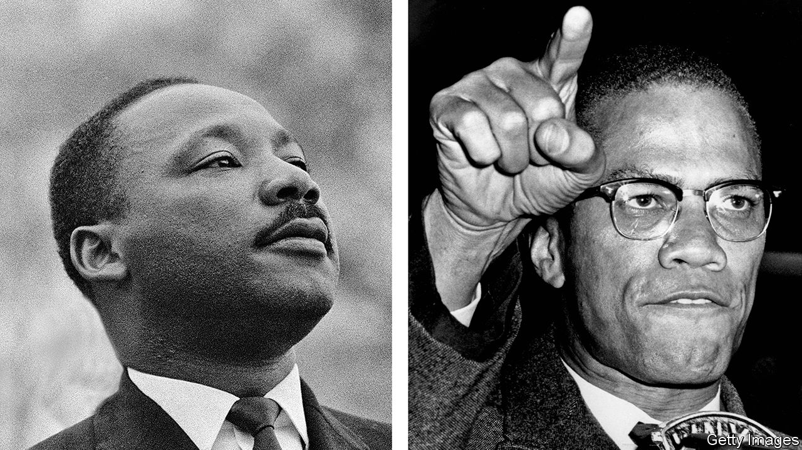

## The ballad of Malcolm and Martin

# A twin biography retells the story of the civil-rights movement

> Malcolm X and MLK had more in common than is often believed

> May 21st 2020

The Sword and the Shield. By Peniel Joseph.Basic Books; 384 pages; $30 and £25.

HIS INDEX finger says it all—pointing accusingly, arm outstretched. He bites his lip in righteous fury. Since his assassination in 1965 Malcolm X’s glare has adorned the T-shirts and dorm rooms of generations of rebellious students. In a simplistic view of the civil-rights movement, he is the radical counterpart to Martin Luther King junior, himself murdered three years later. King is the peacemaker, the Baptist preacher who called for an integrated America that fulfilled its promise of equality. Malcolm is the militant, the Muslim convert who advocated using “any means necessary”, implicitly including violence, to achieve dignity for black Americans.

Peniel Joseph, a historian at the University of Texas at Austin, wants to complicate this story. Malcolm’s and King’s views on American racism and injustice were not always far apart, he argues, and their strategies for advancing black rights were often symbiotic rather than conflicting. The two may have begun as rivals, but by the mid-1960s they had a tacit “political partnership” in which Malcolm’s stance allowed King to portray himself as a moderate. In this telling, the traditional juxtaposition seems less a fair analysis than a reflection of expectations: because Americans often see racial politics as a contest between reconciliation and revenge, they are inclined to classify black leaders as either compromisers or extremists.

Mr Joseph is hardly the first to argue that King’s posthumous image is too soft. It is often noted that, although he is a national hero today, most white Americans disapproved of him during his lifetime. The non-violent marches against segregation which he led across the South were condemned as provocations not just by southern conservatives but by many northern liberals. Disappointed with the civil-rights laws passed by President Lyndon Johnson, King grew more radical in the last years of his life, helping lead opposition to the Vietnam war and flirting with socialism.

Malcolm’s moderate turn, meanwhile, has been on record at least since his autobiography was published shortly after his death. He had joined the Nation of Islam, a sect launched in Detroit in the 1930s, during a stint in prison, imbibing its anti-white theology along with its discipline. His charisma made him a leader in that outfit and beyond. While King insisted on non-violence, Malcolm warned that blacks had the right to meet police brutality with force, and deployed the Nation’s nattily dressed toughs to show he meant it. But he feuded with the sect’s hierarchy, eventually leaving it for mainstream Sunni Islam and building relationships with post-colonial African and Arab leaders. After a pilgrimage to Mecca in 1964, awed by the pan-racial spectacle of the haj, he began describing American racism as a perverse system trapping both whites and blacks.

Mr Joseph’s twin biography provides insights into why the two leaders took such different paths. King was the son of a successful pastor in Atlanta, brought up in a stable family that belonged to the city’s black elite. He attended the historically black Morehouse College and Boston University, where he befriended national civil-rights figures. Once back in the South and a pastor himself, he exploited these connections. His organising efforts, courageous as they were, utilised the existing political infrastructures of blacks and liberal whites. He saw integration as a natural goal.

By contrast, Malcolm grew up poor. He was six years old when his father, a radical preacher and activist, was killed. His mother later suffered a nervous breakdown, and Malcolm, a promising student, ended up in Boston with a cousin. There he drifted into gang life. Joining the Nation of Islam and isolating himself from mainstream society were the beginning of his redemption. It is not surprising that he endorsed black separatism, nor that someone who suffered as he did through racial inequality would embrace drastic solutions to it.

This book’s main weakness begins to emerge in its fondness for effusive clichés. Both men were certainly brilliant, but Mr Joseph says so incessantly and applies the word to half the people they meet. Speeches are electrifying, abilities uncanny, humour scathing. This stylistic problem eventually becomes a substantive one.

Take the phrase “truth telling”, which Mr Joseph uses repeatedly. In a discussion with the writer James Baldwin in 1963, a week after the “I Have a Dream” speech, Malcolm dismissed King’s rhetoric: “It’s not integration with us until the entire thing is laid on the table, not a hundred years from now, but in the morning.” Baldwin, Mr Joseph writes, was “mesmerised by the sheer audacity of Malcolm’s truth telling”. Yet it is not clear what Malcolm meant. (How exactly does a society lay the entire thing on the table?) This seems less an example of truth telling than of what social-media activists would call edgelord behaviour: a provocative figure, sensing that a rival has seized the initiative, trying to outflank him with a more extreme approach.

Mr Joseph’s hero-worship of both men sometimes undermines his effort to demystify the opposition between them. The book is at its best when it treats them pragmatically, as two leaders with different inclinations and separate power bases but sometimes convergent interests. Turning them into icons itself plays into the tendency to sort black leaders into angry radicals and compromising moderates, a habit Mr Joseph means to critique.

This tendency is as old as racial oppression in America, which is to say as old as the nation. To some extent, it is driven by fear. Consciously or otherwise, some whites fear the history of white supremacism is unforgivable. For their part, many black Americans think racism is ineradicable (according to a survey by Pew last year, half of black adults consider it unlikely that racial equality will ever be achieved). On that painful view, moving on means living with discrimination. Thus some whites wonder if black politicians despise them; blacks sometimes ask if they have sold out. It may have been inevitable that the leaders of the civil-rights movement came to be judged along these enduring lines. ■

## URL

https://www.economist.com/books-and-arts/2020/05/21/a-twin-biography-retells-the-story-of-the-civil-rights-movement
