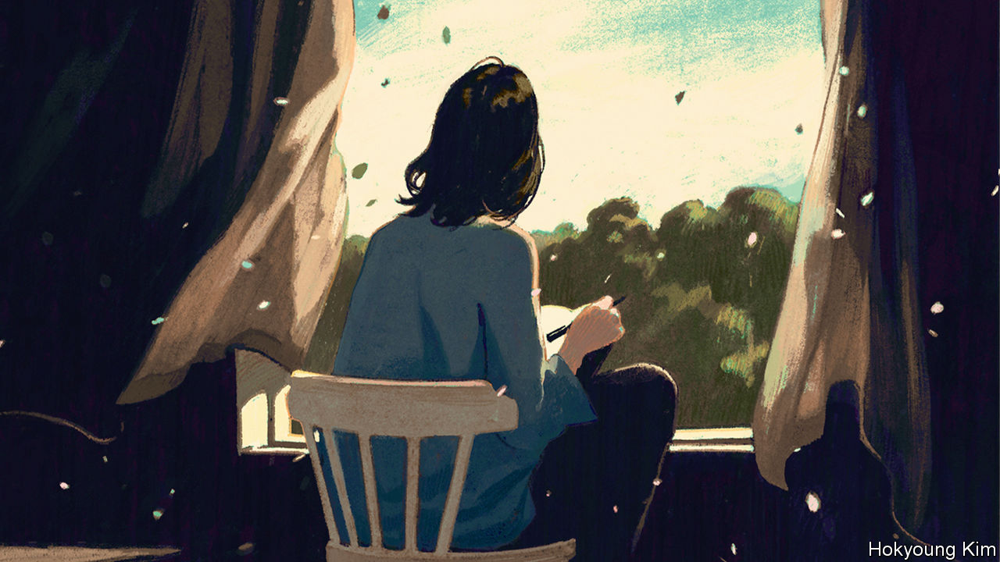
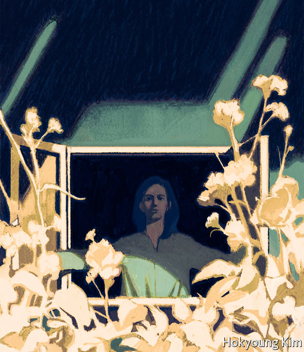

## The lives of others

# Diaries written in adversity can be a source of solace

> The feelings and fears of their authors often chime with today’s

> May 23rd 2020

THE DIARIES of Virginia Woolf are bookended by wars. Early entries, written when she was a young novelist, describe sheltering in her kitchen during the now-forgotten air-raids over London in 1917. Over nearly three decades she would fill 26 volumes, usually settling down after tea to write up the day or, if she had been laid low by mental illness, as she often was, to recount events spanning weeks or months. Her observations of people, places and books are sometimes catty and prejudiced, often wry and incisive. In October 1940, an established modernist author living in Sussex, she chronicled another conflict:

Five months later, as she sensed another nervous breakdown approaching, Woolf would drown herself in the River Ouse. Yet on that autumn day she could find solace in the quiet of village life—in “October blooms; brown plough; and the fading and freshening of the marsh.” Her diary is testament to the complex, shifting moods of a brilliant mind, but also to the possibility of finding beauty amid chaos.

During a crisis, whether political or personal, writing a diary can be a comfort. In March, as lockdowns were imposed around the world in response to covid-19, columnists advised the quarantined to keep a journal of the warped new reality in which they communicated with loved ones through pixelated screens. Astronauts disclosed how recording their thoughts and dreams helped them endure the loneliness of space. New Zealand’s prime minister, Jacinda Ardern, encouraged people to annotate their days for a more prosaic reason: it could aid in tracing the disease.

But for frazzled minds, with attention spans cut by the rolling, roiling news, prying into other lives can be even more therapeutic than documenting your own. Unlike novels, which demand commitment or at least the pretence of it, you can dip in and out of diaries; they are episodic by nature, broken into shards of days, weeks and months. Entries are often hastily written, and can be consumed just as quickly. Sometimes, as with the contraction of Woolf’s world and her isolated friends, they offer unexpected parallels with the pandemic—suggesting that, in the face of very different adversities, people have experienced familiar feelings and fears.

Take Samuel Pepys’s diaries, which describe the course of the plague that hit London in 1665, when he was 32. His early entries that year are filled with blithe, gluttonous descriptions of food, plays and women. Arguments with his wife feature prominently. In April he “Lay long in bed, troubled a little with wind, but not much.”

By the end of that month, however, he refers to another ailment: “Great fears of the Sicknesse here in the City, it being said that two or three houses are already shut up.” By June he sees red crosses painted on doors; before long, the “town grows very sickly, and people [are] afeared”. Yet still the disease seems distant—disbelief and denial always seem to accompany epidemics—and life and laughter keep breaking in. In the middle of July Pepys shares a water-taxi with a stranger, a “man of love to Musique”, and they “sung together all the way down—with great pleasure”. That evening he “dined well, and mighty merry”. After all the gaiety, he curtly records: “Above 700 dead of the plague this week.”

As the months pass, his anxiety rises. He worries about catching a cold and about a servant’s headache. He ponders the plague’s impact on the vogue for the “periwig” (he has not worn his new one for fear of catching someone else’s lice). He walks through a changed London: “But Lord, how empty the streets are, and melancholy.”

This uncanny sense of a city sliding from familiar to strange recurs in the diaries George Orwell kept during the second world war. “Huge areas of London almost normal,” he observes as the Blitz begins in September 1940, “and everyone quite happy in the daytime…” Four days later, though, he finds Oxford Street empty of traffic and almost deserted, “the late afternoon sun shining straight down the empty roadway and glittering on innumerable fragments of broken glass”.

War is not a precise parallel for pandemics, however fond today’s politicians are of martial rhetoric. But war diaries such as Orwell’s are full of moments that resonate now. “As soon as war started the carrying or not carrying of a gas mask assumed social and political implications,” he writes in June 1940, though he might have been talking about masks in the age of covid. “You are still a little stared at if you carry one without being in uniform.” Or take the day in July when he sees a heron flying over Baker Street: “I suppose it is possible that the war, ie the diminution of traffic, tends to increase bird life in inner London.”

The wartime diaries of Astrid Lindgren, author of “Pippi Longstocking”, highlight the shortages and terror of invasion that gripped even neutral Sweden—and the challenges of motherhood when you have to worry about feeding and entertaining children. Lindgren worked as a censor, learned about overseas atrocities early, and worried that they would happen in Sweden, too. After opening letters describing starvation in Belgium and France she writes: “It makes one feel quite hopeless, sitting at work and reading them.”

In many war diaries there is an uneasy tension between headline events and personal tribulations. “Not much news”, Orwell writes, “ie only events of worldwide importance…” Three years into the war Lindgren recalls how “we used to talk about it all the time; now we see it as a necessary evil, to be thought of and talked about as little as possible.” By contrast, in the diaries of Derek Jarman, a British film-maker and artist, the personal and the political fuse.

Jarman began his diaries, published in two volumes as “Modern Nature” and “Smiling in Slow Motion”, soon after learning he was HIV-positive, and just before he revealed the diagnosis publicly. Behind the tally of days, weeks and months runs an undercurrent of mortality—a fate that many people, even if they know their death is close, try to ignore. Jarman faces the ultimate, inevitable adversary head on.

His record of his last five years is angry, beautiful and haunting by turns. As he grapples with the effects of the disease and the attendant hospital visits, he records the stigma HIV-positive people faced in the 1980s and 1990s, brilliantly articulating the mental toll of a physical illness: “I’m less alive. There’s less life to lead. I can’t give 100% attention to anything—part of me is always thinking about my health.”

In “Modern Nature”, which begins in 1989, he reflects on his life as a gay man in London in the 1960s and 1970s, his childhood, the experience of living with a scourge that would kill many close friends, and on things which give him pleasure—including his partner, “HB”, and his garden at Prospect Cottage in Dungeness:

Just as Woolf found a spell of respite in the landscape of Sussex, so Jarman’s brightly coloured shingle garden is a place where he can find peace.

Diaries can show people at their messiest (even if they are intended for publication, as Jarman’s were). At the best of times people are anxious, lonely, bitter, prejudiced, annoyed and confused. Encompassing all these feelings, diaries can be as expansive and gripping as fiction. They display the best and worst sides of their writers; they show readers that they are not alone in feeling scared or miserable. And reading the lives of others suggests that, even at times of crisis and distress, it is possible to find and grasp moments of joy. ■

Editor’s note: Some of our covid-19 coverage is free for readers of The Economist Today, our daily [newsletter](https://www.economist.com/https://my.economist.com/user#newsletter). For more stories and our pandemic tracker, see our [hub](https://www.economist.com//news/2020/03/11/the-economists-coverage-of-the-coronavirus)

## URL

https://www.economist.com/books-and-arts/2020/05/23/diaries-written-in-adversity-can-be-a-source-of-solace
