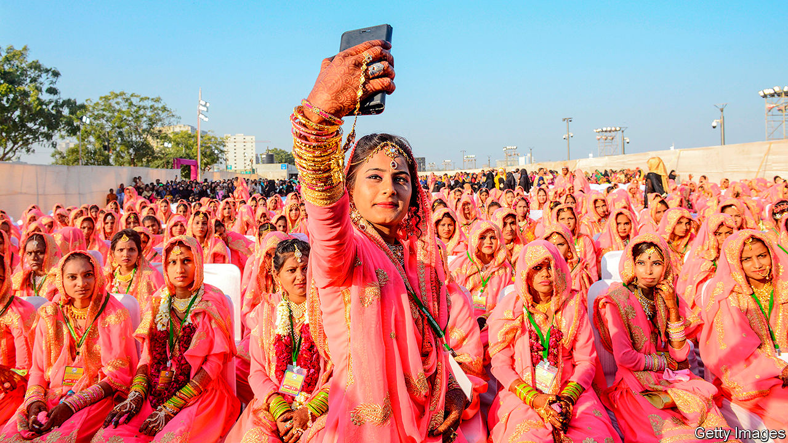

## The camera always lies

# “No Filter” chronicles the rise of Instagram

> Sarah Frier, a reporter for Bloomberg, also offers glimpses of Silicon Valley’s weirdness

> May 23rd 2020

No Filter. By Sarah Frier.Simon & Schuster; 352 pages; $28. Random House Business; £20.

ON A BEACHSIDE walk in Mexico in 2010, Kevin Systrom’s girlfriend explained the problem with his new photo-sharing app, then called “Codename”. Professionals might want the world to see their pictures, but her own phone snaps weren’t good enough. Back at the hotel, Mr Systrom coded a quick solution: a filter that gave even the most basic shot a hipster finish. He applied it to a snap of a dog by a taco stand, and uploaded it, making it the first image posted to what became Instagram.

A billion users later, the look in that filtered photo is ubiquitous. Square proportions, high contrast and darkened edges have instantly smartened up profile pictures, holiday albums and advertising campaigns around the world. In “No Filter” Sarah Frier, a technology correspondent at Bloomberg, uses close access to Instagram insiders to give a lively and revealing account of how the world came to see itself through Mr Systrom’s lens.

The tale of nerds who struck gold offers glimpses of Silicon Valley’s weirdness. In the early days Mr Systrom and his co-founder, Mike Krieger, patched errors with their laptops on camping trips and took a call from Justin Bieber when he forgot his password. Later, haggling over Instagram’s sale to Facebook, a crunch negotiation took place over a barbecue at Mark Zuckerberg’s mansion, with the Facebook founder grilling meat he boasted of shooting himself, though he was unsure if it was venison or boar. Mr Systrom went to the Vatican to persuade the ultimate influencer to sign up—and @franciscus obliged.

The sale, for a then-unthinkable $1bn, went sour. At Facebook “every single activity…stemmed from a religious obsession with growth,” writes Ms Frier, who is even-handed but seems closer to Instagram’s founders than Facebook’s high command. As its new owner steered Instagram towards taking ads and making money, some early employees, who had wanted to build “a community centred around the appreciation of art and creativity...instead felt that they had built a mall”. Mr Systrom, a perfectionist who initially oversaw every ad carried on Instagram, personally editing one to make the French fries look crispier, was seen by Facebookers as a precious snob.

As Instagram grew bigger and cooler, Facebook began to act “like the big sister that wants to dress you up for the party but does not want you to be prettier than she is”, complains one Instagram executive. Mr Zuckerberg limited how many people Instagram could hire. He even got cross that its new video app, IGTV, had a logo that looked a bit like that of Facebook Messenger. In 2018, after six years of this, Mr Systrom and Mr Krieger quit.

Within this business story are several subplots. One is how Instagram blurred the lines between the personal and the promotional. Snoop Dogg, a rapper, made what may have been the first paid Instagram post in January 2011, when he uploaded a picture of himself “Bossin up wit dat Blast”, a new drink. At least before covid-19 struck, Kim Kardashian could make $1m from a single post to her 157m followers; over 200m users had 50,000 followers or more, enough to make a living as “human billboards”. America’s Federal Trade Commission has said influencers should declare when they are being paid. They often don’t.

Another subplot is how an app that people use to document their life turned into one that determines how they live it. At first this was a virtue. In the early days Instagram began encouraging wholesome outings to scenic spots for users to photograph. But it has become a problem. Some photogenic places, like Norway’s Trolltunga cliff, have been overrun. Worse, the ability to edit photos to perfection has spread insecurity. “I don’t know what real skin looks like any more,” complains Chrissy Teigen, an Instagram star.

All this brought in $20bn for Instagram in 2019, or a quarter of Facebook’s revenue. But perhaps encouragingly, some in the company have come to see perfectionism as a risk to Instagram’s business. Young people have embraced Snapchat and, more recently, TikTok, as networks where they can go unfiltered. There they can post even imperfect shots: of their ordinary selves, their ordinary lives, even an ordinary dog by a taco stand. ■

Dig deeper: