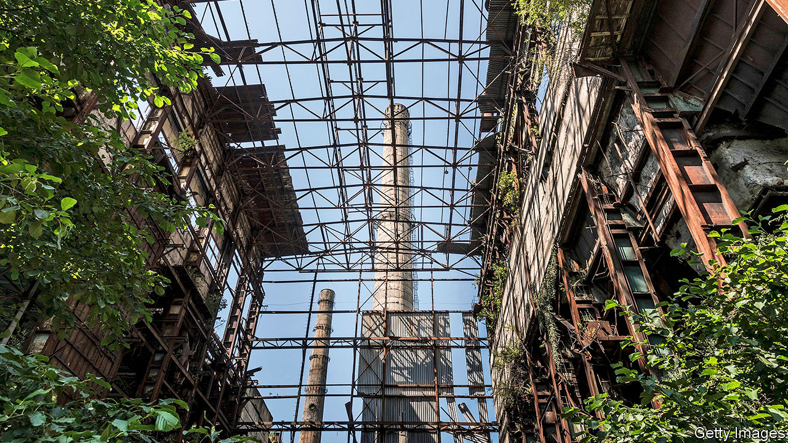
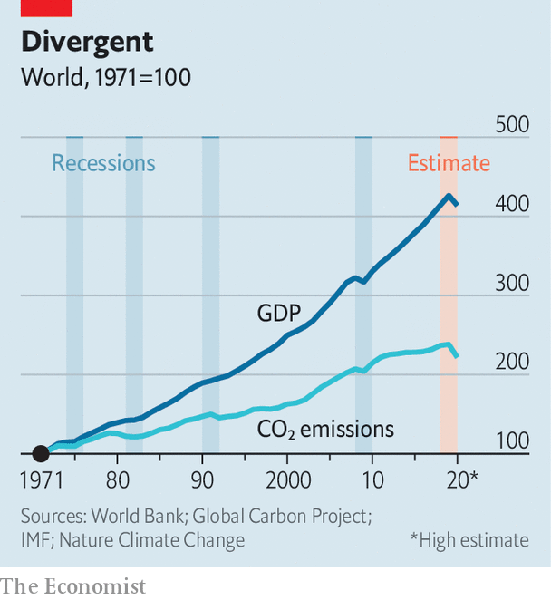

## The other crisis

# Can covid help flatten the climate curve?

> Arriving at a time of change, the pandemic could bring forward the fossil-fuel peak

> May 21st 2020NEW YORK

Editor’s note: Some of our covid-19 coverage is free for readers of The Economist Today, our daily [newsletter](https://www.economist.com/https://my.economist.com/user#newsletter). For more stories and our pandemic tracker, see our [hub](https://www.economist.com//news/2020/03/11/the-economists-coverage-of-the-coronavirus)

AMID COVID-19’s sweeping devastation, its effect on greenhouse gases has emerged as something of a bright spot. Between January and March demand for coal dropped by 8% and oil by 5%, compared with the same period in 2019. By the end of the year energy demand may be 6% down overall, according to the International Energy Agency (IEA), an intergovernmental forecaster, amounting to the largest drop it has ever seen.

Because less energy use means less burning of fossil fuels, greenhouse-gas emissions are tumbling, too. According to an analysis by the Global Carbon Project, a consortium of scientists, 2020’s emissions will be 2-7% lower than 2019’s if the world gets back to prepandemic conditions by mid-June; if restrictions stay in place all year, the estimated drop is 3-13% depending on how strict they are. The IEA’s best guess for the drop is 8%.

That is not enough to make any difference to the total warming the world can expect. Warming depends on the cumulative emissions to date; a fraction of one year’s toll makes no appreciable difference. But returning the world to the emission levels of 2010—for a 7% drop—raises the tantalising prospect of crossing a psychologically significant boundary. The peak in carbon-dioxide emissions from fossil fuels may be a lot closer than many assume. It might, just possibly, turn out to lie in the past.

That emissions from fossil fuels have to peak, and soon, is a central tenet of climate policy. Precisely when they might do so, though, is so policy-dependent that many forecasters decline to give a straight answer. The IEA makes a range of projections depending on whether governments keep on with today’s policies or enact new ones. In the scenario which assumes that current policies stay in place, fossil-fuel demand rises by nearly 30% from 2018 to 2040, with no peak in sight.

The IEA, though, has persistently underestimated the renewable-energy sector. Others are more bullish. Carbon Tracker, a financial think-tank, predicted in 2018 that with impressive but plausible growth in renewable deployment and relatively slow growth in overall demand, even under current policy fossil-fuel emissions should peak in the 2020s—perhaps as early as 2023. Michael Liebreich, who founded BloombergNEF, an energy-data outfit, has also written about a possible peak in the mid 2020s. Depending on how the pandemic pans out he now thinks that it may be in 2023—or may have been in 2019.

Previously, drops in emissions caused by economic downturns have proved only temporary setbacks to the ongoing rise in fossil-fuel use. The collapse of the Soviet Union in 1991, the Asian financial crash in 1997 and the financial crisis of 2007-09 all saw emissions stumble briefly before beginning to rise again (see chart). But if a peak really was a near-term prospect before the pandemic, almost a decade’s worth of setback could mean that, though emissions will rise over the next few years, they never again reach the level they stood at last year.

The alternative, more orthodox pre-covid view was that the peak was both further off and destined to be higher. On this view, emissions will regain their pre-pandemic level within a few years and will climb right on past it. Covid’s damage to the economy probably means that the peak, when it arrives, will be lower than it might have been, says Roman Kramarchuk of S&P Global Platts Analytics, a data and research firm. But an economic dip is unlikely to bring it on sooner.

What, though, if covid does not merely knock demand back, but reshapes it? This shock, unlike prior ones, comes upon an energy sector already in the throes of change. The cost of renewables is dipping below that of new fossil-fuel plants in much of the world. After years of development, electric vehicles are at last poised for the mass market. In such circumstances covid-19 may spur decisions—by individuals, firms, investors and governments—that hasten fossil fuels’ decline.

So far, renewables have had a pretty good pandemic, despite some disruptions to supply chains. With no fuel costs and the preferential access to electricity grids granted by some governments, renewables demand jumped 1.5% in the first quarter, even as demand for all other forms of energy sank. America’s Energy Information Administration expects renewables to surpass coal’s share of power generation in America for the first time this year.

Coal prices have fallen, given the low demand, which may position it well post-pandemic in some places. Even before covid, China was building new coal-fired plants (see [article](https://www.economist.com//china/2020/05/21/a-glut-of-new-coal-fired-power-stations-endangers-chinas-green-ambitions)). But the cost of borrowing is also low, and likely to stay that way, which means installing renewables should stay cheap for longer. Renewable developers such as Iberdrola and Orsted, both of which have weathered covid-19 rather well so far, are keen to replace coal on an ever larger scale.

Those who see demand for fossil fuels continuing to climb as populations and economies grow have assumed demand for oil will be much more persistent than that for coal. Coal is almost entirely a source of electricity, which makes it ripe for replacement by renewables. Oil is harder to shift. Electric vehicles are sure to eat into some of its demand; but a rising appetite for petrochemicals and jet fuel, to which lithium-ion batteries offer no competition, was thought likely to offset the loss.

Now oil’s future looks much more murky, depending as it does on a gallimaufry of newly questionable assumptions about commuting, airline routes, government intervention, capital spending and price recovery. In the future more people may work from home, and commuting accounts for about 8% of oil demand. But those who do commute may prefer to do so alone in their cars, offsetting some of those gains. Chinese demand for oil has picked up again quickly in part because of reticence about buses and trains.

As to planes, Jeff Currie of Goldman Sachs estimates that demand for oil will recover to pre-crisis levels by the middle of 2022, but that demand for jet fuel may well stay 1.7m barrels a day below what it was as business travel declines. That is equivalent to nearly 2% of oil demand.

Such uncertainty means more trouble for the oil sector, whose poor returns and climate risks have been repelling investors for a while. Companies are slashing spending on new projects. By the mid-2020s today’s underinvestment in oil may boost crude prices—making demand for electric vehicles grow all the faster.

Natural gas, the fossil fuel for which analysts have long predicted continued growth, has weathered the pandemic better than its two older siblings. But it, too, faces accelerating competition. One of gas’s niches is powering the “peaker” plants which provide quick influxes of energy when demand outstrips a grid’s supply. It looks increasingly possible for batteries to take a good chunk of that business.

Those hoping for fossil fuels’ imminent demise should not be overconfident. As lockdowns around the world end, use of dirty fuels will tick back up, as they have in China. Energy emissions no longer rise in lockstep with economic growth, but demand for fossil fuels remains tied to it. Mr Currie of Goldman Sachs, for one, is wary of declaring a permanent decoupling: “I’m not willing to say there is a structural shift in oil demand to GDP.” Even so, a peak of fossil fuels in the 2020s looks less and less farfetched—depending on what governments do next in their struggle with the pandemic. Of all the uncertainties in energy markets, none currently looms larger than that. ■

## URL

https://www.economist.com/briefing/2020/05/21/can-covid-help-flatten-the-climate-curve
