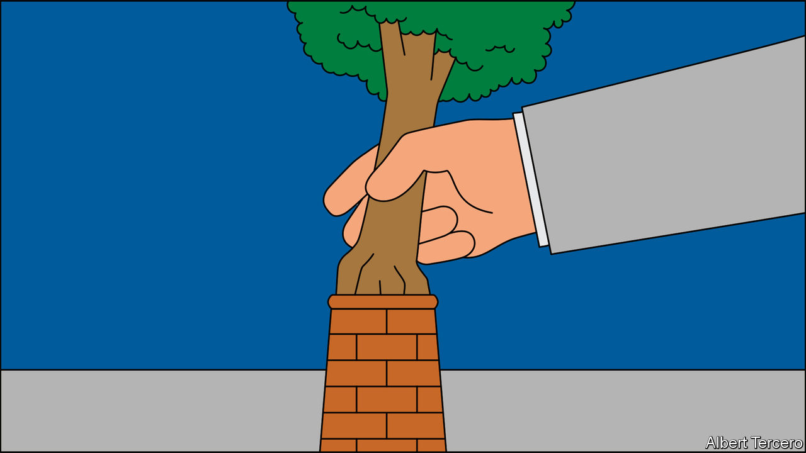

## If a tree falls

# Carbon offsetting is essential to tackling climate change

> If the world is to achieve net-zero emissions, then offsets are part of the plan

> May 21st 2020

WHEN COMPANIES that depend on emissions, such as easyJet, an airline, use offsets sold on private “over the counter” markets to claim carbon neutrality it is hard not to be reminded of the indulgences sold by the medieval Catholic church that helped sinners to go on sinning guilt-free. But the recent emphasis on “net zero” economies has made offsets central to climate-change plans. In a net-zero economy adding carbon dioxide, or another greenhouse gas, to the atmosphere is only allowed if an equivalent amount of greenhouse gas is removed from it.

Offsets already play a role in some international agreements and government-backed programmes. But the idea of including them in emissions-trading schemes triggers bad memories in Europe. Credits for dodgy offsets helped to undermine the credibility of the Emissions Trading Scheme (ETS) in its early years. International offsets are in the process of being expunged from the ETS, though they are still traded on the Californian emissions market.

Despite this rocky start, offset-trading could still work. Indeed, the 2015 Paris agreement already includes rules for how to account properly for offsets, according to Kelley Kizzier of the Environmental Defence Fund, a campaign group. Many of the issues with monitoring offsets come from the fact that offsetting takes place in remote places where the rule of law is weaker, because planting trees and plants requires a lot of cheap land.

But it is likely to become easier. Ben Caldecott of Oxford University points out that technology used to monitor offsets has improved. The use of high-resolution satellite imagery means that it is possible to know exactly when a tree is cut down. In theory offset contracts could also be auctioned on mobile phones with payments sent via mobile banking. “We can create smart contracts between a smallholder farmer and a funder where the payment is unlocked if the tree is still there,” he says.

If the world is to achieve net-zero emissions, the only permissible offsets will need to be genuine negative emissions (rather than schemes that simply reduce emissions). This may mean sucking carbon out of the air using machines. A nascent industry aims to do this, but the costs are big. An estimate in 2018 by researchers at Carbon Engineering, a Canadian firm, put the cost of direct air capture between $94 and $232, many times the carbon price in most places.

It is possible that with sufficient investment those costs could fall as carbon prices rise, allowing a “direct air capture” industry to make money by selling credits into emissions-trading schemes. Direct-capture machines are much more efficient in terms of land. Mr Caledcott hopes that Britain, which has said it will leave the ETS now it is no longer in the EU, will pioneer the first net-zero emissions trading system including such offsets.