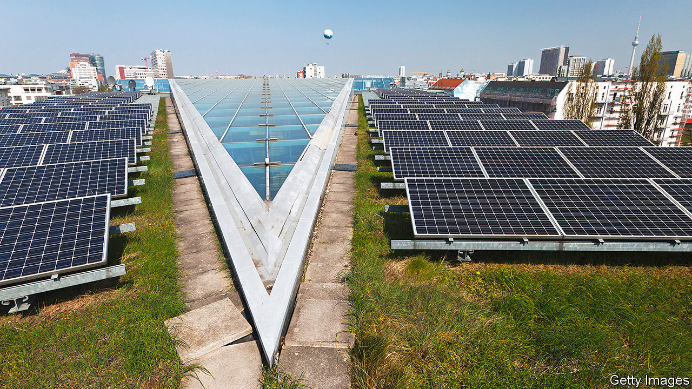

## Never let a crisis go to waste

# The pressure to make the post-covid rebound green

> A matter of opportunities and costs

> May 21st 2020

Editor’s note: Some of our covid-19 coverage is free for readers of The Economist Today, our daily [newsletter](https://www.economist.com/https://my.economist.com/user#newsletter). For more stories and our pandemic tracker, see our [hub](https://www.economist.com//news/2020/03/11/the-economists-coverage-of-the-coronavirus)

IN THE SIMULTANEOUSLY global, parochial and precise view of the scientists of the Global Carbon Project (GCP), it was April 7th which marked peak lockdown. The parts of the world where there was some sort of confinement order in place on that day would normally have accounted for 89% of the world’s greenhouse-gas emissions, the highest such percentage of the whole pandemic: the day before, less of America was locked down; the day after, more of China had gone back to work. The amount of carbon dioxide emitted on that peak day was, the GCP calculates, 17% lower than 2019’s daily average.

That is a huge difference: more than 11m tonnes of carbon dioxide. It is also a small one. For years, environmentalists have been calling on people to change their lifestyles in order to protect the planet. In the face of covid-19, governments have made some of their strictures official policy. The world now knows what can be achieved by closing a vast number of shops, as well as offices and factories, and stopping a great many people from travelling: a reduction in emissions which, though striking, is not enough to fundamentally change things, gained at an enormous price in terms of liberty and the pursuit of happiness.

The measures governments have taken against covid-19 are entirely unsuited to a campaign against climate change that has to last for decades, rather than days. But the financial muscle brought to bear and the willingness to use the full force of the state is nevertheless suggestive. Climate-minded academics, public intellectuals and think-tankers have worked themselves into a lather over the benefits which action on such a scale could provide if effects on climate were actually part of the remit.

As Fatih Birol, the head of the International Energy Agency, an intergovernmental think-tank, points out, government decisions guide about 70% of the world’s spending on energy. “In a very short period of time,” he says, “governments will make enormously consequential decisions.” Total stimulus spending will be in the trillions. If a decent fraction of that is earmarked for climate action, it could be world changing.

This idea is not new. Similar pleas were heard—from some of the same people—a decade ago, when policymakers were trying to get the world out of the slump brought on by the financial crisis of 2007-09. Roughly an eighth of the stimulus money disbursed by the American Recovery and Reinvestment Act (ARRA)—some $90bn—went into clean-energy loans and investments.

This greenery is remembered in political circles mainly because the first loan issued under the scheme—for a meaty $535m—went to Solyndra, a company devoted to cylindrical solar cells which went bust soon afterwards. The overwhelming majority of its loans, though, were repaid. One of them helped to finance Tesla’s first car factory.

Defenders of those clean-energy investments argue that they drew in $150bn of private and non-federal investment in clean energy—2009 and 2012 proved to be bumper years in America’s wind-energy sector—and paved the way for great progress over the subsequent decade. They did not, though, have any prompt appreciable effect on the global emissions trajectory. That was dominated by China’s post-crisis stimulus, which relied on ramping up coal-fired power stations. If American emissions did not rise as fast as they might have, it had more to do with cheap natural gas from the fracking boom providing a profitable alternative to coal-fired electricity than to any effects of ARRA.

Whatever ARRA’s role in the matter, though, renewables did start to have an appreciable effect in later years. They helped global emissions plateau in 2014-16, and again in 2018-19, even as the economy expanded. Renewables are now often cheaper than fossil fuels in large parts of the world. This is one of the reasons why today’s calls for a green stimulus are not carbon copies of those made ten years ago. They have less stress on renewable-energy R&D and fewer calls for demonstration projects. There is more emphasis on deploying technologies for types of decarbonisation not easily achieved with electricity, and on energy-storage systems and greatly improved electric grids that will open the way to much needed further expansion of renewables.

In America, the precise details of what is on the stimulus menu seem immaterial; President Donald Trump’s administration is much more interested in helping coal and oil companies than it is the renewable sector. That said, a block of Republican senators from states with significant clean-energy industries—including wind farms of the sort that blossomed after the financial crisis—has convinced the Treasury to consider extending tax-incentive schemes for renewable developments which have been stalled by the response to the epidemic.

The fact that renewables now have lobbying power is one demonstration that things are different this time. Another is that politics have changed, too. The Paris agreement of 2015 required its signatories to develop plans for emissions reduction, and to stand ready to increase their ambition at another big UN summit, co-hosted by Britain and Italy, which was originally planned for this year but has now been deferred to 2021. Polling suggests that citizens would be happy to see them take that commitment seriously. In April Ipsos MORI asked people from 14 countries whether they thought climate change was as serious a threat as covid-19. The greatest assent was in China, where 87% agreed that it was; but even in America, where the assent was lowest, 59% agreed. Nearly two-thirds of respondents, including 57% of Americans, went on to say that it was important that government actions aimed at economic recovery prioritise action on climate change.

Green boosters have always been keen to claim that strong climate policies have the added advantage of producing copious jobs; the Obama administration credited clean-energy investments under ARRA with supporting 900,000 job-years of employment. In recent years of low unemployment such claims have come to seem somewhat beside the point. With joblessness now having bounced back above Great Depression levels in many places, green jobs have again become a selling point.

Some see mass unemployment not just as a symptom to assuage, but as a unique opportunity to get things done which, if everyone had a job, would be much harder. Such ideas fit with the growing need for large-scale infrastructure that gets the most out of private investments. With renewable energy growing fast, getting it to the places where it can do the most to edge out fossil fuels—for example, the batteries of electric vehicles—is an obvious next step. The British government is one of those considering rolling out a huge network of car-charging facilities.

Many economists might prefer to see governments simply provide incentives for endeavours they think worthwhile, leaving industry to meet those goals with whatever number of workers seems most efficient, rather than how many the government wants off the dole. This is particularly true given that much covid-related unemployment has fallen on the service sector; the jobs that need doing and the people who need jobs might be a poor fit.

Against that needs to be considered the problem of the “90% economy”. Some service-sector jobs will come back quite slowly, if at all. If governments incentivise, say, home insulation and offer training and certification, all sorts of local companies might provide the actual service, and they would be quite labour intensive.

In Pakistan the unemployed are being released from lockdown to work on a tree-planting programme that predates the crisis. The climate impact may not be that high; but refugees from service sectors around the world might rather enjoy similar opportunities, at least for a while. And they would not need all that much training. As Cameron Hepburn of the University of Oxford points out, you can go from pulling pints to planting pines pretty quickly. ■

## URL

https://www.economist.com/briefing/2020/05/21/the-pressure-to-make-the-post-covid-rebound-green
