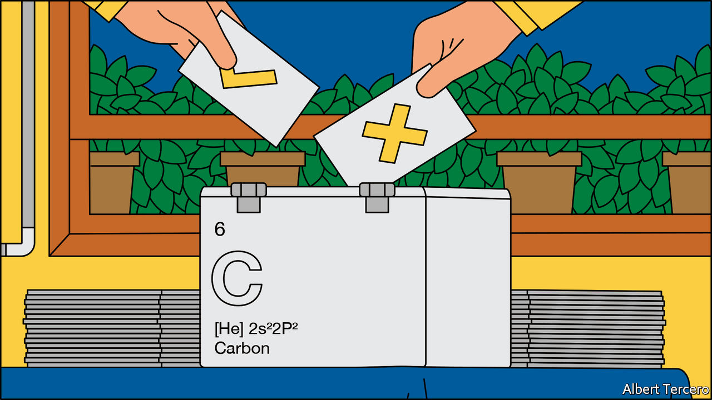
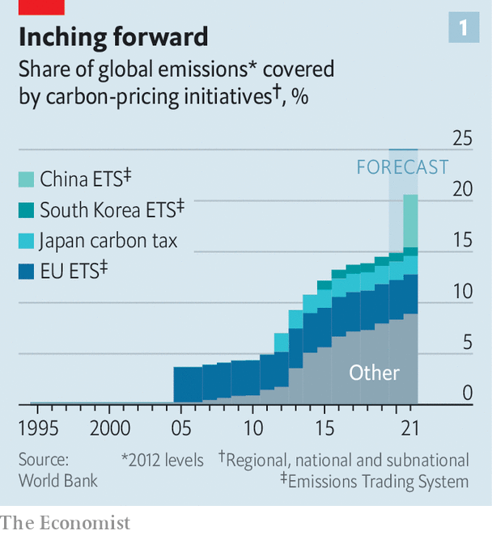
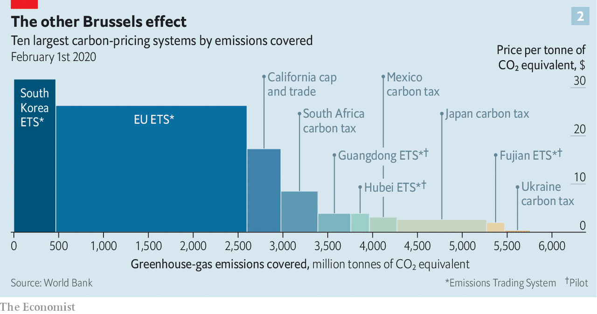
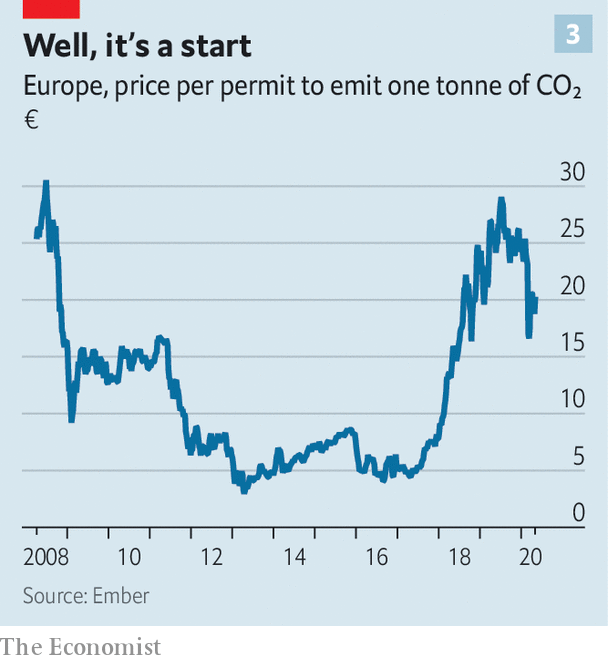

## Fighting climate change

# The world urgently needs to expand its use of carbon prices

> But doing so could provoke another trade war

> May 23rd 2020

IF ECONOMISTS ruled the world, carbon prices would drive most of the action on climate change. Polluters would pay for the negative externality their emissions inflict on the planet. There might be differences on the method of payment—some might lean more towards taxes, others towards the permits used in “cap and trade” schemes. But the idea that some sort of price would help people find an efficient means of reducing emissions is a given.

In the absence of a global econocracy, the policy has fared less well. Take the experience of Yoram Bauman. He is unusual, among those with doctorates in economics, in earning his living as a stand-up comedian. But he is in line with the professional mainstream on carbon prices. In 2016 he led an attempt to get the state of Washington to raise a new tax on emissions of carbon dioxide and use the revenues mostly to cut sales taxes. The ballot measure gained some support from politicians of both parties, but it was opposed by environmental groups on the left who wanted its revenues spent on clean energy investments and redistribution, not tax cuts. It was defeated 41% to 59%.

In 2018 a second proposal for a carbon tax was put to the ballot. This one followed what Mr Bauman calls a “unite the left” approach; any cash raised was to go on green investments and communities affected by climate change. The “yes” side, whose financial backers included Bill Gates and Michael Bloomberg, spent $15m, much more than in 2016. The “no” side, backed mainly by fossil-fuel interests such as the Western States Petroleum Association, spent about twice that. This time the carbon tax attracted the support of 43%.

The vast majority of humankind’s carbon emissions are currently unpriced. This is not simply a snub to the dismal science. As Mr Bauman’s experience shows, other factors are at play. One is that when asked to pay a new tax, people by and large demur; when told that they will, as a result, pay less in old taxes, they tend to scoff. Another is that companies which depend on their, or their customers’, greenhouse-gas emissions for their livelihood do not want to see those emissions discouraged—especially if companies elsewhere do not have to play by the same rules. A third is that, in some places, the green left, which plays a decisive role in climate politics, has come to distrust the idea.

As a result only 20% of global emissions are currently subject to a pricing scheme or soon to become so (see chart 1). And the prices in these plans are too low. The Paris agreement, adopted in 2015, commits its signatories to keeping the rise in global temperature, compared to that of the preindustrial climate, “well below 2°C”. A serious attempt to use carbon prices to that end, according to Nicholas Stern and Joseph Stiglitz, two noted economists, would require a price in the range of $40-80 to be levied on all the world’s industrial greenhouse-gas emissions (as well as some other interventions). In existing schemes the median tonne of carbon emissions is priced at only $15. Nowhere is there a carbon price that is both above $40 and applies to more than half a country’s greenhouse-gas emissions.

Despite such limited progress, advocates for a carbon price remain committed to the cause. Before the advent of covid-19, they also seemed to be on something of a roll. Since January carbon emissions have been priced at a minimum of C$20 ($14) per tonne across Canada. By 2022 that will rise to C$50. In 2021 70% of global aviation emissions were scheduled to enter a UN emissions-trading programme which aims to cap them at 2020 levels. China was going to launch a nationwide carbon market for its notoriously dirty power sector at the end of the year. And as part of its “green deal”, the European Commission had announced plans for the expansion of its Emissions Trading Scheme (ETS), already the largest carbon-pricing system in the world (see chart 2). Its carbon price, stuck in the single digits in the 2010s, rose to around €25 ($27).

The pandemic has derailed many of these plans. If aviation emissions were capped at the levels likely to be seen in 2020, the industry would be doomed. Climate change is no longer the top priority of the commission, which has an economic and political crisis to fight. And the ETS carbon price has fallen by about a fifth in 2020 as the world economy has suffered.

The need to decarbonise the economy, though, remains as urgent as ever. Indeed, the pandemic demonstrates the scale of the climate challenge. Although entire sectors of the economy, including aviation, have shut down, emissions this year will still remain too high. What is now needed is a way around various political barriers to a carbon price as well as at least one economic one: the effect that prices imposed piecemeal might have on trade.

Making it expensive to use fossil fuels can change behaviour quickly if there are easy and cheap alternatives available. In a history of carbon pricing published in 2018, Barry Rabe of the University of Michigan points to the experience of America’s sulphur dioxide permit scheme in the 1990s. It reduced the sulphur emissions from power plants largely because power companies had access both to sources of low-sulphur coal and technology to “scrub” sulphur dioxide from their smokestacks. The companies best placed to make the shift sold the allowances to emit sulphur that they had received from the government to those finding it harder.

The effect that the ETS has had on European emissions is based on a similar sort of substitution. After years of low prices following the global financial crisis, in 2018 prices started to rise as the EU reduced the number of permits in circulation (see chart 3). This had the effect of beginning to price coal—which releases twice as much carbon dioxide per watt as gas—out of the market. In 2019, for the first time, renewables produced more of the electricity consumed in Europe than coal.

Prices change behaviour less when there are few immediate alternatives to emitting carbon. Cars are taxed heavily in many places, for example. In 2018 a study by the OECD, a club of mostly rich countries, found that in 34 of 42 countries at least 90% of road transport emissions incurred taxes equivalent to a carbon price of more than €60 per tonne. Yet in the absence of readily available alternatives many people pay these taxes and drive lots.

In principle, faced with a price on carbon companies will invest in the development of alternatives that are not yet competitive. But only if they believe that the carbon price will be high enough in the future to make this worthwhile. And there is nothing to stop governments scrapping carbon-pricing schemes. That is what Australia did in 2014 after a campaign to “axe the tax” helped to swing an election. Britain, while in the ETS, imposed a carbon-price floor that drove a decisive shift away from coal, but in 2014 the government reneged on a commitment to raise that floor. When an oil giant such as ExxonMobil supports a carbon-pricing plan such as that touted by America’s Climate Leadership Council (CLC), a campaign group, sceptical observers may well have a point in thinking that the company imagines either that the scheme will not survive or that lobbying will keep the price low.

How can high prices be made credible? Ben Caldecott of Oxford University points out that it is possible for governments to strike contracts that will cost them money if the price underperforms. His example is Britain’s Woodland Carbon Guarantee (WCaG). One of the purported charms of cap-and-trade carbon markets is that those who can see no alternative but to emit greenhouse gases can buy permission to do so from those businesses which are more flexible, or who make it their business to suck carbon out of the air (see [article](https://www.economist.com//briefing/2020/05/21/carbon-offsetting-is-essential-to-tackling-climate-change)).

The WCaG encourages people to plant trees which could be used as offsets in this way. As it is inevitably a long-term commitment, the British government guarantees a floor price for the carbon stored in the wood until 2056. If, when the planter sells the credit, the carbon stored in the trees is worth more on the offset market than the government is obliged to pay it will be off the hook. If not it is obliged to cough up. That gives the government an incentive to see the value of carbon on such offset markets remain high.

The result is elegant but only really feasible on a smallish scale—the WCaG scheme is valued at £50m ($61m). The ultimate guarantor of prices that can be relied on to persist, or increase, is public and political support. There are two ways to make this more likely. One is to simultaneously commit to public investments that will make compliance with carbon taxes less onerous as those investments bear fruit—in effect doing what the private sector deems too risky. The other is to use the revenues from carbon-pricing schemes to create a political lobby in favour of keeping and expanding them.

Economists have historically wanted to use carbon-tax revenue to cut other taxes—the logic behind the first of the two Washington state initiatives. This is held to have two benefits. It reduces the economic drag those other taxes impose, thus helping the economy at large and compensating households for having to pay the tax. The world has just one example of full revenue recycling: British Columbia’s carbon levy. This funds lower taxes and some transfers to households and affected firms. It is popular with the public. Prices have risen substantially since its launch in 2008, despite a big fossil-fuel industry.

Recycling through the tax system is efficient. David Victor, a political scientist at the University of California San Diego, points out that it can also be politically efficacious if the tax benefits favour interests otherwise likely to oppose the scheme. But it is not the norm. In other jurisdictions the revenues are spent on environmental measures. That is how most of the money from Europe’s ETS is spent. An alternative approach, favoured by the CLC in America, is to give the money straight back to the people in a “fee-and-dividend”. It may lack efficiency and targetability, but a monthly cheque offers a nice, clear incentive to the voters—and, in theory, increasing the size of that cheque means that carbon prices can be increased, too.

Getting a pricing scheme started is not enough; it also has to have scope. When the ETS was being set up, according to Jos Delbeke, a former commission official who was heavily involved in the process, the politicians wanted it up and running quickly. The easiest way to do so was to impose a price just on the sectors where emissions were large and easily monitored: electricity generation and heavy industry.

The ETS has since been expanded. It now includes flights within Europe, and covers just under half of emissions from the EU. As part of the green deal, Ursula von der Leyen, the president of the commission, wants to expand the ETS once more to include emissions from transport, shipping and heating buildings, to increase its coverage to over 90% of emissions. But that brings up the issue of trade.

In the economists’ utopia there exists a single global carbon market. Any polluter or offsetter could participate in it. In this ideal world the pay-off from emissions trading is greatest when it takes place between countries that are dissimilar. (In the rich world, emissions are most valuable, whereas in the poor world measures to reduce them are cheap.) According to modelling by the Environmental Defence Fund, a campaign group, a global carbon market could reduce the total cost of fulfilling the Paris agreement by 79% compared with relying on local markets alone. Existing carbon markets like the ETS, or the regional greenhouse-gas initiative in the north-eastern states of America, tend towards homogeneity.

Such a market would also not merely be more efficient; it would also be less gameable. No firm would be placed at a disadvantage by having to compete with rivals outside the scheme, and thus free of its costs; no firm would be tempted to move its factories beyond the scheme’s reach.

In the absence of the ideal scenario, both energy-intensive, trade-exposed companies worried about competition and governments anxious about factories moving beyond their reach seek protection in the form of so-called “border carbon adjustment” (BCA) mechanisms. The adjustment is in effect a tariff on countries which are not members of the carbon-pricing scheme. Through such tweaking it allows schemes to reach emissions otherwise hidden from them: those “embedded” in imported goods.

The EU says it will propose a BCA mechanism next year as part of the expansion of the ETS. In America the CLC’s fee-and-dividend proposal includes both an exemption for exporters and a carbon tariff on imports. Joe Biden, the Democratic presidential nominee, has promised border adjustments to stop his climate plans hurting competitiveness. Both the carbon-pricing bills recently tabled in Congress offer some form of BCA.

In advanced economies that have outsourced a lot of heavy industrial production, a BCA would capture quite a lot of carbon. In America and Europe the emissions associated with all goods consumed, including imports, is 15% higher than the emissions associated with all production, including that which is exported. What is more, BCAs should also make carbon prices more attractive to countries which have yet to impose them. Better to impose the price internally, and thus see revenues at home, than to let some other government get those revenues at the border.

As appealing as BCAs may be, they also throw up a large number of practical and political problems. For all but the most basic commodities the process of determining the right levy would be nightmarishly complicated. In 2018 a report by the European Commission said that an ideal BCA would depend on “the sources of energy used by each producer...and the effectiveness of the climate policies of the country of production”. Such a system “would be clearly unmanageable at this stage”.

The only existing BCA bears this out. It applies to electricity imports into California, which has a state wide cap-and-trade programme. Companies importing electricity into the state can either specify its source, and hence the emissions with which it is associated, or be treated as if the electricity was generated by a relatively efficient natural-gas power plant.

This system is clearly imperfect, because the imports may in fact be dirtier than that. But if it were tougher, the incentive to game the system—by exporting the cleanest electricity to California while using the dirtiest elsewhere—would get even stronger. If such compromises have to be made when there are only electrons involved, imagine the complexities involved for an object made of many components from many jurisdictions.

Then there is the question of whether other countries might retaliate against a BCA. Rough calculations by The Economist using OECD data on the carbon emissions embodied in international trade suggest that a BCA of €30 per tonne levied on all goods coming into Europe would amount to €10bn on imports from China and €3bn on imports from the United States, equivalent to tariffs of 2.8% and 1.2% respectively. On imports from India the price would be €2bn, equivalent to a 5.1% tariff. In all three cases it is roughly equivalent to doubling existing average tariffs.

In 2012 a far less ambitious attempt to level carbon-emission playing fields inside and outside the EU quickly came to grief. The EU wanted to include emissions from flights to and from countries beyond the EU in the ETS; both some of its own airlines and its trading partners protested, the latter threatening action through the World Trade Organisation (WTO) and reviews of bilateral air-service agreements.

Ms von der Leyen has insisted that any BCA would need to be consistent with the rules of the WTO. But although it might be allowed if it were equivalent to a domestic tax, or if it were applied to protect the environment, nobody knows quite how a BCA would have to be crafted in order to qualify.

The more complicated and overlapping BCAs get, the greater the risk they would be captured or gamed. There will be pressure to exempt some of the EU’s trading partners, such as poor developing countries, who often depend on dirty exports for growth. The more bespoke the carve-outs, the greater the risk that the EU will be accused of unfair discrimination.

The difficulties and dangers of BCAs explain why Europe, and California, have until now used a different tool to placate industries made less competitive by carbon pricing: giving out permits to emit carbon at no charge. The idea is that free permits preserve the firms’ profits, allowing them to compete on international markets and removing the incentive for them to go overseas. The incentive to cut emissions remains, because cleaner production would allow them to sell their surplus permits.

The EU prefers not to award freebies to polluting sectors, arguing that they reduce the urgency of cutting emissions. The free permits currently issued to sectors including wine making, textile weaving and tools manufacturing are due to be phased out of the ETS by 2030, though sectors such as steel and cement will get to keep theirs. Part of the impetus for BCAs is that they could replace free permits, though the generosity of the existing scheme means that some firms are better off with free permits than they would be under a BCA. California rejected a BCA for trade in cement in part because its producers preferred subsidies. Because overcoming all these issues is hard, any EU carbon border charges are probably six or seven years away.

The environmental argument for a BCA ultimately rests on the idea that countries like China and India would respond by pricing carbon-dioxide emissions adequately. Some countries might even want to join the ETS, edging towards the global carbon market which economists have long dreamed of. But it is also possible that BCAs could undermine the international co-operation on which the fight against climate change depends—say by provoking a trading partner to withdraw from the Paris agreement. Ensuring that carbon emissions carry a high price everywhere is vital, and increasingly so. But rarely is so stark a contrast found between the simplicity of the theory and that of the practice. ■

## URL

https://www.economist.com/briefing/2020/05/23/the-world-urgently-needs-to-expand-its-use-of-carbon-prices
