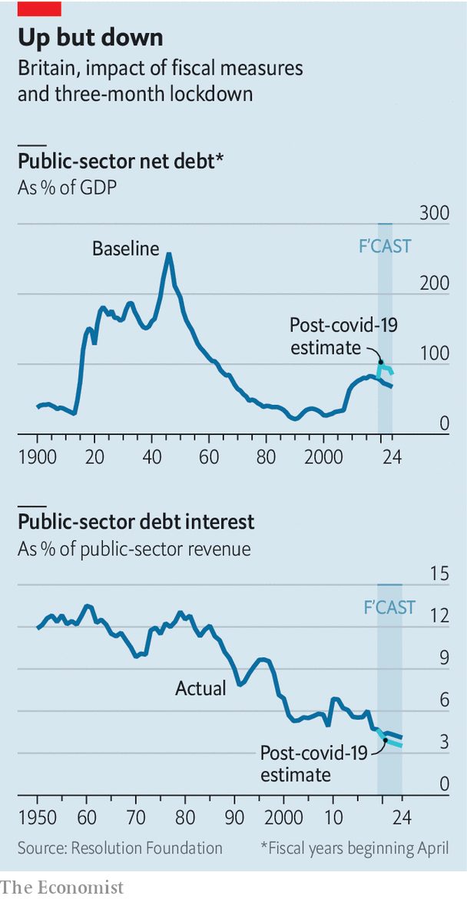

## Not so burdensome

# As debt soars, the cost of servicing it keeps falling

> Good news for the British government’s finances

> May 21st 2020

AN AWFUL LOT has changed since Rishi Sunak, the chancellor, unveiled his budget in March. Britain’s economy looks set to experience an unprecedentedly rapid and deep recession. What is more, the government, through actions such as the furlough scheme to support employment, is choosing to bear an unusually large share of the initial costs. The result will be much higher government debt than previously anticipated. And yet the actual cost of servicing that higher debt may well turn out to be lower than was expected back in March.

There is now so much uncertainty that the official government forecasters—the Office for Budget Responsibility (OBR) and the Bank of England—have declined to issue their usual forecasts, instead presenting what they call “scenarios”. More detailed modelling by the Resolution Foundation shows what may be to come. According to the think-tank’s three-month lockdown estimate, the debt-to-GDP ratio will soon head back to the 100% mark—a level not seen since the 1950s, when Britain was still burdened with the costs of fighting the second world war.

But at the same time, interest rates have collapsed. When the budget was delivered, the OBR expected the yield on government debt to average around 0.9% a year between 2020 and 2023. Since then the Bank of England has cut rates to a record low and restarted its programme of quantitative easing (buying government debt). As a result, the yield on the benchmark ten-year government debt has fallen to closer to 0.2%. On May 20th the government sold two-year gilts to investors with a negative nominal yield for the first time. For some maturities, the government is therefore being paid to borrow. Many bond strategists now reckon that leaving the European Union without a deal would push the Bank of England into taking its base rate negative, putting yet more downward pressure on borrowing costs.

Low borrowing costs are good news for the government’s finances. In the Resolution Foundation’s scenario, interest costs will take up a smaller share of tax revenues by 2024 than was expected at the budget. Indeed, they will be lower than at any point in Britain’s post-war history. And not only will new borrowing attract a lower rate, but as existing debt is refinanced the cost of servicing it will fall, too. More debt leaves the government vulnerable if interest rates return to higher levels. So far, though, there is little sign of that happening.