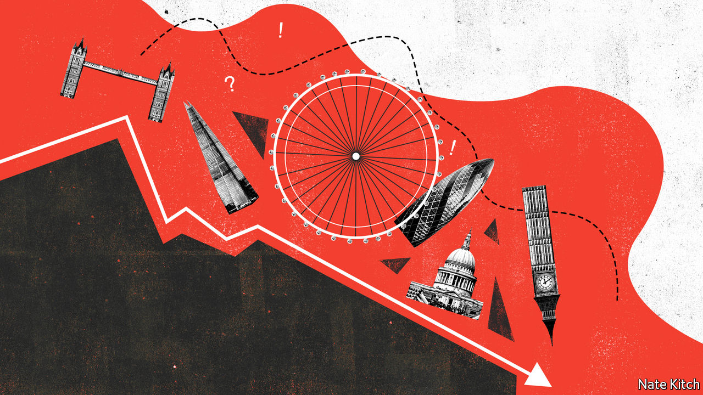
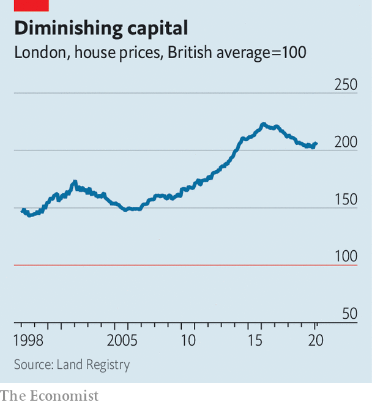

## Peak capital

# London may have gone into a covid-accelerated decline

> The shift could reverse three decades of ascendancy

> May 23rd 2020

BEFORE IT WAS blown off course by covid-19, Boris Johnson’s government had big plans to reshape the economic geography of Britain. Poor parts of the Midlands and north of England would get lots of infrastructure investment, helping them to close the productivity gap with London. The country would be “levelled up”.

The idea always seemed a little far-fetched. British governments have been trying to boost productivity outside London for decades, with not much success. And it seems less and less likely that the government will be able to focus on grand new designs as opposed to hasty repair jobs. But something else might happen, to spare Mr Johnson’s blushes. Rather than levelling up, Britain could be about to level down, as London sags.

London was not always the great success it is now. After the second world war the government, which had already pinched the capital with a thick Green Belt, deliberately pushed businesses and citizens out to “new towns” in the Home Counties. Manufacturing declined, as did the docks that had once provided jobs and prosperity. By the 1980s the city’s population had fallen by a quarter from the 8.6m it had hit in 1939. London’s schools and services were famously awful.

After the Big Bang deregulated financial services in 1986, the logic of agglomeration reasserted itself and London took off. The creative industries and, in recent years, a thriving tech centre have joined the staples of banking, asset management and business services. Schools, policing and transport have all been transformed. People have flooded in from all continents, making London the world’s most global city.

Yet some warning signs have been visible for a while. Although London’s population has continued to grow, over the last decade that has been driven by international migration and the birth rate. Between 2008 and 2018, 550,000 more Britons left London than moved to it. People complain of high costs and anxiety. One league table in which London scores poorly is the Office for National Statistics’ rankings of well-being and life satisfaction. Since 2015 migration from the capital has helped reduce the differential between London’s house prices and those in the rest of the country (see chart).

But London’s house prices remain double those elsewhere. After housing costs are accounted for Londoners are, on average, worse off than residents of the rest of southern England or Scotland. The chairman of PWC, a professional-services firm, has argued that graduates are turning their backs on London. Whereas 60% of graduates working for the big four accounting firms used to be based in the capital, in 2018 60% of new starters were outside.

The London office-cost premium is even higher than the housing-cost one. Prime square footage in the capital costs three times as much as space in other southern cities and seven to nine times as much as elsewhere in Britain. According to a legal recruitment firm, a company can save about £20,000 ($24,500) a year by moving a lawyer out of central London, after office costs and salary are taken into account. “Northshoring”—usually referring, confusingly, to places such as Birmingham that are far from northerly—has become something of a buzzword in the industry. HSBC chose to move its British retail banking headquarters to Birmingham in 2017. Amazon, an internet retailer, picked Manchester for its major British corporate site in 2018.

If the coronavirus crushes property values and office rents, London might become a little less offputting. Perhaps some graduates will be tempted back from Leeds or Manchester. But covid-19 and the extreme social-distancing measures used to combat it pose a new and more profound danger to the capital, for they threaten two factors that have been central to its success: fun and foreigners.

London’s triumph is at least partially based on it being a fun place to live. “People come here not only because you can get paid well but because you can have a good time,” says Douglas McWilliams of the Centre for Economics and Business Research, a consultancy. The bars and cafes of the East End have been an important driver of what Mr McWillams once dubbed the “flat white economy”, where people with interesting hair bounce ideas off each other while drinking trendy beverages.

It is hard to have a flat white economy when you have to maintain two-metre distancing while queuing for your caffeine. Restaurateurs fear that being forced to operate at a lower capacity will drive many of them out of business. Theatres are facing disaster. As a hedge-fund manager puts it, “London without the culture and the restaurants is just a more expensive Frankfurt with more congestion.”

Covid-19 might combine with Brexit to cut international migration. Although foreign candidates for London jobs will score better on Britain’s new points-based immigration system than those for jobs elsewhere in the country, because the jobs are better paid, the signal has been sent: Britain is not keen on mass immigration. Universities fear that foreign student numbers could fall by 20-50% in the year ahead. For London, with its more than 100,000 foreign students, that is a problem.

Like all great cities, London could also suffer from changing assumptions about work. Many firms now expect that some people will keep working from home even after the danger of coronavirus has receded—if not every day then several days a week. As firms learn to make do with smaller offices, workers might prize bigger homes outside London where they can have an office. The trade-off between space and commuting time looks different if you only have to go in two or three times a week. But if this happens, it will probably benefit commuter towns in the south-east rather than the northern and Midlands towns that Mr Johnson wanted to help.

Lisa Taylor of Coherent Cities, a consultancy, remains optimistic. “The next two years are going to be very tough,” she argues. “But a different city could emerge on the other side. One where land use has changed, where we have more co-working and co-living spaces.” She reckons that a greener, less congested London could take its inspiration from cities like Copenhagen and Amsterdam. But those are hardly world-beating metropolises.

London is unlikely to slip back into the dismal state it was in before the mid-1980s. It is likely to remain richer and more productive than the rest of Britain. It will remain Europe’s most powerful magnet for talented immigrants. Still, its pulling power is likely to wane. If that happens, Britain’s economy will probably suffer. But a less centralised country, in which opportunity was more evenly distributed, might be a better place in other ways.■

Editor’s note: Some of our covid-19 coverage is free for readers of The Economist Today, our daily [newsletter](https://www.economist.com/https://my.economist.com/user#newsletter). For more stories and our pandemic tracker, see our [hub](https://www.economist.com//news/2020/03/11/the-economists-coverage-of-the-coronavirus)