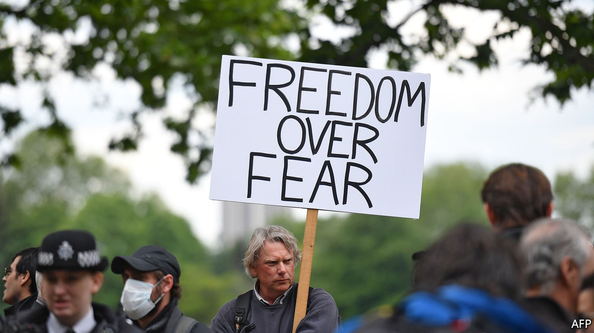

## Politics

# The pandemic is dividing Britons, not uniting them

> Views on covid-19 are splitting along party lines

> May 23rd 2020

WHEN BORIS JOHNSON announced lockdown on March 23rd, he was supported by Sir Keir Starmer, front-runner to be Labour leader, and the governments in Scotland, Wales and Northern Ireland. A furlough scheme to allow workers to be kept on in their jobs was designed with trade unions’ assent. More than 90% of voters backed the shutdown; the support was consistent across parties and around the country. Steve Baker, a self-described libertarian MP, suppressed tears as he told the House of Commons the “dystopian” restrictions were unavoidable.

Now politics is back. Labour and the unions are increasingly critical of government policy. There is sniping from Scotland and Wales, too. And Mr Baker has returned to his usual occupation of snapping at the government’s ankles.

Harassment from the right focuses on hostility to the lockdown. Ardent Brexiteers and climate-change sceptics have reunited around the issue, and are attacking the model from Imperial College London on which the government based its decision to shut the economy down as a “buggy mess”. A Tory MP approvingly compares the row to that over the validity of climate-change forecasts that engulfed the University of East Anglia a decade ago.

On the left, the teachers’ unions are refusing to go back to work until schools are “safe’”—which leaves much scope for disagreement. The government wants schools to reopen on June 1st. A number of councils have weighed in to support the unions, and the devolved governments of Wales, Scotland and Northern Ireland are taking a more cautious line on school reopening.

Voters, too, are dividing. Britain is not seeing the same deep polarisation as America, where a deep partisan split over whether the virus was dangerous or not appeared swiftly. There is little support outside the Conservative back benches for an immediate reopening of schools and pubs, and Britons of all parties tell pollsters they are worried by the virus. But their views about the future and the government’s response are shaped by party allegiance. “The immediate effect of the emotional shock starts to fade, and when it does you see familiar patterns of divergence re-emerge in the public,” says Rob Ford, a political scientist at the University of Manchester. Voters are exploring a strange new world through old political lenses.

Nearly two-thirds of Tories support the modest relaxation of the lockdown, while two-thirds of Labour voters oppose it, according to YouGov, a pollster. Labour voters are more prone to say that public health should trump economic concerns. Tories are more likely to be among the handful of voters who think schools and pubs should reopen next month.

A belief that people should be free to take risks has long been part of the Conservative cause. But tribalism probably helps explain the split, too. When faced with complex questions—such as how to loosen a lockdown, or what trade policy to pursue after Brexit—uncertain voters form their views based on prompts from the political elites they like, such as politicians, trade unions or newspapers, says Professor Ford. Those signals have been getting stronger in recent weeks. “If you ask people about what they think of the epidemiological uncertainties of the risk of sending your kids back to school, they think: ‘What does somebody I trust say on that?’”

Mr Johnson has insisted that his strategy is rooted in science, not politics, but science may not be a unifying force. Tory voters have more confidence in Chris Whitty, England’s chief medical officer, who is a fixture at Boris Johnson’s press conferences, than Labour voters do. “It’s not that Whitty is a partisan figure, but he is associated with government policy,” says Will Jennings, a political scientist at the University of Southampton.

Britain is likely to dodge a Brexit-style culture war over coronavirus, says Professor Jennings. Voters of all stripes accept that the virus poses a significant threat to health, and there have been few American-style protests. Yet Mr Johnson still faces a moment of difficulty. There was consensus on introducing the lockdown, but there is none on easing it.■

Editor’s note: Some of our covid-19 coverage is free for readers of The Economist Today, our daily [newsletter](https://www.economist.com/https://my.economist.com/user#newsletter). For more stories and our pandemic tracker, see our [hub](https://www.economist.com//news/2020/03/11/the-economists-coverage-of-the-coronavirus)