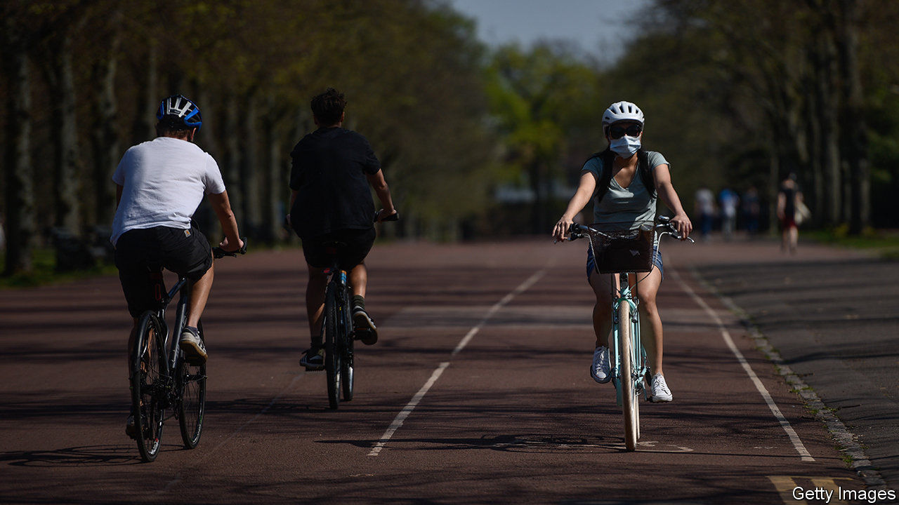
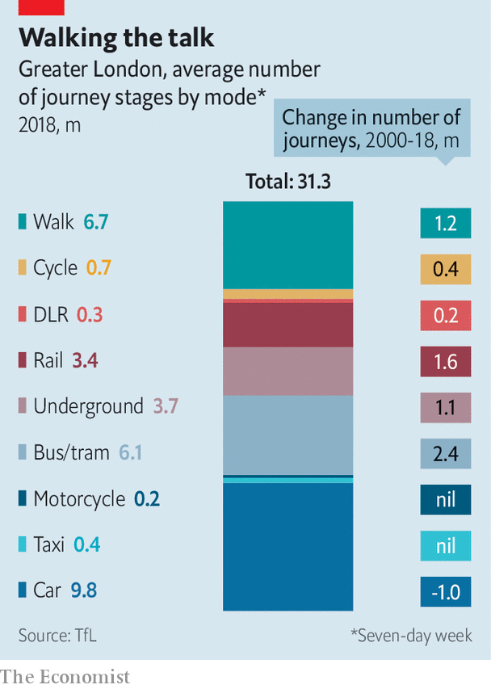

## The great land grab

# Walkers and cyclists are using the covid-19 crisis to swipe road space

> They may not give it back to cars

> May 23rd 2020

AFTER LONDON was destroyed by fire in 1666, several worthies drew up bold plans for a new city. The philosopher Robert Hooke, who lived and worked at Gresham College near Bishopsgate, envisaged a gridded city with small parks, rather like Barcelona. Others, including Sir Christopher Wren, an architect, and John Evelyn, a diarist, devised plans to improve the city. All were disappointed—the authorities moved too slowly, and London was rebuilt along its old medieval roads. But the streets around Hooke’s former home may be about to change.

The Corporation of London, which runs the financial district, proposes to make the roads that once led to Gresham College one-way, and give space now occupied by cars to pedestrians and cyclists. Cars and buses will be barred altogether from other nearby streets between 7am and 7pm. Transport for London plans to sweep cars off London Bridge and Waterloo Bridge. These are bold schemes, affecting major roads that had been considered untouchable, says Giulio Ferrini of Sustrans, a cycling and walking charity. And central London is not the only place with plans.

Camden High Street in north London is a mess of barriers and traffic cones, which take road space away from parked cars and give it to pedestrians. Bike lanes have popped up on thoroughfares like Park Lane and Euston Road. Birmingham’s city council plans to cut street parking and is considering carving bike lanes out of dual carriageway roads. Bristol, Edinburgh, Liverpool and Manchester have similar plans. JSP, a company that makes barriers and traffic cones (including one called “dominator”) says that demand for its products has jumped.

Will Norman, London’s walking and cycling commissioner, argues that the city has no choice but to repurpose roads for walking and cycling. In normal times Londoners rely on trains, buses and the Tube for more than two-fifths of their travel (see chart). Covid-19 has made them fearful of doing so: on the morning of May 18th London Underground carried 8% of the passengers that it did a year earlier. If lots of people transfer from public transport to cars, the streets will gum up and pollution will rise. The city must be quickly reconfigured to make that option seem less attractive, and cycling and walking more so.

Yet the danger of gummed-up streets seems a long way off. London and other British cities are still deathly quiet. And if they do bounce back to life—which, if social distancing is a long-term reality, they may not—taking lanes away from cars might exacerbate congestion. Steve McNamara of the Licensed Taxi Drivers’ Association reckons that covid-19 is merely an excuse to force through an anti-car strategy. “This is a land grab,” he says.

It might be a worthy one nonetheless, if urbanites can be jolted out of their cars and onto pedals or pavements. The construction of a network of more-or-less safe bike routes is one reason that cycling has roughly doubled in London since 2000. But it is still a minority activity, accounting for less than 3% of journeys. For all the cost and unpleasantness of driving in London, one in three trips is by car. Outside the capital, two-thirds are—a proportion that has barely changed in 15 years, according to the National Travel Survey.

The cycling and driving lobbies agree on one thing: although they are sometimes described as temporary, many of the changes to roads will be permanent. People get used to new arrangements, and those who benefit do not want to give them up. “We’re not going to go back to the same situation,” says Mr Norman. Cities have learned the lesson of London in the 17th century. You can change a city following a crisis, but you have to move quickly, before things go back to normal. ■

Editor’s note: Some of our covid-19 coverage is free for readers of The Economist Today, our daily [newsletter](https://www.economist.com/https://my.economist.com/user#newsletter). For more stories and our pandemic tracker, see our [hub](https://www.economist.com//news/2020/03/11/the-economists-coverage-of-the-coronavirus)