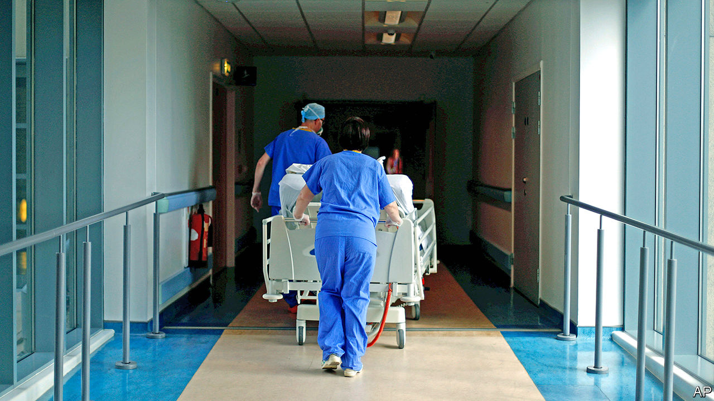
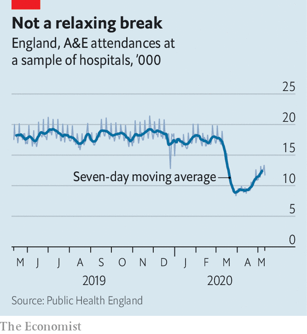

## Unwinding the National Covid Service

# Why the NHS will not be back to normal for a very long time

> Numbers of covid patients are falling. Yet the health service faces an enormous backlog

> May 23rd 2020

OVER THE past few months, the thousands of organisations that make up the National Health Service, and the 1.7m people they employ, have turned their attention to one task: dealing with the pandemic. The astonishing transformation that resulted saved many people’s lives, and the health service from collapse. Now, however, it must be undone. Medics everywhere are working out how to return to something like normality, even as the virus circulates. Many hospital chiefs believe doing so will prove even more difficult than the initial transformation.

The covid-19 burden has at least become less pressing. In England fewer than 700 victims a day are now hospitalised with the virus, down from a peak of 3,121 on April 2nd. So people are being encouraged to seek treatment for other issues, with doctors worried they are avoiding doing so for fear of contagion. On May 16th Matt Hancock, the health secretary, tweeted a video in which he said that “it’s really important that you help us help you, by coming forward with problems if you have them...If you’re asked to go to a hospital by a clinician then please do go.” Numbers arriving at accident-and-emergency departments are beginning to rise, though they are still below pre-crisis levels (see chart).

In truth, the NHS will never return to its pre-pandemic state. For one thing, NHS England, which runs the health service, is working out which innovations introduced because of covid-19 should stay. Almost all prescriptions and primary-care appointments now happen online, as do lots of outpatient ones. Doctors have been surprised by how well this works. Other changes—like the retraining of specialists and the increase in intensive-care capacity—will become a permanent feature to protect against further waves of the virus. According to the Financial Times, the NHS London region plans to double the number of intensive-care beds in its hospitals.

Such innovations will make the NHS more resilient. But even if it manages to keep them, the health service will still face difficulties. Before the crisis, it was in bad shape. In February just 85% of people turning up at accident-and-emergency departments were seen in four hours, for instance, against a target of 95%. And dealing with yet more sweeping changes will be a big ask for staff who “are absolutely wrung dry”, says Sir Chris Ham, co-chair of the NHS Assembly, which advises on the integration of the health service.

The knackered workforce will have to deal with an enormous backlog of patients. In a typical month 1.5-1.7m people start a new course of treatment. But as Nigel Edwards of the Nuffield Trust think-tank has noted, in many hospitals levels of elective care have been running at 15-20% of normal, suggesting the backlog will be in the millions. Many patients will require more complex care, too, their problems having worsened without treatment.

It has also become clear that hospitals are a good place to catch covid-19. Thus waiting rooms will have to be emptied, protective kit donned and deep cleaning regularly carried out. Radiologists expect that such precautions will halve the number of CT scans that can be carried out. Neil Mortensen, president-elect of the Royal College of Surgeons of England, predicts a similar fall in the capacity to carry out surgery. “You can’t just flick a switch and go back to what it was before,” he says.

In a few big cities it may be possible to run some hospitals “red” (taking covid patients) and other ones “green” (not taking them), which would speed things up. In more sparsely populated parts of the country, this division will have to happen within hospitals, which will be trickier to manage. All of this means that overall capacity will be way down on pre-pandemic levels.

At the end of March the NHS struck a deal that allowed the state to use private-sector beds. An extension is likely to be announced soon, with the extra capacity used to treat the backlog, rather than the virus itself. Some senior people in the system want the emergency “Nightingale” hospitals, which are being mothballed, to be repurposed to help out. Yet even with these measures, the combination of a huge backlog and reduced capacity means that waiting times are about to become very long indeed. Like many covid victims, the NHS will take time to get back on its feet. ■

Editor’s note: Some of our covid-19 coverage is free for readers of The Economist Today, our daily [newsletter](https://www.economist.com/https://my.economist.com/user#newsletter). For more stories and our pandemic tracker, see our [hub](https://www.economist.com//news/2020/03/11/the-economists-coverage-of-the-coronavirus)

## URL

https://www.economist.com/britain/2020/05/23/why-the-nhs-will-not-be-back-to-normal-for-a-very-long-time
