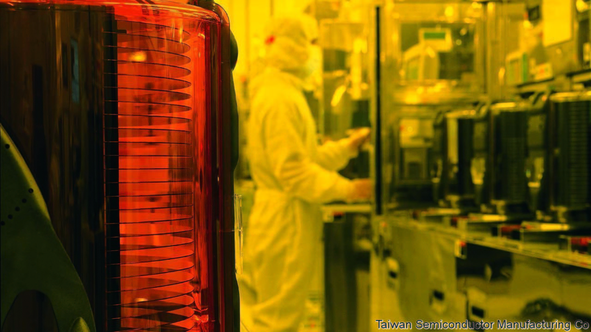

## Immaculate misconceptions

# America’s latest salvo against Huawei is aimed at chipmaking in China

> It may push the industry out of America, too

> May 23rd 2020HONG KONG

AMERICA HAS it in for Huawei—and not just because some of its politicians fear the Chinese giant’s networking gear lets spooks in Beijing eavesdrop on customers’ communications. The firm, a world leader in futuristic 5G telecoms, also symbolises China’s technological and economic ascent. President Donald Trump does not like it one bit. William Barr, his attorney-general, has warned that America risks “surrendering dominance” to China if it cannot “blunt Huawei’s drive” to 5G supremacy.

An earlier attempt at blunting, which made it illegal to sell American-made components to Huawei, including advanced computer chips on which the Chinese firm relies, was not the knock-out blow the White House hoped it to be. Chipmakers were able keep shipping Huawei semiconductors from factories outside America. So on May 15th the Trump administration extended its restrictions from chips to the tools used to make them—many of which come from America. So long as big microprocessor producers, like Taiwan Semiconductor Manufacturing Company (TSMC), use American-made equipment, they will no longer be able to forge Huawei-designed chips anywhere in the world.

In a press conference on May 18th a reticent Huawei said that the new rule put its survival at risk. Three days later President Xi Jinping vowed to invest $1.4trn by 2025 to increase China’s tech independence. Yet as with America’s original restrictions, the latest blast in the Sino-American chip war may not end up having the intended effect.

The new rule may miss its target entirely. Huawei pays contract manufacturers to assemble its phones and base stations. The chips that TSMC makes for Huawei are sent to those companies, not to the Chinese firm, for integration. Finished products are usually sent directly to Huawei’s customers. Huawei need not touch the blacklisted chips at any point. This may get Huawei off the hook. Some lawyers note that the new restriction does not seem to apply to items sent to third parties and not destined for Huawei, even where these are being supplied at Huawei’s direction.

Even if the legal experts are wrong, the rule will be difficult to enforce: the clean rooms of Asian chip foundries are hard to monitor. More important, the $412bn semiconductor industry is so globalised that even the long arm of American law will struggle to pin it down. The likelier upshot of the new export controls may be to drive a portion of America’s chipmaking industry from its shores.

The industry’s geographic scope was already becoming broader—and less American—over time. One crude yardstick for this is to track where its physical assets sit, as recorded in the filings of public tech businesses (see chart). The top dozen global semiconductor firms, for example, now have only 20% of their plant in America. Asian firms, such as TSMC, SMIC and Samsung, mostly locate their factories at home. American chipmakers, meanwhile, and many suppliers, have been diversifying geographically for years, says Dan Hutcheson of VLSI, a consultancy—partly in pursuit of cheap labour, partly to protect against natural disasters.

Consider Intel, which makes chips of its own design for customers (among them Huawei) that assemble electronic devices. In 2019 the American giant had over 35% of its $55bn in physical assets, a rough proxy for manufacturing capacity, abroad. Some $8bn-worth sat in Israel and another $4bn in Ireland. Industry insiders report that China-bound shipments from both places have increased since America’s Huawei-baiting began. Intel also has more than $5bn in assets in China, its biggest market. All told, $20bn of its $72bn in revenues last year came from China.

Another example is Analog Devices, a smaller American firm which makes radio-frequency chips on which Huawei relies heavily for the assembly of telecoms base stations. It, too, is spread around: half of its assets sit in the Philippines, Ireland, Singapore and Malaysia. Perhaps that might make it easier for the firm to explore the option of making its Huawei-bound chips in non-American facilities.

Geographic complexity has made it hard for America’s government to stop chipmakers’ kit from reaching Huawei. Hence the new focus on chipmaking tools, many of which are still made in America and so easier for Washington to control. Applied Materials, based in California, builds kit used to etch patterns into silicon, has 90% of its assets in the United States. Lam Research, an American maker equipment used by TSMC and others to process silicon wafers, has 88% of its $1.1bn plant at home.

One big unknown surrounding the new Huawei rule—which the chip industry’s lawyers are busily unpacking—is whether, under it, equipment manufactured at American firms’ overseas facilities counts as “American”. If so, advanced chipmaking factories that rely on such kit to fabricate cutting-edge chips for Huawei, as TSMC does, will need alternative suppliers. The American toolmakers’ Japanese rivals, such as Tokyo Electron and Hitachi High-Technologies, suddenly find themselves with a new geopolitical competitive edge.

Another mystery relates to an announcement made just as the new American measures against Huawei were being unveiled. On May 15th TSMC confirmed it would build a $12bn chip factory in Arizona, to be up and running by 2024. Why would the Taiwanese firm, which gets 15% of its revenue from Huawei, agree to pour billions into America just as its new host in effect deprived it of a big customer? It may be currying favour with the administration, hoping to avert sanctions against more Chinese customers. Observers point to another possibility. TSMC could equip the Arizona foundry with American gear from its existing factories, freeing space in its Taiwanese operations for brand new non-American kit that can freely serve Chinese customers. TMSC did not respond to a request for comment.

Even if that is not TSMC’s intention, workarounds are bound to proliferate. On May 18th the boss of Samsung Electronics toured his company’s new chip factory in Xian, a city in central China. The South Korean firm, which plans to invest $115bn in its chipmaking business over the next decade, has made it clear that it will not ignore China. America’s export controls may prompt it to kit out its foundries with equipment that will not fall foul of Sino-American geopolitics.

Chip-industry insiders report that semiconductor equipment is already being marketed inside China as “EAR free”—meaning Chinese buyers need not worry about the “export administration regulations” that the Trump administration is using to attack Huawei. A person close to American toolmakers says some of them are thinking about moving their patents abroad to rebuild operations from scratch away from America’s jurisdiction, in order to circumvent present and future anti-Chinese restrictions. Mr Trump’s attempt to de-Sinify the semiconductor industry may do more to de-Americanise it instead. ■

## URL

https://www.economist.com/business/2020/05/23/americas-latest-salvo-against-huawei-is-aimed-at-chipmaking-in-china
