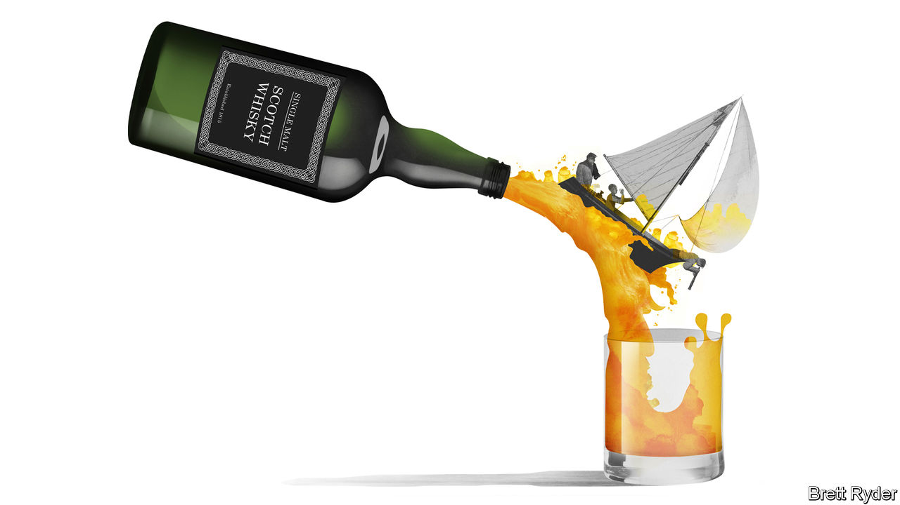

## Schumpeter

# Farewell for now to a golden age of drinking

> The pandemic has hurt the booze business

> May 23rd 2020

A  YEAR AGO your columnist joined a sailing trip to Islay, an island in western Scotland famous for peaty malt whisky that can singe the hair off your nostrils. The mooring was in front of a distillery called Ardbeg, its name painted in huge black letters on a whitewashed wall facing the sea. Its breakfast included haggis—and a dram of scotch. Then came the distillery tour, and more samplings. Even at midnight, the air reeked with the smoky vapours coming from the mash tun. Night workers cooed over the spirit as it flowed through pipes and jars. They said demand was so strong that production was running round the clock.

Thanks to such artisan devotion, in recent years the $1.5trn booze business has become a gilded one. For the well-heeled (or deck-shoe clad), brands like Ardbeg, owned by LVMH, a French luxury-goods firm, could sell rare whiskies at more than $100 a bottle. Champagne had record turnover last year, and among still wines even rosé, long frowned upon by connoisseurs, developed a cachet. Financially, the biggest drinks companies performed a feat of mixology that would make a bartender blush. As overall volumes declined in the West, firms like Diageo and Pernod-Ricard coaxed people into spending more on higher-quality brands, sharply increasing profits. Brewers, led by Anheuser-Busch InBev (ABI) and Heineken, acquired competitors and slashed costs, creating a high-margin duopoly in some emerging markets.

Yet the greatest effervescence was at the hipster level. Innovation, in the form of craft beers, locally distilled gins and mezcal bars, fizzed with the energy of the cocktail age in late 19th-century America. That helped revitalise gourmet culture and inner-city life (as well as irrigating a bizarre beard-revival).

So far covid-19 has not been a full-blown disaster for the drinks business. The speed with which the wines-and-spirits stock in Schumpeter’s drinks cupboard has dwindled in recent weeks proves that drinking is not just a way to celebrate good times but to endure bad ones. Sales for home consumption have boomed. Yet even if there is plenty of pent-up demand for social lubrication when lockdowns end, a golden age of booze is probably over.

The immediate reasons for this are social distancing and economic hardship. The first may have the more detrimental impact on wine-and-spirits producers. They are overwhelmingly reliant on bars, nightclubs and duty-free shops, where markups of 30% are common, to encourage consumers to experiment with fancier tipples. Such “premiumisation” is crucial for profits, observes Mark Meek, who runs IWSR Drinks Market Analysis, a data-gatherer. It may suffer as people remain wary of crowds or travel; a wave of recent infections in Seoul’s night spots is a bad omen. The continued rationing of restaurant space, sports and mass entertainment will further depress sales of beer, wine and champagne. Without a vaccine, many of these activities may take years to recover, Mr Meek says.

The economic situation is the second blight. This is likely to hurt brewers more than other drinks companies. That, at least, was the experience during the financial crisis a decade ago, when beer and cider sales went from 6% growth in 2007 to a 1% decline in 2009. ABI is particularly vulnerable: weighed down by $96bn in net debt, it is unable to diversify away from beer. But sales of wines and spirits for drinking at home will suffer, too. Firms will probably try to promote their most affordable brands, reducing margins. Even Ardbeg has gone downmarket with a youthful five-year-old whisky called Wee Beastie.

Lockdown and its aftermath leaves craft firms most exposed. Some have been bought by industry giants; ABI now owns Goose Island and Camden Town Brewery. But many still sell from their own small premises, making it harder to attract social-distancing customers. Even in good times many barely covered their costs. Being small, they have less leverage to force their wares onto supermarket shelves. Some will either be sold or sluiced down the drain. Inevitably, the industry will lose some of its creative fizz.

In addition, two longer-term threats loom on the horizon: demography and drugs. Studies show that Generation Z, the eldest of whom have recently reached drinking age, are far less likely to consume alcohol than their elders, says Javier Gonzalez Lastra of Berenberg, a bank. That will affect the drinks industry for years to come, because peak alcohol consumption has traditionally been between the ages of 18 and 34. Partly as a result, in America, historically the world’s biggest drinks market, total alcohol sales volumes have declined for three years in a row. Overlapping with youthful sobriety is cannabis use. A report co-written by IWSR last year found that this was an emerging alternative to booze among the young. Millennials in America accounted for almost half of “dualists”, who both smoke pot and imbibe. Covid-19 could benefit cannabis further. In Schumpeter’s limited experience, pot-smoking has always been something of a furtive activity. That may make it better suited to social distancing than clinking glasses in a pub.

Drinks firms can take some comfort from China, where covid-19 fears are on the wane. Punters there are once again queuing up to enter bars. The share price of Kweichow Moutai, China’s most exclusive brand of baijiu firewater, continues to soar, hinting at a thirst for luxury tipples among the super-rich. And some quarters are abuzz about the potential of e-commerce to reshape the business, arguing that if producers can use technology to sell booze directly into the home rather than through supermarkets, they can gain a better understanding of how to get deeper down drinkers’ throats. There will, to be sure, be more opportunities to innovate. But for now most of the excitement will be about new direct-to-consumer business models, rather than new types of exotic liquor. Business innovation is always alluring. Not quite in the same way as whisky fumes in the nostrils, though. ■

Editor’s note: Some of our covid-19 coverage is free for readers of The Economist Today, our daily [newsletter](https://www.economist.com/https://my.economist.com/user#newsletter). For more stories and our pandemic tracker, see our [hub](https://www.economist.com//news/2020/03/11/the-economists-coverage-of-the-coronavirus)