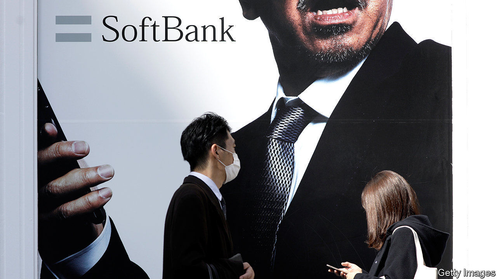

## Born again

# SoftBank is a big beneficiary of the Fed’s pandemic response

> Now the Japanese technology group hopes a tech rally will boost its huge but underperforming startup fund

> May 21st 2020

SHARES IN SOFTBANK, a Japanese conglomerate, have gained almost 70% in value since mid-March, more than twice as much as Tokyo’s Nikkei stockmarket index. One big reason is $23bn in share buy-backs, announced in March and now under way. Another is central-bank activity. In April America’s Federal Reserve started buying junk debt.

Two months ago fears that SoftBank’s debt-addiction could spell ruin sent its own junk bonds tumbling; now yields have fallen. This has given SoftBank’s eccentric boss, Son Masayoshi, a confidence boost, even as he reported a record $8.8bn loss for the year to March on May 18th. Rather than repent and praise the Fed for the manna from monetary heaven, Mr Son likened himself to Jesus.

Just as the saviour was misunderstood in his day, Mr Son mused, so is he—specifically with respect to the Vision Fund. The tech-investing vehicle, 48% of whose equity came courtesy of SoftBank, lost $17.7bn in the past year, mostly on paper and in the last quarter. The fund runs until 2029 so needn’t divest. Since 2017 it has booked $4.9bn of realised gains and $200m of realised losses. Add paper ones and you get an overall loss of $800m, or 1% of the fund’s $81bn investments—“not bad”, Mr Son said, considering the market meltdown.

The pandemic is a handy cover for trouble that began a few years ago, when Mr Son started overvaluing WeWork, an office-sharing firm, and other startups. The resulting financial hit—and a loss of confidence in Mr Son—forced SoftBank into the buy-backs. They will be partly financed by selling forward contracts on some of its lucrative 26% stake in Alibaba, China’s e-commerce titan, and, maybe, $20bn of its stake in T-Mobile, an American telecoms firm. This week SoftBank said Jack Ma, Alibaba’s founder, would step down from its board.

With technology shares soaring, especially in America, some of the Vision Fund’s 88 startups may prosper post-pandemic. SoftBank could list a few over the next couple of years, reckons Atul Goyal of Jefferies, a bank. One of the fund’s biggest bets is ByteDance, owner of TikTok, a hit video app. The Chinese firm’s valuation has reportedly risen to over $100bn of late. Without the Fed’s moves, says Mr Goyal, Mr Son would have struggled under the weight of debt. Now he has a shot at redemption.