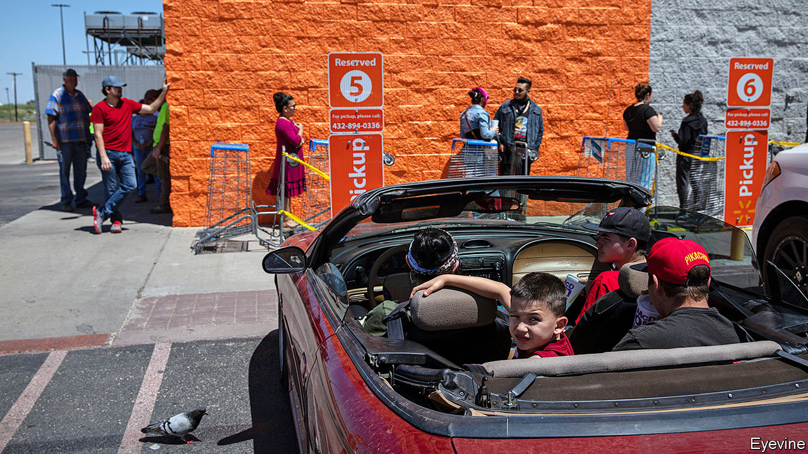

## A nimble beast

# Walmart ekes out an edge in groceries during the pandemic

> America’s biggest retailer has outshone Amazon when it comes to food

> May 23rd 2020NEW YORK

AS COVID-19 began to spread across America shoppers rushed to stock up on pasta, hand-sanitiser and loo roll. Other things equal, that should be good news for purveyors of these and other essentials. But other things are not equal: social-distancing restrictions have disrupted retailers’ supply chains and their operations. Amazon, whose e-commerce empire reported record sales in the first quarter, booked lower profits as a result of ballooning pandemic-related expenses. Could Walmart, with a quarter of America’s grocery market, 5,000-plus stores and 1.5m employees in America, including 235,000 temporary ones hired to cope with coronavirus-fuelled demand, cope any better with the pandemic?

On May 19th the answer came in Walmart’s earnings report for the three months to April. It was a resounding “yes”. Total revenue shot up by 9%, year on year, the highest rate in nearly two decades, to $135bn. Same-store sales rose faster still. The firm’s “omnichannel” sales, which combine online shopping with in-store pick-up, surged by 74%. Unlike Amazon, it also saw quarterly net income rise relative to the same period last year, by 4% to $4bn, despite nearly $900m in corona-spending (on things like “co-payments” for employee health bills, higher wages and bonuses for workers). The Arkansan behemoth is proving not only essential but nimble, too. 

The sales surge was not just the result of panic-buying—though there was that, too, especially in March, when the firm reported “unprecedented demand” for staples, which pushed monthly revenues up by 15%, year on year. Things slowed down in April, once the initial panic eased. But only a bit: sales grew by 9.5% compared with the same month last year, nearly three times the rate in February, as Americans spent some of their stimulus cheques from the government on higher-margin feel-good purchases like clothes and video games. 

Walmart’s performance owes much to its renowned ability to contain expenses—or at least not let them spiral out of control. The cost of sales rose by around 10%, year on year, last quarter, roughly in line with revenues.

But the company has also displayed dexterous management. Paul Lejuez of Citigroup, a bank, points out that before covid-19 it offered a “ship from store” service from about a hundred of its locations. As its 45 online fulfilment centres became overwhelmed, it quickly expanded that to some 2,500 stores. It piloted a two-hour delivery service at 100 stores in April, and has already expanded it to 1,000 stores. It plans to double that within weeks.

Walmart allows shoppers to order groceries online and then get them delivered or pick them up at drive-through stations. Such blended purchases of food products helped drive the rise in omnichannel sales, the firm says. They are well suited to times when fear of infection puts shoppers off jam-packed supermarket aisles.

It is here that Walmart has really outshone Amazon, which has yet to crack groceries. Whole Foods, Amazon’s upmarket chain of food shops, is virtually nonexistent outside big cities and too pricey for most Americans, especially the millions on the dole amid the covid-19 slump. Cheaper Amazon Fresh has struggled to cope with demand. Some shoppers fed up with delayed deliveries turned instead to Walmart, a trusted brand with “everyday low prices”. The firm says the number of people placing online orders rose fourfold in the quarter, compared with a year ago.

This has allowed Walmart at last to reap rewards from years of e-commerce investments once seen as a money pit. The firm does not disclose figures but by the reckoning of Simeon Gutman of Morgan Stanley, an investment bank, Walmart has so far invested a total of $15bn in online operations, which made a loss of over $1.6bn last year. Now Mr Gutman is encouraged by the improved outlook for e-commerce profits, thanks to those higher-margin purchases. Doug McMillon, Walmart’s boss, told analysts that his firm has expanded the assortment to “much more than grocery”.

Some new customers who have sampled Walmart’s digital offering because their favoured retailer was closed or unavailable may not stick around once things get back to normal. But Mr Lejuez, pointing to evidence from the last recession, thinks the firm may hang on to many of them.

His view is bolstered by a survey by Greg Melich of Evercore, an advisory firm. It reveals that, in antepandemic America (ie, February), consumers of all ages expected to purchase ever less from bricks-and-mortar shops. No surprise there. More revealing was the finding that shoppers also thought they would buy less from purely online shops—but more from retailers that, like the beast of Bentonville, mix bricks with pixels. ■

Editor’s note: Some of our covid-19 coverage is free for readers of The Economist Today, our daily [newsletter](https://www.economist.com/https://my.economist.com/user#newsletter). For more stories and our pandemic tracker, see our [hub](https://www.economist.com//news/2020/03/11/the-economists-coverage-of-the-coronavirus)

## URL

https://www.economist.com/business/2020/05/23/walmart-ekes-out-an-edge-in-groceries-during-the-pandemic
