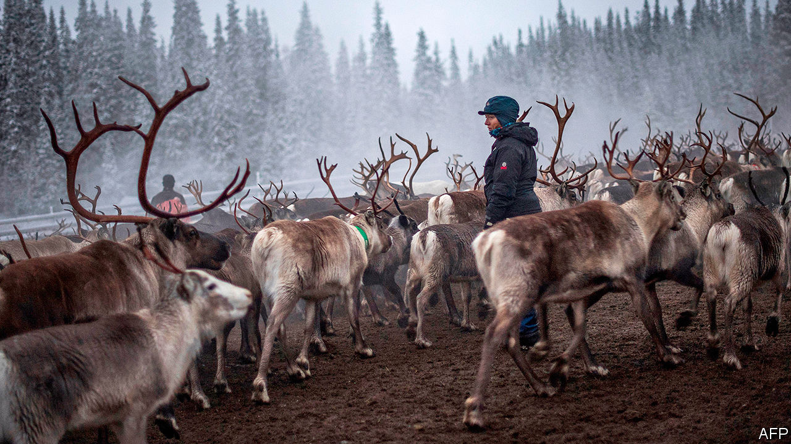

## Sami difference

# Sweden’s reindeer-herding Sami take back control

> An indigenous people wins the right to decide who hunts and fishes on public land

> May 21st 2020

TO MOST PEOPLE, one reindeer looks much like another. But for Anders-Erling Fjallas, one of the Sami people indigenous to northern Sweden, it is easy to tell which reindeer belongs to whom. “We carve our brand in their ears with a knife when the calves are a few months old,” says Mr Fjallas, who owns about 700 of the animals. Once hunter-gatherers, the Sami switched to herding reindeer (caribou) in the Middle Ages. Nowadays they move with their herds between the lowlands and the mountains. But their lifestyle is threatened by development.

Until recently there was little they could do about this. But in 2009 Girjas, a Sami community, sued the government for control of hunting and fishing permits in their territory. On January 23rd Sweden’s supreme court ruled for the Sami, citing government records going back to the 16th century which recognised Sami rights in exchange for taxes (paid in fur). Until the government passes new legislation, any Sami community can sue and win such rights across much of northern Sweden.

Not everyone is thrilled, particularly around the northern mining town of Kiruna. Elsewhere, Sami groups have opposed mining projects they said would interfere with herding. Like the Sami, Kiruna itself is migrating. The tunnels through its iron-ore deposits are caving in, forcing the whole town to move two miles (3.2km). In February reindeer belonging to Sami started showing up dead, with bullet holes in them. Some Sami received death threats.

The city council condemned such nastiness. “Racist hatred must never be tolerated,” says Mattias Timander, the council’s chairman. Still, critics argued that Sami should be treated like anyone else. The politics of indigenous rights in Sweden differ from those in America or Canada: ethnic Swedes consider themselves natives, too.

The Sami have been in Scandinavia for millennia. They are linguistically and genetically distinct. In Sweden, a country of 10m people, there are only about 20,000 Sami. But the state owes them a fair shake. It long oppressed them on racial grounds. The main thing, Mr Timander and Mr Fjallas agree, is for the government to incorporate the ruling into law so herders, hunters and miners can stay out of each other’s way.