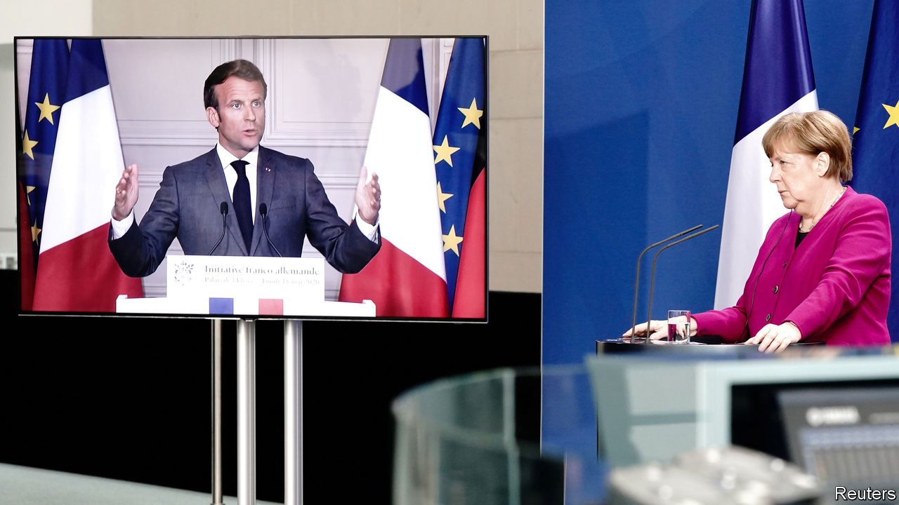

## Who will pay for the pandemic?

# The Merkel-Macron plan to bail out Europe is surprisingly ambitious

> Germany is making a big concession to support weaker states

> May 21st 2020BERLIN AND PARIS

“IN EVERY BEGINNING dwells a certain magic,” beamed Angela Merkel, cribbing from Herman Hesse, when a freshly inaugurated Emmanuel Macron visited Berlin three years ago. But Germany’s chancellor added an earthy caveat: “The magic lasts only when there are results.” And there have been precious few to speak of. A plan to reboot the euro area was ground down to a budget of homeopathic insignificance. A revised Franco-German treaty substituted symbols for substance. Mrs Merkel and Mr Macron fell out on everything from Brexit to the Balkans. Europe’s “locomotive” was left idle in the sidings.

So the ambition of the two leaders’ proposal for a post-covid EU recovery plan, unveiled on May 18th, came as a genuine surprise. The plan, mainly thrashed out in three videoconferences between the pair, comprises four pillars, including boosting the EU’s health-care capabilities and its economic “sovereignty”, a pet theme for Mr Macron. But at its heart is a recovery fund worth €500bn ($546bn), or 3.6% of the EU’s GDP, to be financed by common borrowing and sitting inside the club’s seven-year budget (“multiannual financial framework”, or MFF). Italy and Spain immediately signed on. Markets surged and Italian borrowing costs fell. French media, often hostile to Mr Macron, were cock-a-hoop.

Mr Macron would have preferred a larger fund, preferably operating outside the MFF. But by far the bigger compromise is Mrs Merkel’s. As covid-19 ripped through Europe, the chancellor resisted calls to lend Germany’s full weight to collective efforts to support the hardest-hit countries. France led a nine-country push for joint and severally guaranteed “coronabonds”, but Peter Altmaier, Germany’s economy minister and a Merkel confidant, dismissed it as a “phantom debate”.

That has not changed. Under the new plan governments’ liabilities would be limited to guarantees equivalent to their contribution to the MFF (Germany’s 27% share would leave it on the hook for €135bn). Yet German support for EU debt incurred on this scale is “an enormous shift in principle”, says Iain Begg, an EU-watcher at the London School of Economics. Mrs Merkel’s second concession is to agree that countries that receive the funds, which will be directed to regions and sectors in acute need, need not repay them. Germany, relatively unscathed by the crisis and less exposed to its economic consequences, such as a collapse in tourism, can therefore expect to stump up a lot more than it receives.

The deal appears to have come together only in the few days preceding the announcement, after pressure on Mrs Merkel from both Mr Macron and Olaf Scholz, Germany’s finance minister. Why did she budge? Officials say her first instinct was simply for a larger MFF, until it became clear that cash-strapped governments could not afford it. The chancellor repeatedly described the crisis as the worst the EU has ever known, a hint she was open to more drastic steps. A recent ruling by Germany’s constitutional court questioning the European Central Bank’s bond-buying may also have focused her mind on the risks of over-reliance on monetary policy.

Criticism from Mrs Merkel’s conservative allies has been muted. But other challenges lie ahead. The first is to plug the plan’s gaps, among them the rules for allocating funds and repaying the debt. This is the job of the European Commission; its MFF proposal, which may offer loans on top of the envisaged transfers, will be unveiled on May 27th. That in turn will kick off fierce negotiations among the EU’s 27 governments, all of which must approve the new budget. Several have already signalled displeasure. Austria, Denmark, the Netherlands and Sweden, the self-styled “frugal four”, want a smaller fund, loans rather than grants, and tight conditions.

These minnows will surely bow before the combined might of France and Germany, but may extract a price. MFF disbursements are usually light on conditions. But the Franco-German deal commits governments that tap the fund to “sound economic policies and an ambitious reform agenda”. German sources have hinted at a role for the annual economic-reform proposals Brussels sends to governments. But accepting structural reforms demanded by outsiders could prove hard to swallow for countries like Italy.

The frugals’ greatest fear is a permanent shift to deeper fiscal integration. The new fund is supposed to be temporary, and can only hope to mitigate the harm to ravaged economies. But establishing the principle that common challenges require common debt may ensure that next time the threshold for action is lower, says Jacob Funk Kirkegaard at the Peterson Institute for International Economics. The need to repay the debt will also spur ideas for common EU revenues, such as a tax on plastic or climate-unfriendly imports. Mrs Merkel’s rhetoric on EU reform has begun a curious shift; in the twilight of her chancellorship she has revived talk of revising its treaties to shift towards “political union”. This week’s may not be her last surprise. ■

Editor’s note: Some of our covid-19 coverage is free for readers of The Economist Today, our daily [newsletter](https://www.economist.com/https://my.economist.com/user#newsletter). For more stories and our pandemic tracker, see our [hub](https://www.economist.com//news/2020/03/11/the-economists-coverage-of-the-coronavirus)

## URL

https://www.economist.com/europe/2020/05/21/the-merkel-macron-plan-to-bail-out-europe-is-surprisingly-ambitious
