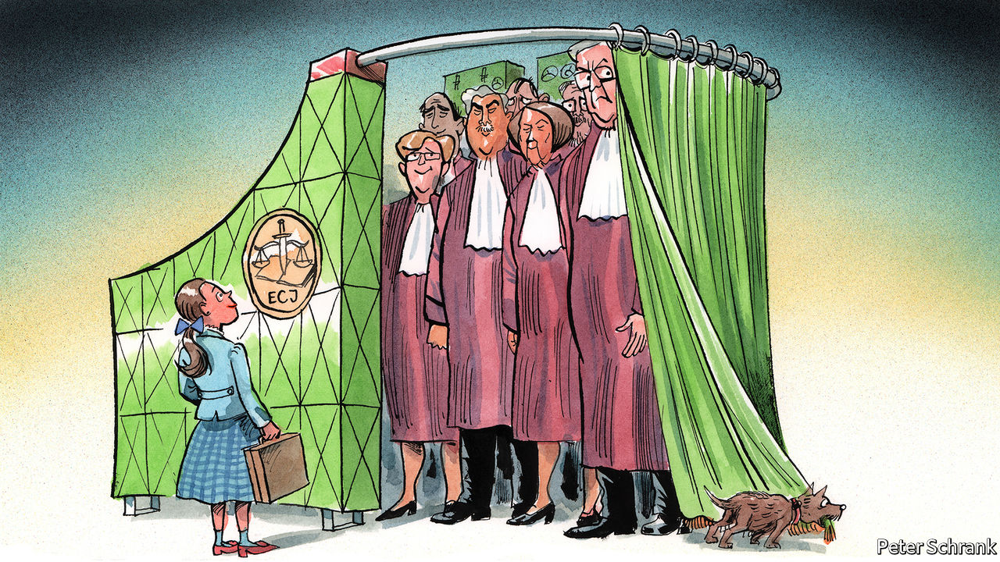

## Charlemagne

# The wizards of Luxembourg

> The EU’s top court gets used to life in the spotlight

> May 21st 2020

IN THE ATTENTION-STARVED world of EU politics, officials and politicians like to vaunt themselves. Folks in the European Commission refer to themselves as the “guardians of the treaties”, which sounds like a tagline from a superhero movie starring polyglot bureaucrats. More enthusiastic MEPs label the European Parliament “the heart of European democracy”. The woeful turnout at European elections—51% in 2019—suggests otherwise.

Only the inhabitants of the European Court of Justice, the EU’s top court, play down their importance. The court is a mere “umpire”, says its president, Koen Lenaerts, a Belgian jurist who has sat on it for three decades. It simply clears up any confusions left over in the bloc’s treaties, steering clear of politics. The Luxembourg-based court often resembles the Wizard of Oz in reverse: a mighty institution determined to portray itself as a puny one.

The court found itself unwillingly thrust into the public gaze this month after Germany’s constitutional court declared that the ECJ had acted ultra vires—beyond its mandate—in giving its blessing to a European Central Bank programme of bond-buying. The ECJ’s decision, which is supposed to be final, was “incomprehensible”, said the German judges. They provoked a terse response from the ECJ, which reminded its German peers that it had the final say on matters of EU law.

This was a very public scrap for a remarkably private institution. For most of its 68-year existence, the ECJ has been in the shadows, acting as a quiet but powerful motor of European integration. Rights associated with the EU, such as the ability to trade across borders or to seek work in another EU member state, owe as much to its judges as to its politicians. As the EU’s responsibilities have deepened, so have the court’s. Whereas once it ruled only on dry economic issues, such as the import of blackcurrant liqueur, today its remit includes everything from asylum to gay marriage.

Where European treaties are vague, it is the court’s job to bring clarity. Such a mandate gives the EU’s judges scope to roam. When negotiations involve 27 countries, hundreds of MEPs and legions of officials, the result is often unclear. Better to have a blurred text than no text at all, is the mantra of politicians working on a continental level. In Mr Lenaerts’ view, the ECJ has “no choice but to complete the constitutional lacunae” left by lawmakers.

But one man’s lacuna-filling is another man’s power grab. Critics portray the court as a power-hungry institution, hellbent on federalising Europe. Roman Herzog, a former German president, diagnosed the court as having a “centralising fever”. Its early years were marked by judicial radicalism, which shaped the constitutional foundations of the bloc. It was a case in 1964 over an electricity bill worth 1,925 lire—about €22 in today’s money—in which the court determined that EU law trumped national law.

Such judgments have been “tolerated, acquiesced [to] or encouraged” by national governments, says Takis Tridimas, a professor of European law at King’s College, London. If legislators did not like the court’s actions, they could always change the law. That they hardly ever do suggests that they do not object strongly to the court’s rulings. In this sense the ECJ resembles an S&M dungeon. National governments are happy to be tied up and slapped around in a dimly lit room by people in odd outfits. However, they would prefer not to mention this fact to their jealous spouses back home: domestic courts and domestic voters.

Such furtive consent has lurked at the heart of the ECJ’s success. Governments may grumble about decisions, but they obey them. Increasingly, however, judges in national courts have chafed at rulings from their European peers. The top courts of smaller countries, including Denmark and the Czech Republic, have rejected the ECJ’s judgments in the past. But size matters. In both the Czech and Danish cases, each country eventually tweaked its own legislation, stitching the tear in the EU’s legal fabric. German judges, by contrast, questioned far more fundamental principles. That rip is not so easily fixed.

A public struggle for supremacy will draw attention to an institution as peculiar as it is powerful. Based in Luxembourg, it is a two-hour drive—or an interminable three-hour train ride—from Brussels, where most EU business is done. It is the only EU institution to operate solely in French, which creates both a translation bottleneck and a tricky learning curve for arriving judges. As is often the case at EU institutions, its staff are a mix of the crème de la crème and dregs sent by national capitals as a reward for good behaviour or to be kept out of the way. “Some are very brilliant; some are tourists,” is the verdict of one former judge. Now a panel vets potential candidates. Last year, 8 of 29 candidates were quietly rejected, including two who were suggested for the court’s highest chamber, which deals with the thorniest constitutional cases.

The ECJ is slowly growing used to the glare of public attention. An older judicial doctrine that the court communicates only through its judgments has been abandoned. Although proceedings are still not televised, the idea has been discussed internally. The court’s president does more interviews than his predecessor, treating journalists to thorough lectures in European law that drop out of his mouth in fully formed chapters.

European voters have yet to realise how powerful the court has become. Any American who reads a newspaper can name a couple of Supreme Court judges, but even the biggest EU nerd would struggle to name their European peers. Few wish to replicate America’s politicisation of judicial appointments. But the court’s increasing impact on the lives of EU citizens should be accompanied by greater scrutiny. Walter Bagehot once argued that the monarchy’s defenders “must not let daylight in on the magic”. Courts require less mystery. The wizards of Luxembourg have nothing to fear from letting in more light. ■