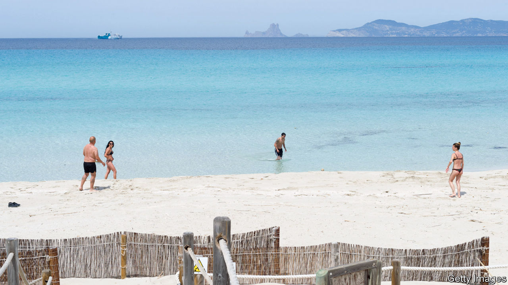

## Empty beaches

# Will tourists come to sunny Spain this year?

> The omens are not good

> May 23rd 2020MADRID

ON MAY 18TH for the first time in nine weeks the idyllic beaches of Formentera, the smallest of the Balearics, were open for bathing. The same went for three of the eight Canary Islands. The coronavirus lockdown means that all of Spain’s other beaches will remain closed for at least another week. But even when they open, how many holidaymakers will be able or willing to laze on them?

For Spain much hangs on whether at least some of the summer season can be rescued from the virus. The tourist industry is 12% of the country’s economy and provides 13% of jobs. In the Balearics and the Canaries, the respective figures rise to over a third. And they are especially dependent on northern European sunseekers: between July and September 91% of tourists to the Balearics are foreigners, and to the Canaries the figure is 79%.

Officials in both regions, which have seen low infection rates, are raring to open for business. The loss of the season would be “catastrophic”, says Francina Armengol, the regional president of the Balearics. She says she wants to open up flights for “pilot groups” of tourists through “safe corridors” from similarly virus-free European regions by the end of June. Such groups might include second-home owners.

Those hopes were dashed when Spain’s government this month unexpectedly imposed a 14-day quarantine for arriving passengers. An official argued that it would be anomalous for Germans with holiday homes in the Balearics to travel there while many Spaniards cannot. Under Spain’s complex, four-stage and regionally varied deconfinement plan, domestic tourism will not start until July at the earliest.

The quarantine “gave a very bad message”, says José Luis Zoreda of Exceltur, a tourism lobby, when rival destinations such as Portugal and Greece are sounding more welcoming. The minority coalition government of Pedro Sánchez, Spain’s prime minister, is under rising pressure to pay more heed to the shackled economy. With the conservative opposition now out to make life awkward for the government, only with difficulty this week did it scrape up enough parliamentary votes to prolong the state of emergency imposed in March for another two weeks.

The government is coming round to allowing tourist flights to the islands from July, from places where the epidemic is under control. Whether that includes all or parts of Britain, usually the largest source of arrivals, will depend on the extent of the virus there and then. José Luis Ábalos, the transport minister, said he will not insist on empty seats on planes. The tourist industry is working on sanitary rules, to include safe distancing between towels on beaches and disinfecting hotel rooms.

How many tourists might come? The Balearic administration reckons its islands may see 25% of the normal rate of arrivals in August, rising in September and October. Many northern Europeans may skip a foreign holiday this year, because of loss of income, to avoid risk, or because they like to plan ahead. For those who pluck up the courage, those Balearic beaches are likely to be pleasantly uncrowded and the locals unusually welcoming. ■

Editor’s note: Some of our covid-19 coverage is free for readers of The Economist Today, our daily [newsletter](https://www.economist.com/https://my.economist.com/user#newsletter). For more stories and our pandemic tracker, see our [hub](https://www.economist.com//news/2020/03/11/the-economists-coverage-of-the-coronavirus)

## URL

https://www.economist.com/europe/2020/05/23/will-tourists-come-to-sunny-spain-this-year
