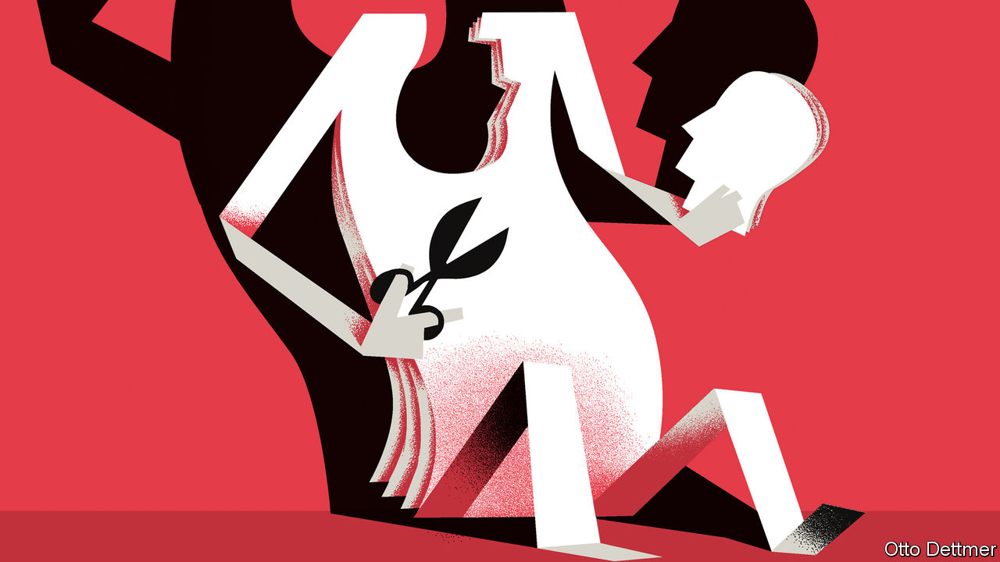

## Free exchange

# Should the Fed cut rates below zero?

> Negative rates are not a cure for what ails the global economy

> May 23rd 2020

YOU COULD be forgiven for supposing that the Federal Reserve has already thrown everything—kitchen fixtures included—at the covid-19 downturn. In recent months the Fed has slashed its benchmark interest rate to near zero, bought nearly $3trn in assets and launched a bevy of lending programmes. But America’s central bank appears conservative in one respect. Whereas peers in the euro area and Japan long ago pushed their short-term interest rates into negative territory, the Fed, like the Bank of England, has stayed positive. Now it faces pressure to change course. President Donald Trump has tweeted that the Fed should accept the “gift” of negative rates. Investors’ bets in the derivatives markets signal a belief that rates may eventually drop below zero. Jerome Powell, the Fed’s chairman, still insists that negative rates are not “appropriate or useful” for America. Regardless of whether he holds firm or markets are proved right, a spell in negative territory would not dramatically change the economic outlook.

Economists have argued energetically over negative rates since the global financial crisis, when rates around the world first dropped towards zero. Many policy rules—used to estimate an appropriate interest rate based on the rate of inflation and estimates of the extent of slack in the economy—suggested that rates ought to be cut deep into negative territory. Work by Jing Cynthia Wu of the University of Notre Dame, for instance, found that rates needed to be as low as -3% in America in 2014 and -6.5% in Britain in 2013. At first it was thought that negative rates were infeasible altogether. Cash pays an effective interest rate of zero; faced with negative deposit rates, bank customers could always withdraw their savings and stash them under their mattresses instead. That would suggest a “zero lower bound” on central banks’ tool of first resort. In fact the limit has not been as inflexible as all that. Piles of cash are more vulnerable to theft (or costly to store safely) and cannot be spent very easily. These costs mean that rates can go at least modestly negative, and some central banks have felt secure enough to dip their toes into sub-zero waters. The European Central Bank dropped its main rate to -0.1% in 2014 and has since cut it to -0.5%. Japan’s policy rate has stood at -0.1% since 2016.

The dire state of the world economy has economists asking whether more can be done. Central bankers weighing further rate cuts face three important questions. The first concerns the technical feasibility of more deeply negative rates. If Europe and Japan are a guide, rates in America and Britain could at least go modestly negative. Some economists, such as Kenneth Rogoff of Harvard University, suggest that with regulatory tweaks the effective lower bound on rates could be pushed much lower. Eliminating high-denomination banknotes and imposing fees on large transfers, for instance, might raise the cost of hoarding cash by enough to allow rates to be cut by a few percentage points.

More negative rates might thus be possible. But a second question is whether they undermine the stability of the financial system, hurting growth. Economists have explored the existence of a “reversal rate”, beyond which interest-rate cuts weaken demand rather than boost it. Negative policy rates mean that some or all of the reserves that banks must keep at the central bank lose value. But banks might not pass those rates on to their depositors, for fear of scaring customers off. A negative turn in rates therefore squishes banks’ margins. Less profitable banks, which struggle to boost their capital buffers by retaining earnings, might opt to curtail their lending, choking off investment and growth. Work by Markus Brunnermeier and Yann Koby of Princeton University concludes that reversal rates almost certainly exist, though their level depends on a banking system’s characteristics.

So far negative rates have not obviously hit the contractionary threshold. Those in Europe have indeed coincided with a drop in banks’ earnings. But Melanie Klein of the Bundesbank notes that, while lower bank margins are generally associated with reduced lending, the link seems to break down when rates move into negative territory. In fact, euro-area credit growth has accelerated since 2014. That does not settle the matter. Other factors, such as an improvement in demand, are likely to have boosted borrowing. And the squeeze that negative rates places on bank earnings has been muted by “tiering”—in which central banks apply different rates to different categories of bank reserves—which may also have limited their effect on the broader economy. For now, the effectiveness of negative interest rates remains an unsettled question.

Nor is the risk of a contraction in bank lending the only potential drawback to negative rates. Some investors warn that they could cause an exodus from money markets, a component of the shadow-banking system that many large firms and banks use to park cash and fund themselves. Money-market funds in Europe and Japan have coped, so far, with the problem of negative-yielding investments. But more deeply negative rates—or their arrival in America, where money markets play a far bigger role in the financial system—could bring different results.

All this leads to a third question: are negative rates worth the hassle? As the experience in Europe and Japan has not been disastrous, central bankers in America and Britain may eventually gingerly cut rates to below zero. (On May 20th Andrew Bailey, the governor of the Bank of England, said that negative rates were under “active review”.) But an easing of half a percentage point or so, while not unwelcome, is too small to mean the difference between a strong recovery and a weak one. Regulatory changes needed to achieve deeply negative rates at acceptable risk would probably prove politically contentious. Meanwhile, far more potent weapons—such as fiscal stimulus in combination with central-bank asset purchases—have not reached their economic and political limits. Little reason yet to venture far into sub-zero terrain. ■

Editor’s note: Some of our covid-19 coverage is free for readers of The Economist Today, our daily [newsletter](https://www.economist.com/https://my.economist.com/user#newsletter). For more stories and our pandemic tracker, see our [hub](https://www.economist.com//news/2020/03/11/the-economists-coverage-of-the-coronavirus)