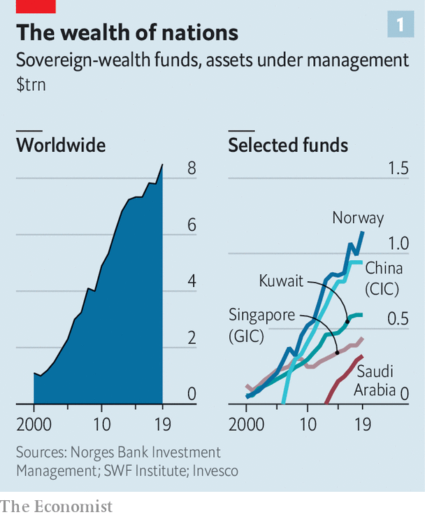
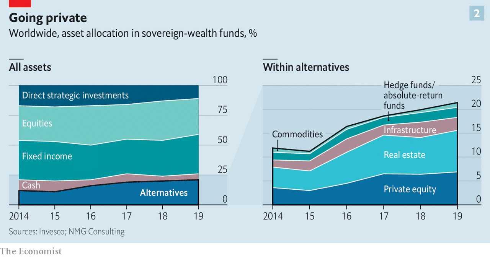

## Raid on the piggy banks

# Sovereign-wealth funds face lean years

> Revenues have fallen, and governments are eyeing their riches

> May 21st 2020

EVERY OTHER Monday Kirill Dmitriev, the boss of the Russian Direct Investment Fund (RDIF), dials in to Zoom to chat with 15 peers from around the world. The hours-long calls often yield precious nuggets of information, both about the state of the pandemic and of financial markets.

Mr Dmitriev says he was convinced early on that the outbreak would be severe. RDIF, which manages $50bn on behalf of the Russian state, has since invested in vaccine research and testing. It has also injected cash into private ventures like uchi.ru, an online-education platform, and ivi.ru, Russia’s Netflix. Meanwhile other sovereign funds, such as Saudi Arabia’s Public Investment Fund (PIF), have taken advantage of bargains in stockmarkets. In the first three months of the year PIF spent $8bn buying up stakes in companies ranging from Boeing to Uber.

The world’s 90-odd sovereign-wealth funds (SWFs) have gained significant clout in markets over the past two decades (see chart 1). Together they oversee more than $8trn in assets, equivalent to around 10% of global GDP. The downturn presents them with an opportunity. Free of the liabilities burdening insurers or pension funds, they are immensely patient investors, and can snap up bargains. But the pandemic also introduces strains. As governments at home battle economic collapse, the SWFs are being urged to chip in, just as, for many, inflows from oil and commodity earnings have dried up. Such pressures could lead funds to change how they invest.

Cash-rich countries have been stashing their excess foreign currency in kitties since the 1950s, when Kuwait launched its fund. SWFs often have two aims: to smooth out fiscal policy, by releasing cash when the weather turns, and to pass wealth on to future generations, in case luck (or oil) runs out. They grew fast in the 2000s, as China’s hunger for raw materials and other goods fed surpluses in oil-rich states and export champions, and in the 2010s, when funds posted strong returns. Since 2015, for instance, PIF has made returns of nearly double its target of 4-5% a year, according to a source familiar with the fund.

SWFs have largely weathered this year’s market rout. Most are notoriously opaque, but calculations by Javier Capapé of IE University for The Economist indicate that the biggest 15 funds, responsible for 80% of transactions, have made $62bn in paper losses on their largest public-equity stakes so far. Two-thirds of that, though, is accounted for by China Investment Corporation, through which Beijing owns stakes in its top four banks. Other big funds have seen losses of less than a third of those in 2008. When asset prices peaked in early 2019, many started holding more cash than usual. A correction seemed due, says Angela Rodell, who runs Alaska’s Permanent Fund (APF).

It helps that policymakers have, in effect, put a floor under stock prices. Governments have unveiled stimulus worth 3.8% of global GDP, more than twice that in 2008. But SWFs have grown savvier, too. The drubbing they took in 2008 led them to diversify, making portfolios resilient. Once obsessed with glitzy towers and football clubs, some have hired armies of investment bankers to make wiser picks. PIF has grown from 40 staff in 2016 to 700 today (though that has not stopped an iffy investment in Softbank’s Vision Fund).

Markets now offer buying opportunities. SWFs have stuck to their “allocation targets”, which dictate how much of their total assets they can invest in a given type of security. When listed stocks collapsed in March, they rushed to buy some more. Bid-ask spreads—the gap between the prices at which investors want to buy and sell—widened, but transaction volume did not dry up, says Yngve Slyngstad, who runs Norway’s $1trn Government Pension Fund Global (GPFG), the world’s largest SWF, which owns 1.5% of all shares issued in the world.

PIF’s recent purchases include a stake in Carnival, a cruise operator (whose share price jumped by 30% when the stake was disclosed in April). Others are betting on Chinese stocks, or privately held assets. James Burdett of Baker McKenzie, a law firm, saw a fund finalise a property-investment platform worth hundreds of millions of dollars weeks into the lockdowns.

Involvement in private markets carries risks, though. In recent years SWFs have piled into such illiquid assets (see chart 2). Where stocks go, unlisted assets often follow. Valuations are uncertain. Matt Whineray of NZ Super Fund, which owns farms and forests, says price ranges for these are now much wider. Low interest rates should push prices up; but investors are also more cautious, which pulls them down.

Another, bigger threat comes from governments. Gulf funds confess to having been asked to assist with covid-related bail-outs. An asset manager says some Asian funds have been coerced to fire-sell assets. Norway’s fund expects to inject cash worth 4.8% of its assets into public coffers in 2020, above its usual limit of 3%. APF, from which the government already plans to withdraw $3.1bn (about 5% of its assets), faces pressure to support struggling firms and pay three dividends to Alaskans this year, up from one.

The onslaught has yet to start in earnest. Instead of dipping deep into long-term savings, Gulf states, which enjoy good credit ratings, have issued billions of dollars in debt, says Jihad Azour, a former finance minister of Lebanon now at the IMF. But the longer the crisis, the greater the need, and the bigger the temptation.

The squeeze on SWFs is exacerbated by losses in revenues. GPFG, which had expected to receive oil proceeds worth 2.5% of its assets going into the crisis, will see these fall to 1%. That implies net outflows in 2020, a situation Mr Slyngstad describes as “unusual”. Gulf SWFs are expected to slim down by more than $300bn (roughly 15% of their assets) in 2020.

The pressure on incomings and outgoings could change the way the funds invest. SWFs will have to post nominal returns of 6-8% to avoid shrinking in the coming years, estimates Max Castelli of UBS, a bank. Slow growth and low interest rates make that a tall order. “If returns are not sufficient, we will see some liquidations,” says Mahmoud Mohieldin of the UN, who considered setting up a SWF for Egypt in the 2000s. Returns could also turn volatile if SWFs are nudged to invest more at home, making portfolios less diversified.

Large funds may also become more active investors. Because of their size, many tend to use a “core/satellite approach”. This allocates most of their assets to low-cost funds tracking indices and uses active investments to insulate their portfolios against long-term risks, like climate change, at the margin. The need for extra returns will demand more of the latter.

In one respect, at least, SWFs are ahead of the curve. Since 2014 one-fifth of their venture-capital investments have backed health-care startups—appetite for which is now proving contagious. ■

## URL

https://www.economist.com/finance-and-economics/2020/05/21/sovereign-wealth-funds-face-lean-years
