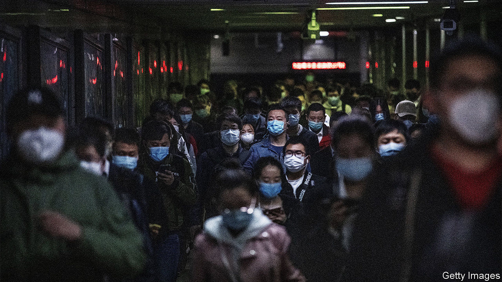
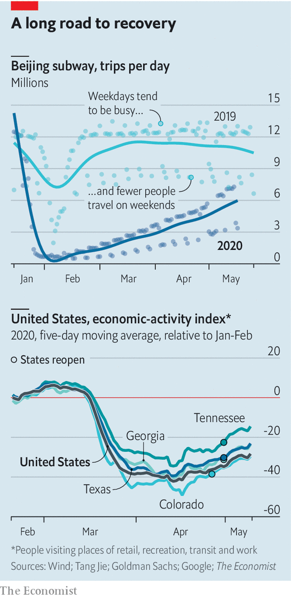

## All work and no play

# Tracking the economic recovery

> Though some lockdowns are being lifted, economies are not roaring back

> May 23rd 2020

LAST MONTH The Economist coined the term "90% economy" to describe what will happen as lockdowns are eased across the world. It depicts a more solitary and less fun sort of society—the sort of place where the office is open but the pub isn’t. Analysis by Tang Jie of Peking University finds that weekday subway trips in China have recovered to a greater extent than weekend ones, suggesting that people are more prepared to travel for work than for pleasure. Sales of instant noodles, savoured by homebodies, have rocketed. Meanwhile, some American states have started to lift lockdowns, but there is little sign of economies roaring back.

Editor’s note: Some of our covid-19 coverage is free for readers of The Economist Today, our daily [newsletter](https://www.economist.com/https://my.economist.com/user#newsletter). For more stories and our pandemic tracker, see our [hub](https://www.economist.com//news/2020/03/11/the-economists-coverage-of-the-coronavirus)