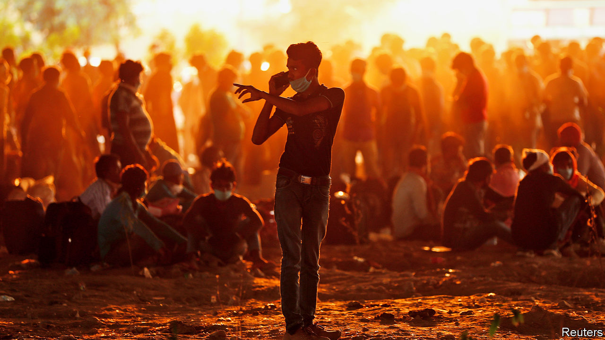
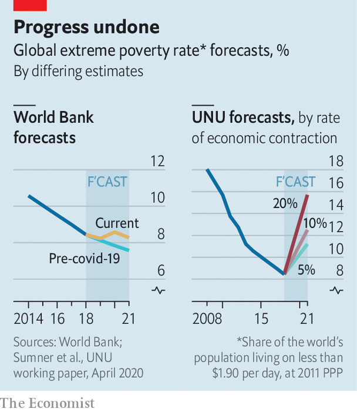
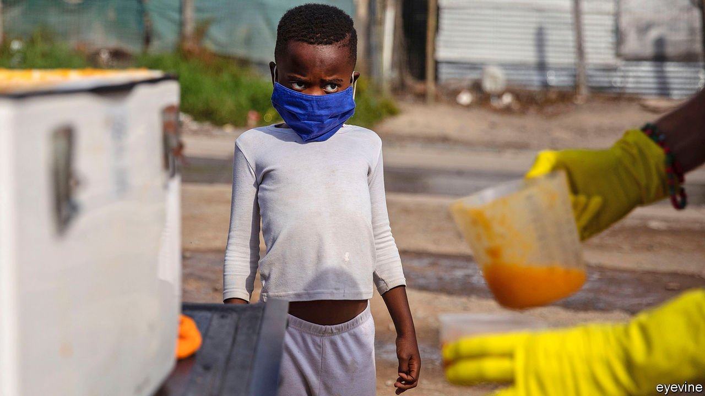

## The great reversal

# Covid-19 is undoing years of progress in curbing global poverty

> The number of very poor people was steadily falling; now it is rising fast

> May 23rd 2020DELHI, KAMPALA AND MEXICO CITY

Editor’s note: Some of our covid-19 coverage is free for readers of The Economist Today, our daily [newsletter](https://www.economist.com/https://my.economist.com/user#newsletter). For more stories and our pandemic tracker, see our [hub](https://www.economist.com//news/2020/03/11/the-economists-coverage-of-the-coronavirus)

JANE KABAHUMA has been eating one meal a day since the end of March, when the lockdown began. She used to work in a hotel, but it had to close, along with most businesses in Uganda. She thinks “it will take time” before the work comes back. In five months she is expecting a baby; it may arrive before a job does.

Her standard of living has plummeted. She used to pay to fill her jerrycans from a clean tap, but these days fetches water from a dirty well, because it is free. She gets by, more or less, with help from friends and family. But for how long?

In normal times, people in poor countries have many ways to cope with shocks. If one member of a family falls sick, the others can work longer hours to make up for the lost income. Or they can ask cousins or neighbours for help. Or, if a whole village is impoverished by a bad harvest, they can ask a nephew working in a big city or a foreign country to send some extra cash. All these “coping mechanisms”, as development experts call them, depend on calamity not striking everywhere at once. Alas, covid-19 has done just that.

In many places, workers cannot make up for lost income by working harder because demand for their labour has collapsed. Empty restaurants need no waiters; shuttered malls need no mopping; and few motorists are rolling down their windows to buy fruit from street hawkers.

The newly impoverished cannot easily get help from friends or relatives because, no matter where in the world they are, they are all experiencing a simultaneous and massive economic shock. The World Bank predicts that remittances from migrant workers will drop by 20% this year. Male Nepali migrants who are still overseas are now sending back only a quarter of what they were in January. Many send back nothing at all, having returned home.

Most countries in the developing world still require their citizens to stay at home, except to duck out for essentials. But few of the world’s poorest can work from home. And without work, many cannot eat. Thus, covid-19 imperils one of the greatest achievements of recent decades—the stunning reduction in global poverty.

From 1990 until last year the number of extremely poor people—those who subsist on less than $1.90 per day—fell from 2bn, or 36% of the world’s population, to around 630m, or just 8%. Now, for the first time since 1998, that number is rising—very fast. The big questions are: how many millions will slip back into penury? And will they quickly escape again when the pandemic is past, or will its effects be long-lasting, or even permanent?

The answers to those questions are maddeningly hard to pin down. The World Bank estimates that national lockdowns and the global economic collapse will push at least 49m people into extreme poverty, eliminating nearly all the gains made since 2017. That seems implausibly rosy—the bank’s estimate was based on data published in April. More recent numbers are far gloomier. For example, on May 17th Goldman Sachs estimated that India’s economy is shrinking at an annualised rate of 45%. Andy Sumner of King’s College London estimates that if global income per head falls by 20%, which it may for several months at least, the number of extremely poor people could increase by 420m—as much as the entire population of South America. That would wipe out a decade of gains in the fight against poverty.

Many poor countries have copied the kind of lockdowns that have been imposed in rich countries. But the circumstances are utterly different. The well-off are much more likely to have jobs that can be done from home. And workers in rich countries who cannot do their jobs, such as hotel receptionists or waiters, are typically wellsupported by taxpayers.

By contrast, when India imposed a strict and dramatic lockdown on March 24th, the 140m people who are estimated to have lost their jobs were suddenly in big trouble. Tens of millions of migrants who had moved from villages to cities suddenly had no income, no way to pay the rent and no trains to take them home, since those were also cancelled. Millions trudged hundreds of kilometres back to their home villages, where their families at least would take them in. The lockdown has been extended to May 31st, with only small adjustments (see [article](https://www.economist.com//asia/2020/05/23/indias-economy-has-suffered-even-more-than-most)).

Similar tales of woe are coming from other poor places. Over 80% of Kenyans and Senegalese reported a loss of income in early April. In a study for the University of Manchester, 60 Bangladeshi families have been writing “money diaries”. Before March, about $1,000 a month passed through each household (not all of it income). In April that fell to $300 or so.

In middle-income countries, too, lockdowns have been excruciating. Colombia’s was so tough that it sparked protests in working-class barrios. In Altavista, a neighbourhood near San Salvador, the capital of El Salvador, people have taken to hanging white flags from their windows to show that they have run out of food.

“Almost overnight people go from having income to having no income,” says Carolina Sánchez-Páramo of the World Bank. Less income often means less food. The World Food Programme (WFP) predicts a doubling of acute hunger by the end of 2020. David Beasely, its boss, worries that the world could see “multiple famines of biblical proportions” within a few months.

Health-care systems have been disrupted not only by the virus itself but also by lockdowns, which make it harder for people to seek treatment for other illnesses. A team at Johns Hopkins University calculates that across 118 poor and middle-income countries, disruption to health systems and hunger could kill 1.2m more children and 57,000 mothers over six months. The Stop TB Partnership, an international research group, reckons that in India alone interruptions of diagnosis and treatment from a three-month lockdown, followed by a 10-month recovery period, could cause 500,000 excess deaths from tuberculosis.

Some kinds of lockdown could cost more lives than they save. A report by the London School of Hygiene and Tropical Medicine estimates that if restrictions prevent vaccinations, in Africa 140 will die for every covid-19 death prevented.

Even moderate lockdowns can be harmful in very poor countries. The Malawian National Planning Commission and two think-tanks did a cost-benefit analysis of continuing Malawi’s restrictions, which include closing schools, curbing travel and stopping health outreach work. They estimated that the lockdown, if maintained for nine months, would avert 12,000 deaths from covid-19. However, it would also cause more people to go hungry, making them vulnerable to TB and malaria, so the net number of deaths avoided would be roughly half that. And because the victims of coronavirus would be largely old people, whereas the victims of malaria would often be infants, the lockdown would actually cause a net loss of 26,000 years of life.

The lockdown would also leave Malawi $12bn worse off, by stopping people from working and interrupting children’s education, thus dooming them to earn less in the future. That is equivalent to nearly two years’ GDP—an astounding sum. Overall, they estimated that the costs of the lockdown outweighed the benefits by 25 to 1.

Such calculations are subject to a wide margin of error. Nonetheless, they explain why many experts think that rich-country style lockdowns are unsustainable in many poor countries.

People who lack savings or a functioning safety net cannot simply stop working. Yet millions are being forced to do so. Before the crisis Jonathan Solmayor drove a tuk-tuk in Davao City in the Philippines. “I am feeding four mouths,” he says, but “my only source of living was stopped.” In western Nepal men have seen the hours they can work for wages fall by about 75%, according to the Yale Research Initiative on Innovation and Scale. In Uzbekistan the number of households where at least one person works has dropped by over 40%.

As the number of breadwinners falls, the price of food is rising. In India the price of potatoes has jumped by over 15%. In Uganda the prices of most key foods have gone up by over 15% since mid-March. The global food supply is holding up, but local disruptions are severe. In the province of Quezon in the Philippines an “extreme” quarantine has seen squash, beans, and watermelons wither in the fields. In India vegetables that were harvested have been left to rot as they cannot be transported to market. In East Africa covid-19 is not the only plague to strike this year: trillions of locusts are once again devouring crops.

Some hope that the rural poor may escape the worst. The virus has taken longer to reach remote villages, where social distancing is easier than it is in slums. Subsistence farmers might be able to feed themselves. But even the poorest rural households in Africa buy almost half their food. Many would normally top up their income with paid work, but no longer can.

Those who were already miserable have become more so. In Uganda the WFP has cut rations for refugees by 30%, and funding is drying up. In Bangladesh more than 70% of Rohingya refugees say they are now unable to buy food.

The most concentrated suffering will be in big cities such as Kolkata and Kinshasa, says Ms Sánchez-Páramo. Even before the pandemic about 130m city-dwellers were extremely poor. Many kept their heads above the poverty line by pedalling rickshaws or hawking vegetables. Lockdowns have stopped that. In India 84% of poor urban self-employed have lost their work.

Even where lockdowns are less strict, the urban poor are struggling. In Mexico City, where staying at home is more of a suggestion than a requirement, Romaldo San Juan Garcia normally spends his days polishing shoes. But these days the kind of people who can afford shoe-shines no longer wear leather shoes, since they are staying away from the office. In a long day on the street Mr Garcia polished only two pairs. Just to pay his monthly rent, he needs to shine about 100. In tough times his children would usually pick up extra shifts waiting tables. But because of the virus, the restaurants are shut.

With so few other options, many of the newly destitute are doing things that will make it harder for them to escape poverty even if the economy recovers. They are eating less, selling productive assets and even pulling children out of school.

“When I eat supper it means I will sacrifice lunch,” explains Nathan Tumuhimbise, a flower worker in Uganda who was sent home on unpaid leave. He has no idea whether he will be able to pay for his daughter’s next instalment of school fees. In desperation he has called his father in the village to sell some of the family goats. “I’m overwhelmed,” he says. Other workers he knows are even selling off their land. Why? “Survival, life and death,” he says.

Assets such as land, livestock and motorbike taxis can be sold only once. When so many people try to sell them at the same time, prices collapse. And people who sell their productive assets today will have no source of income tomorrow.

Cutting back on food is risky, too, especially for children. Malnutrition stops brains and bodies from growing properly. Stunting results in lower IQs, greater risk of chronic illness and lower lifetime earnings. In towns in Sierra Leone almost 60% of people said they had eaten fewer times than normal in the past week, according to the Yale Research Initiative. Fully 14% have gone a whole day without eating.

Pulling kids out of school has awful long-term consequences. One World Bank paper found that if schools remain closed for just four months, the reduction in their lifetime earnings will be equivalent to 15% of a year’s global GDP.

Governments can help. Fully 181 countries have announced extra efforts to protect the poor, about 60% of which involve cash or food aid. For millions, these have proven a lifeline. Ganesh, an auto-rickshaw driver in Delhi, says he was lucky to spot an advert about a state government scheme to pay idle auto drivers a one-off 5,000 rupees (about $70). He texted in his ID and soon got the money. However, the vast majority of the cash in all these new welfare schemes is in rich countries. In the poorest ones, extra social spending announced so far amounts to just $1 per head—in total, not per day. Other drivers applied for help too, says Ganesh, but they have not received anything.

Existing safety nets have long focused on rural folk, which used to make sense because they were the poorest. However, many of the newly poor are in cities. Systems need to adapt, but many are badly managed. India’s federal programme of cash and food handouts is scattershot and misses many of the neediest. In Uganda the government’s own spokesperson described its efforts to get aid to the right people as “inadequate, incompetent, disorganised.” Egypt has managed to get payments only to 2m of its 100m people.

In countries such as Kenya and Bangladesh mobile money is being used to distribute aid more quickly. But the poorest are often hard to reach. Governments often do not know who they are. And welfare systems were not designed with pandemics in mind. In South Africa delays have led people to form queues (not always socially distanced ones) outside post offices to sign up for benefits. In many countries corruption limits the effectiveness of welfare. In Zimbabwe aid has been steered to supporters of the ruling party. In Uganda MPs initially put themselves in charge of distributing $2.6m of relief cash in their constituencies (a court ruled they should pay it back).

The biggest problem, though, is simply that governments in the poorest countries do not have much money. And they are getting poorer. The World Bank says that African government revenues will drop between 12% and 16% this year. In Nigeria, home to more extremely poor people than any other country, the collapse of the oil price has shredded government spending plans. During the global financial crisis many poor countries slashed spending on education; they may do so again.

All this has prompted calls to ease lockdowns. That will not save poor countries from being battered by the global economic crisis. Nor will all businesses reopen if people are still scared of being infected. But at least the poor would be able to try to work and children would be able to get vaccinations.

Nigeria has already loosened lockdowns in some big cities, even as cases rise. Bangladesh and Pakistan have eased up, too. India will open up somewhat next month. This is not always popular—after two weeks shut in, 82% of Indians supported the first extension there. Ghana, one of the first in Africa to remove some restrictions, shows the risks. In one fish factory, 533 workers were recently infected.

However, the choice is not binary: total lockdown or no precautions at all. Governments and citizens can do a lot to prevent infections without freezing the whole economy. They can protect the elderly while letting most adults go to work and children go to school. They can keep nightclubs closed but allow markets, bus stations and factories to open—with compulsory masks, hand-washing and social distancing. They can do a better job of spotting outbreaks and quarantining the infected. They can teach people the facts about the disease, so they can protect themselves. Community health workers did this well during the Ebola crisis.

Whatever the approach, poor countries will need help from developed ones. Rich countries have spent a stunning $8trn on supporting their own citizens during the pandemic, notes Homi Kharas of the Brookings Institution, a think-tank. It is in their interest to help poor countries grapple with the disease—otherwise they will become a coronavirus reservoir that can reinfect the rich. Yet the international response has been “very go slow”, says Matthew Spencer of Oxfam, an NGO. So far the IMF and World Bank have lent about $20bn and $6bn respectively. Talks about debt relief are moving lethargically.

In the past, crises have sometimes fostered solidarity with the poor, notes Amartya Sen of Harvard University. In Britain during the 1940s life expectancy shot up by seven years, thanks to a wartime rationing system that ensured everyone had nourishing (if dull) food. According to a forthcoming UN Development Programme study between 2013 and 2016, despite an Ebola epidemic, living standards in Sierra Leone improved faster than in any of 70 poor countries. The huge effort to fight Ebola had spillover effects, as aid-workers and public servants also helped improve nutrition and child mortality. It would be wonderful if covid-19 could inspire similar efforts. But for now, the rich world is too distracted by its own problems to pay much heed to the poor.■

## URL

https://www.economist.com/international/2020/05/23/covid-19-is-undoing-years-of-progress-in-curbing-global-poverty
