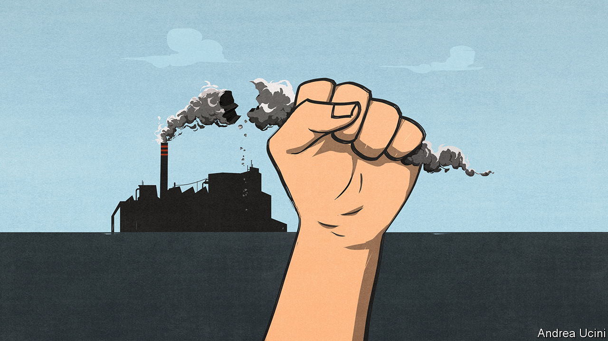

## A new opportunity to tackle climate change

# Countries should seize the moment to flatten the climate curve

> The pandemic shows how hard it will be to decarbonise—and creates an opportunity

> May 21st 2020

Editor’s note: Some of our covid-19 coverage is free for readers of The Economist Today, our daily [newsletter](https://www.economist.com/https://my.economist.com/user#newsletter). For more stories and our pandemic tracker, see our [hub](https://www.economist.com//news/2020/03/11/the-economists-coverage-of-the-coronavirus)

FOLLOWING THE pandemic is like watching the climate crisis with your finger jammed on the fast-forward button. Neither the virus nor greenhouse gases care much for borders, making both scourges global. Both put the poor and vulnerable at greater risk than wealthy elites and demand government action on a scale hardly ever seen in peacetime. And with China’s leadership focused only on its own advantage and America’s as scornful of the World Health Organisation as it is of the Paris climate agreement, neither calamity is getting the co-ordinated international response it deserves.

The two crises do not just resemble each other. They interact. Shutting down swathes of the economy has led to huge cuts in greenhouse-gas emissions. In the first week of April, daily emissions worldwide were 17% below what they were last year. The International Energy Agency expects global industrial greenhouse-gas emissions to be about 8% lower in 2020 than they were in 2019, the largest annual drop since the second world war.

That drop reveals a crucial truth about the climate crisis. It is much too large to be solved by the abandonment of planes, trains and automobiles. Even if people endure huge changes in how they lead their lives, this sad experiment has shown, the world would still have more than 90% of the necessary decarbonisation left to do to get on track for the Paris agreement’s most ambitious goal, of a climate only 1.5°C warmer than it was before the Industrial Revolution.

But as we explain this week (see [article](https://www.economist.com//briefing/2020/05/21/can-covid-help-flatten-the-climate-curve)) the pandemic both reveals the size of the challenge ahead and also creates a unique chance to enact government policies that steer the economy away from carbon at a lower financial, social and political cost than might otherwise have been the case. Rock-bottom energy prices make it easier to cut subsidies for fossil fuels and to introduce a tax on carbon. The revenues from that tax over the next decade can help repair battered government finances. The businesses at the heart of the fossil-fuel economy—oil and gas firms, steel producers, carmakers—are already going through the agony of shrinking their long-term capacity and employment. Getting economies in medically induced comas back on their feet is a circumstance tailor-made for investment in climate-friendly infrastructure that boosts growth and creates new jobs. Low interest rates make the bill smaller than ever.

Take carbon-pricing first. Long cherished by economists (and The Economist), such schemes use the power of the market to incentivise consumers and firms to cut their emissions, thus ensuring that the shift from carbon happens in the most efficient way possible. The timing is particularly propitious because such prices have the most immediate effects when they tip the balance between two already available technologies. In the past it was possible to argue that, although prices might entrench an advantage for cleaner gas over dirtier coal, renewable technologies were too immature to benefit. But over the past decade the costs of wind and solar power have tumbled. A relatively small push from a carbon price could give renewables a decisive advantage—one which would become permanent as wider deployment made them cheaper still. There may never have been a time when carbon prices could achieve so much so quickly.

Carbon prices are not as popular with politicians as they are with economists, which is why too few of them exist. But even before covid-19 there were hints their time was coming. Europe is planning an expansion of its carbon-pricing scheme, the largest in the world; China is instituting a brand new one. Joe Biden, who backed carbon prices when he was vice-president, will do so again in the coming election campaign—and at least some on the right will agree with that. The proceeds from a carbon tax could raise over 1% of GDP early on and would then taper away over several decades. This money could either be paid as a dividend to the public or, as is more likely now, help lower government debts, which are already forecast to reach an average of 122% of GDP in the rich world this year, and will rise further if green investments are debt-financed.

Carbon pricing is only part of the big-bang response now possible. By itself, it is unlikely to create a network of electric-vehicle charging-points, more nuclear power plants to underpin the cheap but intermittent electricity supplied by renewables, programmes to retrofit inefficient buildings and to develop technologies aimed at reducing emissions that cannot simply be electrified away, such as those from large aircraft and some farms. In these areas subsidies and direct government investment are needed to ensure that tomorrow’s consumers and firms have the technologies which carbon prices will encourage.

Some governments have put their efforts into greening their covid-19 bail-outs. Air France has been told either to scrap domestic routes that compete with high-speed trains, powered by nuclear electricity, or to forfeit taxpayer assistance. But dirigisme disguised as a helping hand could have dangerous consequences: better to focus on insisting that governments must not skew their bail-outs towards fossil fuels. In other countries the risk is of climate-damaging policies. America has been relaxing its environmental rules further during the pandemic. China—whose stimulus for heavy industry sent global emissions soaring after the global financial crisis—continues to build new coal plants (see [article](https://www.economist.com//china/2020/05/21/a-glut-of-new-coal-fired-power-stations-endangers-chinas-green-ambitions)).

The covid-19 pause is not inherently climate-friendly. Countries must make it so. Their aim should be to show by 2021, when they gather to take stock of progress made since the Paris agreement and commit themselves to raising their game, that the pandemic has been a catalyst for a breakthrough on the environment.

Covid-19 has demonstrated that the foundations of prosperity are precarious. Disasters long talked about, and long ignored, can come upon you with no warning, turning life inside out and shaking all that seemed stable. The harm from climate change will be slower than the pandemic but more massive and longer-lasting. If there is a moment for leaders to show bravery in heading off that disaster, this is it. They will never have a more attentive audience. ■

## URL

https://www.economist.com/leaders/2020/05/21/countries-should-seize-the-moment-to-flatten-the-climate-curve
