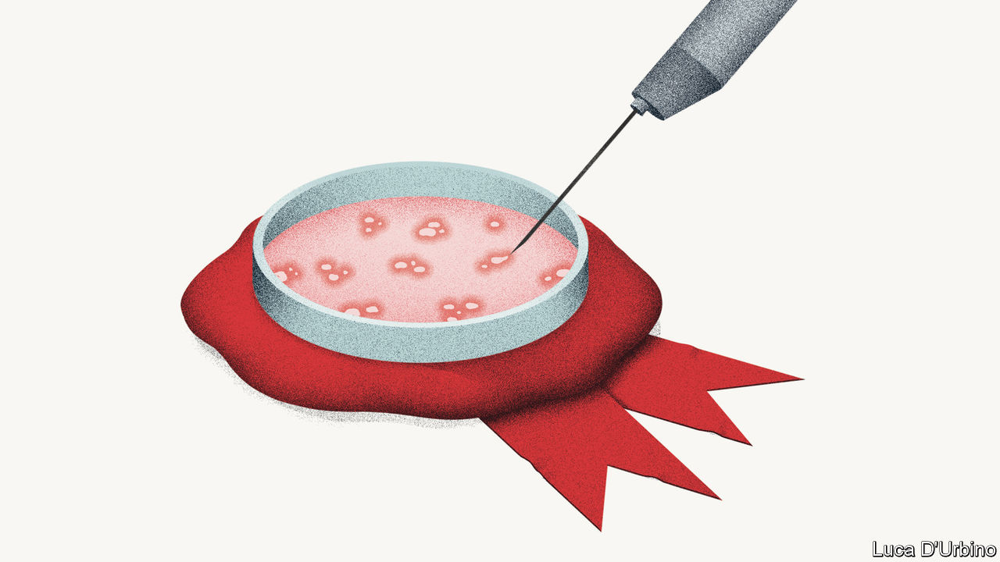

## Big pharma is having a good crisis

# Drug innovation is back in fashion

> Big pharma is no longer the villain

> May 23rd 2020

Editor’s note: Some of our covid-19 coverage is free for readers of The Economist Today, our daily [newsletter](https://www.economist.com/https://my.economist.com/user#newsletter). For more stories and our pandemic tracker, see our [hub](https://www.economist.com//news/2020/03/11/the-economists-coverage-of-the-coronavirus)

FOR MUCH of the past two decades big pharma has been a lost cause. Despised by the public, it became notorious for price-gouging, secretiveness and its neglect of global health problems. Big pharma also lost its lustre with investors, despite its bumper profits. They worried that a business model that relied too much on rent-seeking and too little on innovation was unsustainable, and that citizens would eventually revolt and demand more regulation—or even rip up the patent system that gives drugs firms a temporary monopoly over new medicines. As a result, in the five years before the covid crisis the pharmaceutical sector lagged behind America’s S&P 500 index.

The pandemic has reminded the world of the industry’s strengths—its capacity to innovate and provide drugs on a vast scale. Many of the big firms, such as Johnson & Johnson and Sanofi, are working on covid-19 vaccines and therapies. Scores of smaller companies are at work, too. On May 18th Moderna, an American biotech firm, said that its much-anticipated vaccine has shown positive early results (although some analysts questioned the validity of its tests). AstraZeneca, a big British firm that invests heavily in research and development (R&D), is working on a vaccine with scientists at Oxford University, helped by $1bn of new funding from America’s government. Even before the virus, the industry had started to invest more heavily. In the most recent quarter America’s 30 biggest firms boosted their R&D by a median of 6% year on year. Now medical innovation is back in fashion.

It looks like big pharma’s moment to shine. However, the pandemic has also created new ethical and political dilemmas. Vaccine nationalism is spreading as governments panic that others may get their hands on crucial drugs first. France’s Sanofi has found itself embroiled in a transatlantic row over who will be first to get any covid-19 vaccine it develops. Paul Hudson, the firm’s boss, stated last week that because the American government invested in his firm’s risky scientific efforts, the United States would have early access. This led to a political explosion in France and a dressing-down from Emmanuel Macron, France’s president. And there is mounting pressure to suspend elements of the patent system. A gathering of the World Health Organisation this week passed a resolution urging drugs firms to pool patent rights. Several dozen current and former world leaders released an open letter demanding that any successful covid-19 vaccine should be made available patent-free.

There is an alternative to beggar-thy-neighbour nationalism and taking a sledgehammer to the intellectual-property regime. First, a global agreement is needed to govern the manufacture and distribution of a potential vaccine. It could take several years to vaccinate the world’s population; global co-operation will mean that the vaccine is deployed first where it brings most benefit.

Second, the patent system should be preserved because, correctly designed, it incentivises investment in new treatments. The big drugs firms have already said they will make any vaccine available at cost-plus prices. Arrangements exist for tiered pricing of medicines and free vaccinations for diseases afflicting the world’s poor that should be extended to covid-19 treatments. If a smaller drugs firm tried to price-gouge, governments in the West and elsewhere have the powers to pass compulsory licensing orders in an emergency. When the pandemic passes, there must be no going back to the bad old days. Governments should seek to authorise new drug patents faster, as the best way to balance innovation and lower prices. And big pharma needs to keep investing. That will help shareholders and global public health, too.■